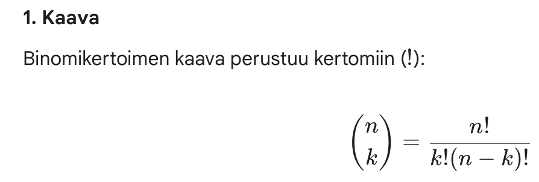
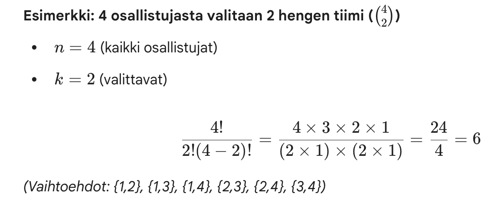

## Kertoma: factorial()

```{r}
factorial(3)
factorial(4)
factorial(10)
```

Laskee kertoman (!) eli sen kuinka moneen eri järjestykseen tietty määrä lukuja voidaan laittaa

-   3 lukua –\> 6 järjestystä

-   4 lukua -\> 24 järjestystä

-   10 lukua -\> 3 628 800 järjestystä

## Kombinaatiot: choose()

```{r}
# choose(n, k) 
choose(4, 2)
```

Kuinka monella eri tavalla voimme valita k alkiot n alkion joukosta, kun järjestyksellä ei ole väliä?

{width="394"}

Eli montako eri tapaa on valita tietty joukko (k) isommasta joukosta (n).

{width="437"}

Permutaatiotestissä lasketaan nimenomaan kombinaatioita

<br><br>

## Vektorien laskutoimitukset

Vektori ja yksittäinen arvo

-   jokainen vektorin arvo käydään läpi ja tehdään sille sama laskutoimitus. Esim. alla vektorin jokaisesta arvosta vähennetään 3 ja palautetaan indeksin joka kohdan tulos.

```{r}
c(2,4,6,8,10) - 3 
```

<br><br>

Kaksi vektoria

-   Kahdella yhtä pitkällä vektorilla voi tehdä laskutoimituksia keskenään

-   Keskenään lasketaan aina saman indeksinumeron arvo

    -   Jos lasketaan esimerkikis V1 + V2, jossa V1 = c(1,2,3) ja V2 = c(2,4,6)

        -   lasketaan 1. V1\[1\] + V2\[1\] = 1 + 2 = 3

        -   2\. V1\[2\] + V2\[2\] = 2 + 4 = 6

        -   3\. V1\[3\] + V2\[3\] = 3 + 6 = 9

        ```{r}

        c(1,2,3) + c(2,4,6)

        ```

## Summafunktiot: sum(), colSums() ja rowSums()

sum()

-   laskee annetun aineiston kaikkien arvojen summan

-   Esim dataframessa siis jokaisen solun summa eli kaikki rivit ja kaikki sarakkeet

<br><br>

colSums()

-   laskee annetun aineiston kolumnien summat

-   eli, jos datafreimissä on 20 saraketta ja 10 riviä, niin antaa vastauksena 20 summaa

    -   laskee siis sarakkeen 1. 10 arvoa yhteen, sarakkeen 2. 10 arvoa yhteen, sarakkeen 3. 10 arvoa yhteen jne.

<br><br>

rowSums()

-   laskee annetun aineiston rivien summat

    jos datafreimissä 20 saraketta ja 10 riviä, niin antaa vastauksena 10 summaa

    -   laskee rivin 1. 20 arvoa yhteen, rivin 2. 20 arvoa yhteen, rivin 3. 20 arvoa yhteen jne.

<br><br>

nrow()

-   kertoo montako riviä on annetussa aineistossa

<br><br>

ncol()

-   kertoo montako saraketta on annetussa aineistossa
