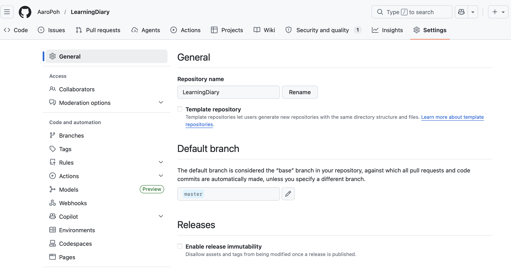
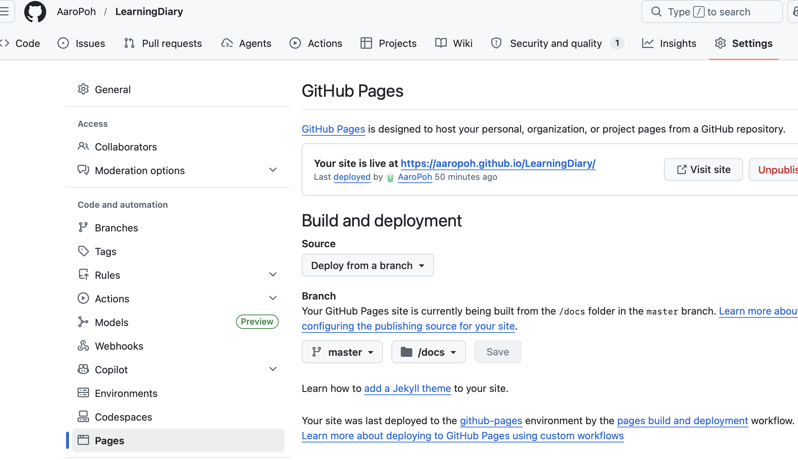

## Git ja github

```{r}
#| eval: false 

usethis::use_git()
```

Luo olemassa olevalle R-projektille git repositorion

- uutta projektia luodessa voi rastittaa saman heti alkuun

- git repositorioon voi tallentaa varmuuskopion aina kun haluaa

  - se tehdään yläoikealta git välilehdeltä valitsemalla tehdyt muutokset ja painamalla commit

<br>

Kun on luonut tunnukset GitHubiin voi projektin tallettaa tililleen pilveen. Paikallinen git täytyy ensin yhdistää githubiin luomalla github token ja lisäämällä se Rstudioon. Github token toimii salasanana. Github suosittelee, että token on voimassa vain määräajan esim. 30 tai 90 päivää, mutta laitoin sen jatkuvasti voimassa olevaksi, koska en halua säätää sen kanssa koko ajan. Alla skripti, jolla pääsee githubin sivuille luomaan tokenin ja sen jälkeen lisäämään sen rstudioon. Token tarvitsee lisätä vain yhteen projektiin rstudiossa ja se toimii sen jälkeen kaikissa. Lisätäkseen projektin gitiin ja githubiin täytyy ajaa komennot **usethis::use_git()** ja **usethis::use_github()**

```{r}
#| eval: false 

if(!require(usethis)) install.packages("usethis")
library(usethis)

# Tämä avaa selaimesi suoraan GitHubin oikealle sivulle
create_github_token()

if(!require(gitcreds)) install.packages("gitcreds")
library(gitcreds)

# Aja tämä ja liitä kopioimasi token (koodi) pyydettäessä konsoliin
gitcreds_set()

# Tämä komento hoitaa kaiken: luo GitHubiin uuden kansion (repository) 
# ja lähettää tiedostosi sinne.
usethis::use_github()


# Kun luo uuden projektin niin alla olevat komennot täytyy ajaa, jotta git ja github toimivat. Tokenia ei tarvitse ajaa uudestaan. 
# usethis::use_git() ja usethis::use_github().

```

## .gitignore

- Gemini suositteli lisäämään alla olevat asiat gitignore tiedostoon

  - sieltä määritetään, mitä ei varmuuskopioida

  - Turhia asioita ei kannata varmuuskopioida, jotta git pysyy selkeänä ja sulavana

```{r}
#| eval: false 

.Rproj.user
.Rhistory
.RData
.httr-oauth
.DS_Store
.quarto
/.quarto/
**/*.quarto_ipynb
_book/
_site/
site_libs/
```

## Quarto-kirja nettisivuksi githubin avulla 

Quarto kirjan saa githubin kautta nettisivuksi muutamalla simppelillä työvaiheella. Aivan ensiksi quarto-kirjan projektikansion täytyy löytyä githubista eli suorita **usethis::use_git()** ja **usethis::use_github()** mikäli et ole niitä jo tehnyt. Ensiksi täytyy lisätä quarto.yml tiedostoon: "**output-dir: docs**". Se lisää projektiin kansion docs, jota käytetään nettisivun lähdekansiona.

```{r}
#| eval: false
project:
  type: book
  output-dir: docs 
```

<br>

Sen lisäksi .gitignore tiedostosta täytyy poistaa tai kommentoida muutama asia, jotta docs kansioon, gitiin ja githubiin tallentuu mukaan tarvittavat tiedostot. .gitignoresta täytyy poistaa tai kommentoida **book/**, **site/** ja **site_libs/**. Ne ovat kirjastotiedostoja ja lisättiin gitignoreen alunperin, koska niitä tallentuu aina renderöidessä paljon ja voivat hidastaa gitin toimintaa. Nettisivuja tehdessä niidenkin tiedostojen täytyy siirtyä gitiin ja githubiin, joten siksi ne poistetaan .gitignore tiedostosta.

Kirjani .gitignore tiedosto näyttää tältä:

```{r}
#| eval: false
.Rproj.user
.Rhistory
.RData
.httr-oauth
.DS_Store
.quarto

/.quarto/
**/*.quarto_ipynb
# _book/
# _site/
# site_libs/
.positai

```

<br>

Noiden valmistelujen lisäksi projektikansioon täytyy lisätä tiedosto "**.nojekyll**". Se lisätään, koska github pyrkii muotoilemaan nettisivut jekyll tyylillä, joka puolestaan estää quarton muotoilujen käyttämisen. .nojekyll tiedosto kertoo githubille, että käytetään quarton muotoiluja ja silloin nettisivut saa näyttämään samalta, kuin html preview tilassa. Tässä on tärkeää muistaa renderöidä projekti tiedoston luomisen jälkeen, koska muuten tiedosto ei generoidu myös docs kansioon, jossa sitä tarvitaan.

```{r}
#| eval: false
> file.create(".nojekyll")
```

.nojekyll on piilotiedosto eli sitä ei tarvitse ihmetellä, jos se ei näy files näkymässä. Voit tarkistaa onnistuitko luomaan sen komennolla **list.files()**

```{r}
#| eval: false
> list.files(all.files = TRUE, pattern = "jekyll")
```

<br>

Mikäli muotoilut eivät mene oikein voidaan ajaa terminaalissa komennot "git add docs/" ja "git add -f docs/site_libs/", jotka pakottava lisäämään gitiin site_libs/ ja docs/ tiedostot. **Tee nämä vain jos kohtaat ongelmia eli muotoilut nettisivuilla eivät näytä oikealta.**

```{r}
#| eval: false
# ajetaan terminaalissa 
git add docs/
git add -f docs/site_libs/

```

<br>

Kun on tehnyt määritykset quarto.yml ja .gitignore tiedostoihin on tärkeää muistaa renderöidä koko projekti html muodossa. Sen jälkeen täytyy commitata muutokset gitiin ja sitten vielä pushata ne githubiin. Tämän jälkeen voidaan siirtyä githubiin viimeistelemään nettisivu.

Työvaiheet ovat siis: Määritykset yml ja gitignore tiedostoihin –\> luo .nojekyll tiedosto –\> renderöi projekti –\> commit -\> push

<br>

Mene githubiin ja avaa sieltä kyseisen projektin repositorio. Actions välilehdeltä voi tarkistaa onko viimeisin push komento jo suoritettuna ja ajan tasalla. Sen kohdalla on punainen pallo, jos on ongelmaa, keltainen jos suorittaminen on kesken ja vihreä jos kaikki on valmiina. Mene repositorion settings välilehdelle ja valitse vasemmalla reunalla olevasta listasta Pages.



Pages sivulla build and deployement kohdalla säilytä tai valitse source kohtaan deploy from a branch (Minulla se oli jo valmiiksi siinä). Sitten valitse branch kohtaan master ja folder kohtaan docs ja paina save. Sen myötä sinulle täytyisi syntyä nettisivut muodossa "https://käyttäjänimi.github.io/ProjektiRepositorio/"


