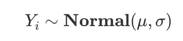

## Kolmogorov-smirnov normaalisuustesti ks.test()

-   Toimii paremmin suurella n:llä kuin shapiro-wilk

-   R:llä toimii funktiolla **ks.test()**

## Shapiro-wilk normaalisuustesti shapiro.test()

-   Toimii pienellä n:llä paremmin kuin kolmogorov-smirnov

-   R:ssä funktiolla **shapiro.test()**

-   Samat arvot (Ties): Jos datassasi on paljon samoja arvoja (kuten Likert-asteikolla 1-5 usein on), R antaa varoituksen: "cannot compute exact p-value with ties". K-S-testi on tarkoitettu jatkuville muuttujille. Jos data on kovin epäjatkuvaa, Shapiro-Wilk (shapiro.test) on usein parempi vaihtoehto normaalisuuden testaukseen. @gemini

  

## Normaalijakauma

> You can read this as “Yi is sampled from a Normal distribution with mean μ and standard deviation σ”. So the tilde (∼) stands for “sampled from”. [@analysisandmodelling]

-   Kaavassa Yi on siis yksi normaalijakauman havainto

-   \~ merkki tarkoittaa, että Y on annetusta jakaumasta satunnaisesti otettu alkio

-   μ tarkoittaa keskiarvoa

-   σ tarkoittaa keskihajontaa
