## Joukko-opin peruskäsitteitä

Perusjoukko = joukko, joka sisältää tapahtuman (experiment) kaikki alkeistapaukset eikä muita alkioita

- merkataan omegalla Ω tai isolla S:llä
- Sample space

Alkeistapaus = tapahtuman mahdollinen lopputulos, esim. nopan silmäluku

- merkitään aaltosulkujen sisään.

- Esim Tapahtuma A = "nopanheiton silmäluku on parillinen" = {2,4,6}

Tapahtumaa, merkitään yleensä isolla kirjaimella esim. A, B tai C (Event)

 

Osajoukko = pienempi osa perusjoukosta, tai toisesta osajoukosta

- Esim. Tapahtuma A = {2,4,6} on perusjoukon S = {1,2,3,4,5,6} osajoukko

- osajoukkoa merkitään kyljelleen käännetyllä U kirjaimella ⊂

{width="400" height="33"}

 

Leikkaus = kahden joukon yhteiset alkeistapaukset

- merkataan päälaelleen käännetyllä U:lla ∩
- englanniksi intersection

{width="300"}

 

Yhdiste = kahden joukon yhdistelmä eli kaikki alkeistapaukset, jotka kuuluvat joukkoon A tai joukkoon B

- inklusiivinen TAI eli yhdisteeseen kuuluu kaikki alkiot, jotka kuuluvat jompaan kumpaan joukkoon tai molempiin.
- englanniksi union

<!-- -->

- merkataan normaalilla U:lla ∪

 

Tapahtuma C = "Silmäluku on 5" = {5}

- Tapahtuma C on tapahtuman B = {5,6} osajoukko

<!-- -->

- Joukkojen B ja C yhdiste on {5,6} = B

  - Eli osajoukon ja joukon yhdiste on sama kuin alkuperäinen joukko

 

Erilliset joukot ovat sellaisia, joilla ei ole yhtään yhteistä alkiota

- Esim joukot C ={5} ja A = {2,4,6} ovat erilliset

- Englanniksi disjoint

- C:n ja A:n leikkaus on tyhjä joukko eli siinä ei ole yhtään alkiota

- Tyhjää joukkoa merkitään ∅

Tapahtuma D = "Silmäluku on pariton" = {1,3,5}

- Tapahtuma D on tapahtuma A:n komplemetti (vastatapahtuma) eli siihen kuuluu kaikki perusjoukon alkiot, jotka eivät kuulu joukkoon A

{width="200"}

Joukon komplementin komplementti on alkuperäinen joukko itse

{width="200"}

 

 

## De Morganin lait

A:n ja B:n leikkauksen komplementti on A:n komplementin ja B:n komplementin yhdiste

 

A:n ja B:n leikkaus

 

A:n ja B:n leikkauksen komplementti

- toisin sanottuna siis leikkauksen ulkopuolinen alue

 

Pelkästään A:n komplementti väritettynä

 

A:n komplementin ja B:n kompelentin yhdiste väritettynä

 

Vassen venn-diagrammi kuvaa yhtälön vasempaa puolta ja oikea diagrammi kuvaa oikeaa

- yhtälö siis pätee eli A:n ja B:n leikkauksen komplementti on sama kuin A:n komplementin ja B:n komplementin yhdiste

 

De morganin lait ovat siis

{width="200"}

- A:n ja B:n leikkauksen komplementti on sama kuin A:n komplementin ja B:n komplementin yhdiste

Toinen sääntö

{width="200"}

- A:n ja B:n yhdisteen komplementti on sama kuin A:n komplementin ja B:n komplementin leikkaus

   

## Todennäköisyyden ominaisuuksia

Tapahtuman A todennäköisyyttä merkataan P(A)

1\) 0 ≤ P(A) ≤ 1

- Todennäköisyys on aina välillä 0 ja 1. 1 tarkoittaa varmaa tapahtumaa ja 0 mahdotonta

2\) P(Ω) = 1

- Perusjoukon todennäköisyys on 1, koska se sisältää kaikki alkeistapaukset ja on siksi varma tapahtuma

3\) P(A\^c) = 1 -P(A)

- A:n komplementin todennäköisyys on 1 - A:n todennäköisyys

4\) Tapahtumien A ja B yhdisteen todennäköisyys on tapahtumien A ja B todennäköisyyksien summa vähennettynä tapahtumien A ja B leikkauksella. Leikkaus vähennetään, koska se sisältyy molempien A ja B todennäköisyyteen, joten niiden summassa leikkaus on laskettuna kahteen kertaan. Kun se vähennetään, niin se on laskettuna vain kertaalleen ja saadaan yhdisteen oikea todennäköisyys.

5\) Tyhjän tapahtuman todennäköisyys on 0 eli se on mahdoton

6\) Kun tapahtumat A ja B ovat erilliset eli niillä ei ole leikkausta, niin tapahtumien A ja B yhdisteen todennäköisyys voidaan laskea summaamalla tapahtumien A ja B todennäköisyys.

   

Klassinen todennäköisyys

Klassisella todennäköisyydellä tarkoitetaan todennäköisyyttä tilanteissa, joissa alkeistapaukset ovat symmetrisiä. Se tarkoittaa, että perusjoukon kaikkien alkeistapausten todennäköisyys on sama. Esimerkiksi noppaa heitettäessä kaikki alkeistapaukset ovat yhtä todennäköisiä.

 

Klassisen todennäköisyys lasketaan jakamalla suotuisien alkeistapauksien lukumäärä koko perusjoukon alkeistapausten lukumäärällä.

P(A) = n(A) / n(Ω)

  

Esimerkkejä joukko-opin ja todennäköisyyslaskennan perusteista

Tehtävässä valitaan perusjoukosta satunnaisesti yksi henkilö, eli kaikki alkeistapaukset ovat symmetrisiä eli yhtä todennäköisiä. Kyse on siis klassisesta todennäköisyydestä.

a\) verrataan suotuisten alkeistapauksien lukumäärää kaikkien alkioiden lukumäärään

b\) tapahtuma on tapahtuman A komplementti eli saadaan vastaus vähentämällä tapahtuman A todennäköisyys 1:stä.

c\) saadaan vastaus vertaamalla tapahtian B suotuisia alkeistapauksia kaikkiin tapauksiin

d\) saadaan vastaus komplementtisäännön avulla ¨

e\) "Valitulla henkilöllä on hattu ja aurinkolasit" –\> molempien täytyy toteutua. Kyse on siis tapahtumien A ja B leikkauksesta.

f\) "hattu tai aurinkolasit" –\> kelpaa kaikki alkiot, joissa on jompi kumpi tai molemmat. Kyse on siis tapahtumien A ja B yhdisteestä. Se saadaan laskemalla P(A) + P(B) - P(A∩B)

 

Kohdissa g ja h käytetään De morganin lakeja

g\) A:n ja B:n komplementtien yhdiste on sama kuin A:n ja B:n leikkauksen komplementti

- Lasketaan siis 1 - leikkauksen todnäk ja saadaan vastaukseksi leikkauksen komplementti

h\) A:n ja B:n komplementtien leikkaus on sama kuin A:n ja B:n yhdisteen komplementti

- Lasketaan yhdisteen komplementti vähentämälle A:n ja B:n yhdiste 1:stä

   

## Kombinatoriikka

### Tuloperiaate

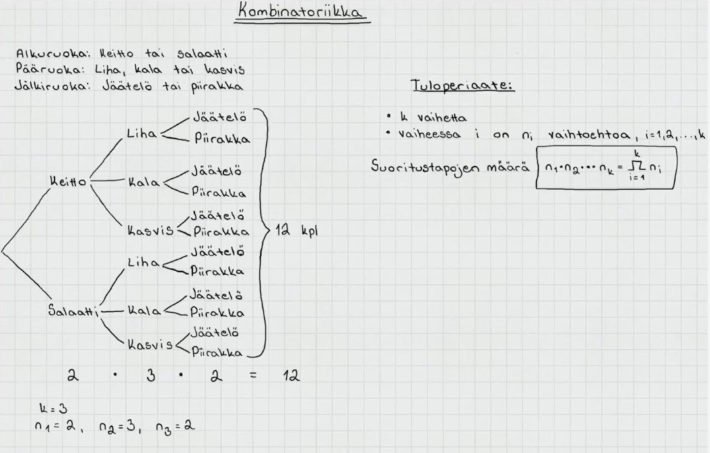

Tuloperiaate:

- kerrotaan kaikkien vaiheiden vaihtoehtojen lukumäärät keskenään

- Kuvan esimerkissä Alkuruoalle on kaksi vaihtoehtoa, pääruoalle kolme ja jälkiruoalle 2

  - vastaus saadaan laskemalla 2 \* 3 \* 2 = 12

 

### Osajoukkojen lukumäärä

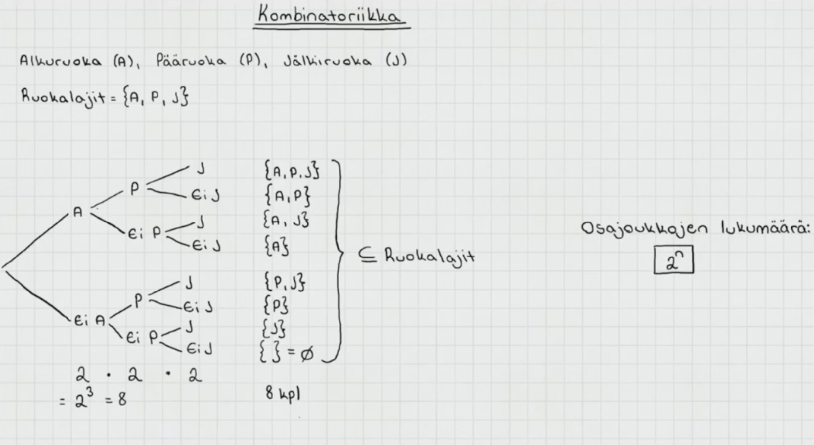

Esimerkissä selvitettiin monellako eri tavalla voidaan valita vaihtoehdot alkuruoka, pääruoka ja jälkiruoka

- alkuruoka joko syödään tai jätetään syömättä, pääruoka joko syödään tai jätetään syömättä, jälkiruoka joko syödään tai jätetään syömättä

- joka vaiheessa on 2 vaihtoehtoa, joten 2 \* 2 \* 2 = 8

Osajoukkojen lukumäärä:

- Kun alkuperäisessä joukossa on n alkiota, niin osajoukkojen lukumäärä on 2\^n

 

### Kertoma ja permutaatiot

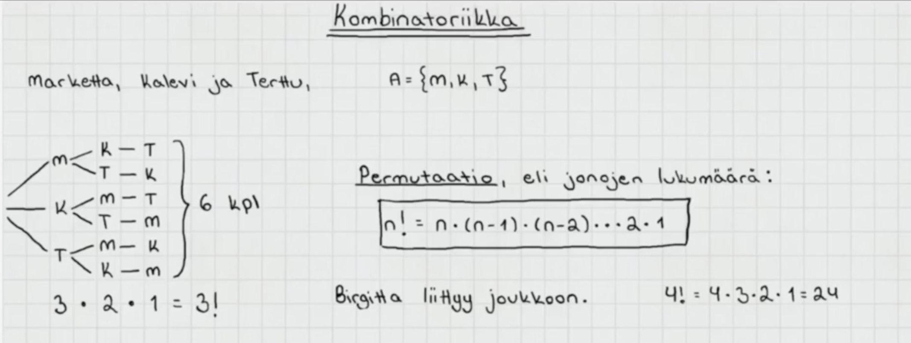

Kuinka moneen eri järjestykseen marketta, kalevi ja terttu voivat mennä istumaan?

- A = {M, K, T} 

- Puukaaviosta nähdään, että mahdollisia eri järjestyksiä on 6. Ensimmäiselle paikalle on kolme vaihtoehtoa, sen jälkeen toiselle paikalle 2 ja viimeiselle paikalle 1.

- Ilman puukaaviota saadaan laskettua tuloperiaatteen avulla 3 \* 2 \* 1 = 6

- Laskevaa tuloa kutsutaan kertomaksi: 3 \* 2 \* 1 = 3!

Permutaatio tarkoittaa jonojen / järjestysten lukumäärää

- Lasketaan joukon alkioden kertomalla: n!

- n! = n \* (n - 1) \* (n - 2) ... 2 \* 1

 

### k-permutaatio

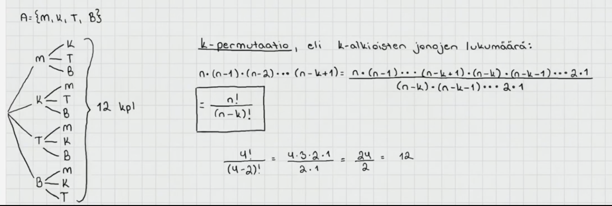

Kuinka monella eri tavalla Marketta, Kalevi, Terttu ja Birgitta voivat istua kahdelle paikalle?

- Ensimmäiselle penkille on 4 vaihtoehtoa. Toiselle penkille joka vaihtoehdon kohdalla 3, joten tuloperiaatteen avulla laskettuna vastaus on 4 \* 3 = 12

k-permutaatiolla tarkoitetaan sitä kuinka moneen eri k alkiota sisältävään jonoon / järjestykseen voidaan luvut asettaa

- n! / (n - k)!

- eli lasketaan koko joukon permutaatiot jaettuna koko joukon alkioden lukumäärän ja jonon pituuden erotuksen permutaatioilla

 

### Binomikerroin

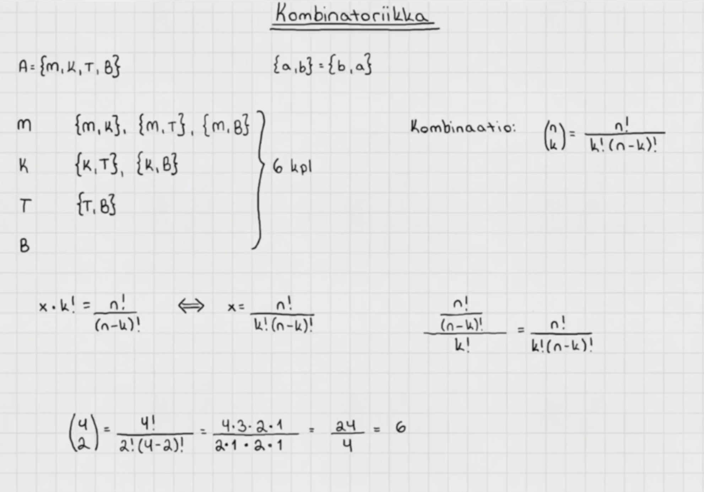

Monellako eri kahden henkilön kokoonpanolla Marketta, Kalevi, Terttu ja Birgitta voivat käydä kaupassa? Tässä merkille pantavaa on se, että ei mietitä nyt järjestyksiä, vaan osajoukkoja. Siis kokoonpanot {Terttu, Marketta} ja {Marketta, Terttu} ovat sama asia.

- Saadaan selville binomikertoimella

Binomikerroin

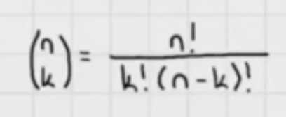{width="220"}

n = koko joukon alkioiden lukumäärä

k = kombinaation koko. Esim. jos halutaan tietää monellako eri 2 henkilön kokoonpanolla 4 ihmistä voivat käydä kaupassa on tuo kahden henkilön kokoonpano kombinaatio.

- Kaava on siis koko joukon alkioiden kertoma jaettuna kombinaation koon kertomalla kerrottuna (n - k) kertomalla

 

## Riippumattomuus

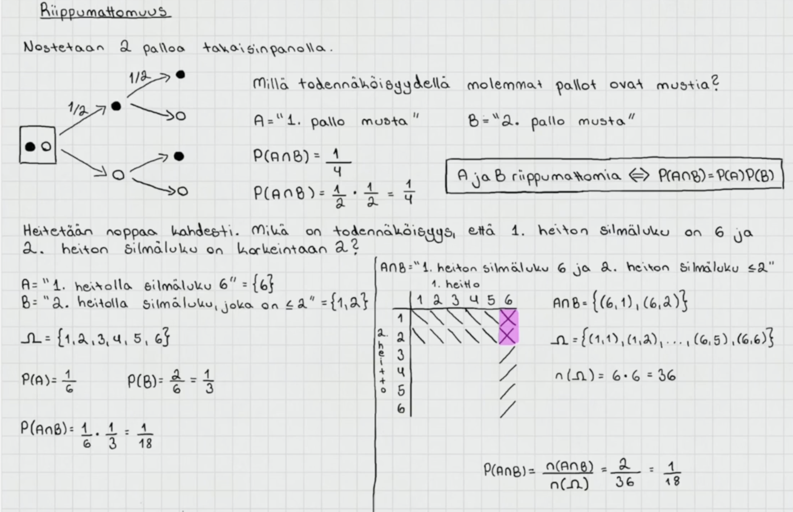

Tapahtumat ovat riippumattomia, kun toinen ei vaikuta toiseen. Esim. kun nostetaan kaksi palloa takaisinpanolla.

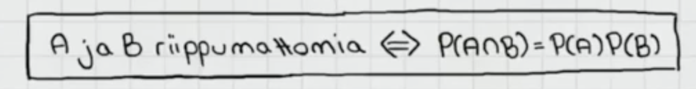{width="556"}

Kun tapahtumat ovat riippumattomia, niiden leikkauksen todennäköisyys saadaan kertolaskusäännöllä tapahtumien todennäköisuuksien tulosta.

- Eli, kun A ja B ovat riippumattomat. A:n ja B:n leikkauksen todennäköisyys on P(A) \* P(B)

 

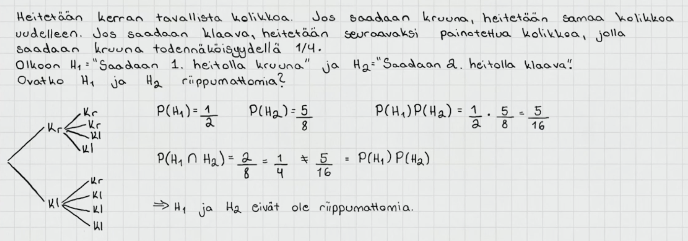

Esimerkki tilanteesta, jossa tapahtumat ovat riippuvaisia. Ensimmäisen heiton (H1) lopputulos vaikuttaa toiseen heittoon (H2). Todistettiin riippuvuus laskemalla tapahtumien todennäköisyyksien tulo (P(H1) \* P(H2) = 5/16) ja verrattiin sitä tapahtumien leikkauksen todennäköisyyteen (1/4) ja ne ovat erisuuret.

Tapahtumien leikkauksen todennäköisyys katsottiin puukaaviosta vertaamalla suotuisia lopputuloksia kaikkiin. Lopputuloksia on kaikkiaan 8 ja suotuisia 2, joten todnäk on 1/4.

 

## Ehdollinen todennäköisyys ja kertolaskusääntö

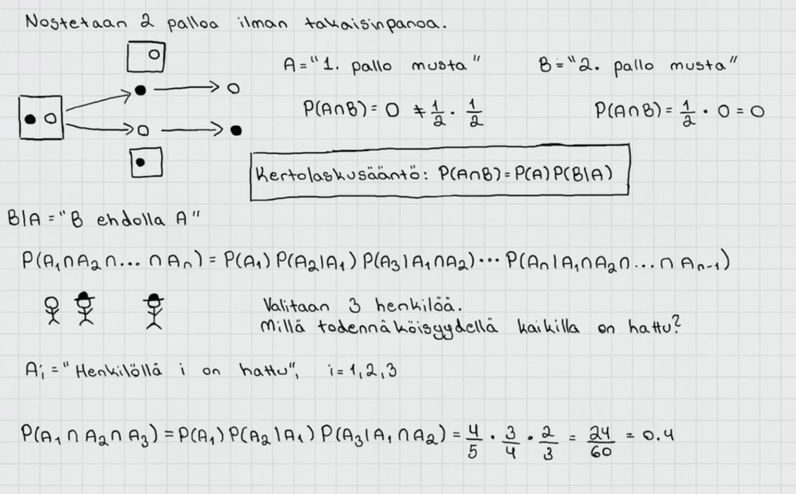

Kun nostetaan kaksi palloa ilman takaisinpanoa tapahtumat eivät ole riippumattomia. Ei siis voida käyttää riippumattomien tapahtumien kertolaskusääntöä. Täytyy käyttää ehdollista kertolaskusääntöä.

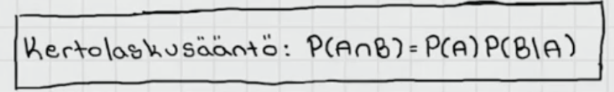{width="389"}

Ehdollinen kertolaskusääntö: A:n ja B:n leikkauksen todennäköisyys on yhtä suuri kuin A:n todennäköisyys kertaa B:n todennäköisyys ehdolla, että A tapahtui. Ehdollista todennäköisyyttä merkataan pystyviivalla.

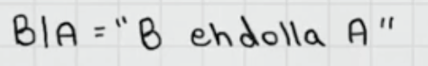{width="246" height="38"}

B\|A = "Tapahtuma B ehdolla, että A toteutuu

 

Kertolaskusääntöä voi käyttää usemmallekin tapahtumalle.

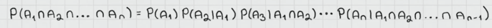{width="781"}

Tällöin myöhempien tapahtumien ehtona on, että kaikki aiemmat ovat tapahtuneet.

 

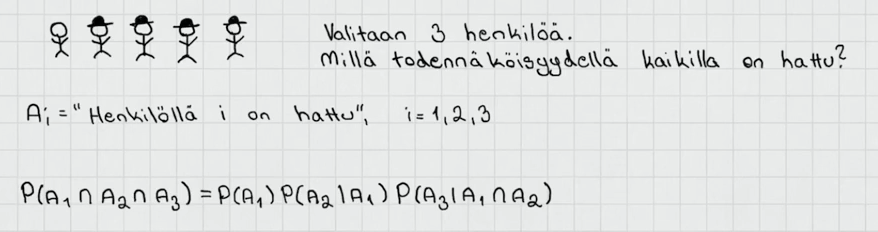

Lasketaan millä todennäköisyydellä satunnaisesti valituilla 3 henkilöllä kaikilla on hattu. Ensimmäisen todennäköisyys on 4/5, sillä henkilöitä on 5 ja hattupäitä 4. Toisena valitun todennäköisyys on 3/4 sillä henkilöitä on 4 ja hattupäitä 3. Viimeisenä valittavan todnäk on 2/3, sillä henkilöitä on 3 ja hattupäitä 2.

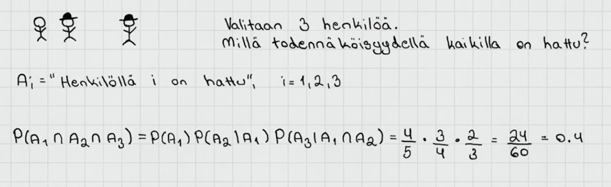{width="625"}

Lasketaan kertolaskusäännöllä ehdollisten todennäköisyyksein tulo ja saadaan tulokseksi 2/5

 

## Ehdollinen todennäköisyys

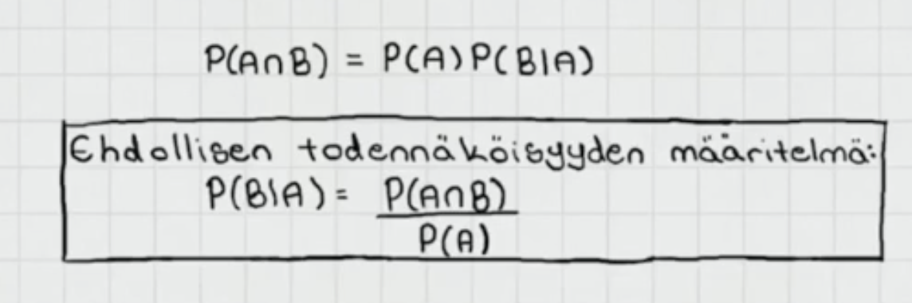{width="563"}

Ehdollisen todennäköisyyden määritelmä:

- P(B\|A) = P(A:n ja B:n leikkaus) / P(A)

- Eli todennäköisyys tapahtumalle B ehdolla, että A on tapahtunut saadaan laskettua jakamalla A:n ja B:n leikkauksen todennäköisyys ehdon eli A:n todennäköisyydellä.

 

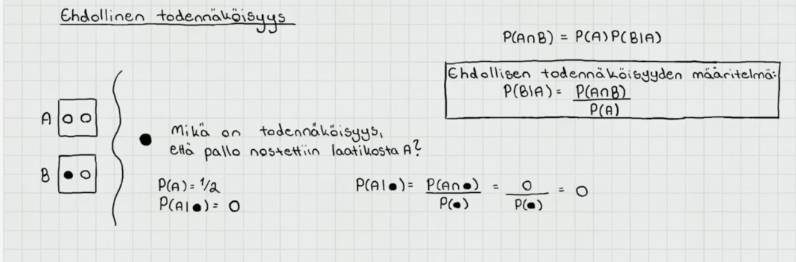

Mikä on todennäkisyys, että musta pallo nostettiin laatikosta A?

- Laatikon A valitsemisen todnäk on 1/2

- Laatikon A valitseminen ehdolla, että nostettiin musta pallo todennäköisyys on nolla

  - Laatikon A ja mustan pallon leikkauksen todennäköisyys on nolla, joten 0 jaettuna ehdon eli mustan pallon todenäköisyydellä on 0

 

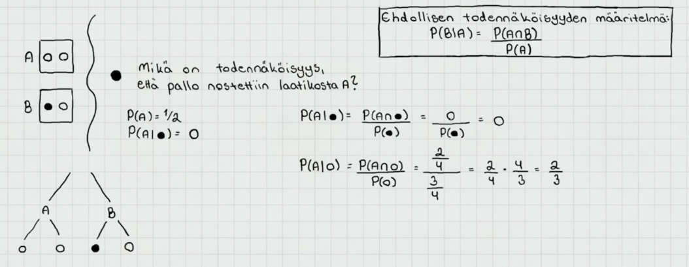

Millä todennäköisyydellä valittiin laatikko A, kun nostettiin valkoinen pallo?

- Puukaaviosta nähdään, että mahdollisia lopputuloksia on yhteensä 4, ja A:lle ja valkoiselle pallolle suotuisia on 2. A:n ja valkoisen pallon leikkauksen todennäköisyys on siis 2 / 4

- Ehdon eli valkoisen pallon todennäköisyys puolestaan on 3/4

- Ehdollisen todennäköisyyden kaavalla saadaan vastaukseksi 2/3

 

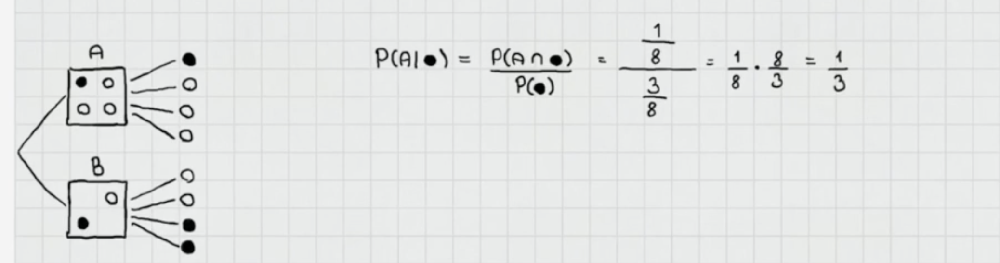

Millä todennäköisyydellä valittiin laatikko A ehdolla, että valittiin musta pallo?

- Lasketaan A:n ja mustan pallon leikkauksen todennäköisyys jaettuna ehdon eli mustan pallon todennäköisyydellä

  - P(A:n ja. mustan pallon leikkaus) = 1/8, koska kahdeksasta alkeistapauksesta yksi on suotuinen sekä A:lle että mustalle pallolle

  - P(musta pallo) = 3/8, koska alkeistapauksista 3 on suotuisia mustalle pallolle

- Jaetaan leikkauksen todennäköisyys ehdon todennäköisyydellä ja saadaan vastaukseksi ehdollinen todennäköisyys 1/3

 

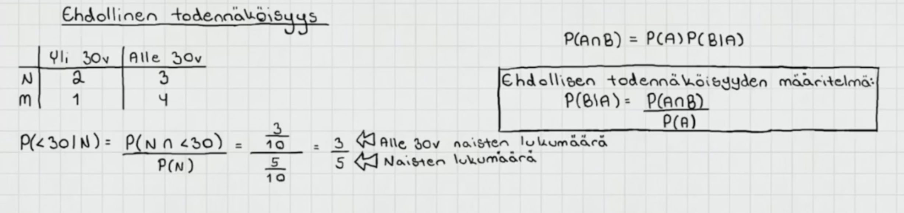

Lasketaan todennäköisyys sille, että valittu henkilö on alle 30v ehdolla, että hän on nainen

 

## Kokonaistodennäköisyys 

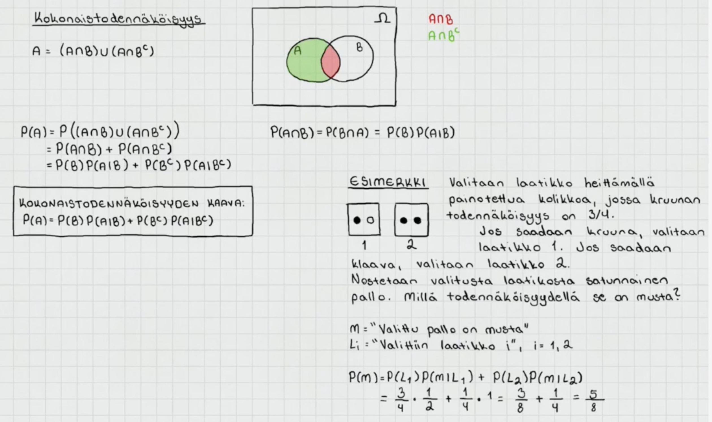

Kokonaistodennäköisyys selvittää todennäköisyyden tilanteessa, jossa lopputulokseen voi päästä monta eri kautta

 

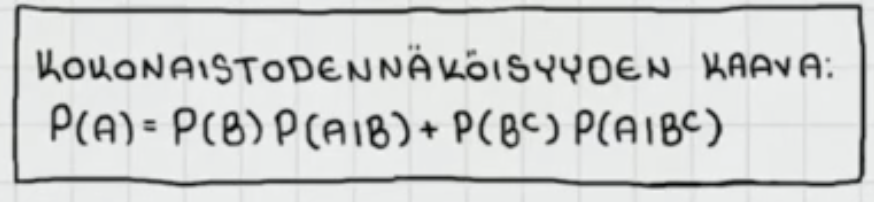{width="479"}

Kokonaistodennäköisyyden kaava

 

## Bayesin kaava

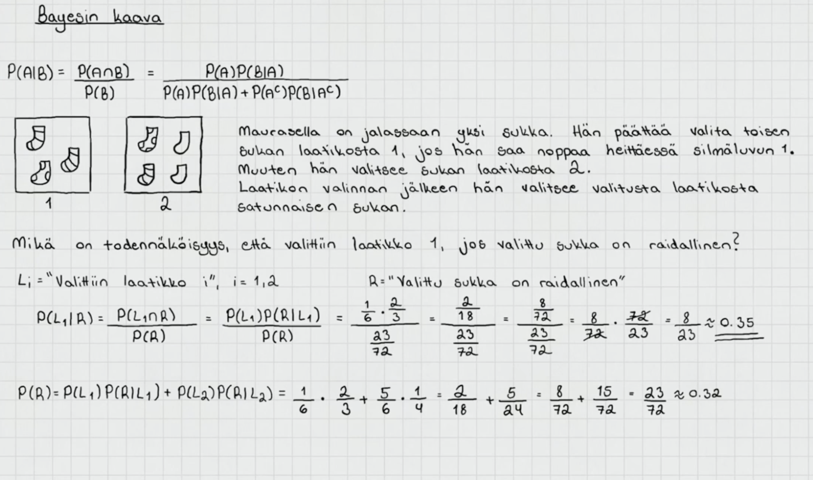

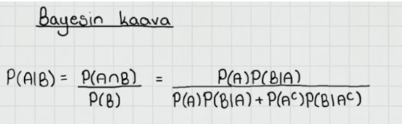{width="501"}
