## Joukko-opin peruskäsitteitä

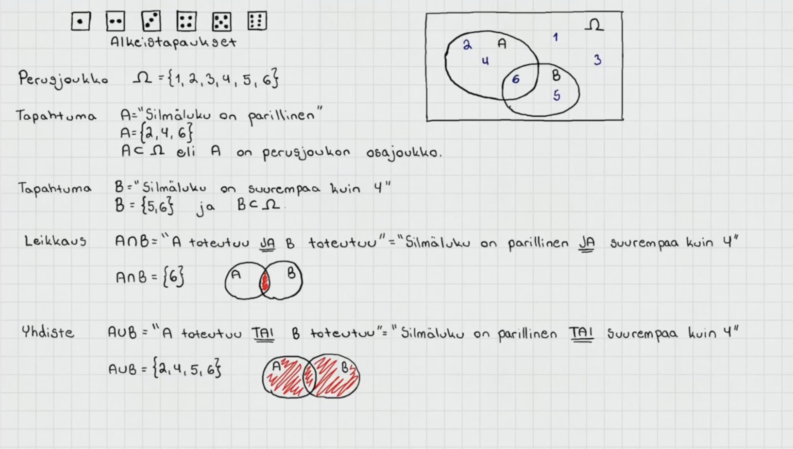

Perusjoukko = joukko, joka sisältää tapahtuman kaikki alkeistapaukset eikä muita alkioita

- merkataan omegalla Ω tai isolla S:llä

Alkeistapaus = tapahtuman mahdollinen lopputulos, esim. nopan silmäluku

- merkitään aaltosulkujen sisään.

- Esim Tapahtuma A = "nopanheiton silmäluku on parillinen" = {2,4,6}

Tapahtumaa, merkitään yleensä isolla kirjaimella esim. A, B tai C

 

Osajoukko = pienempi osa perusjoukosta, tai toisesta osajoukosta

- Esim. Tapahtuma A = {2,4,6} on perusjoukon S = {1,2,3,4,5,6} osajoukko

- osajoukkoa merkitään kyljelleen käännetyllä U kirjaimella ⊂

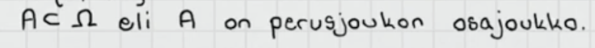{width="400" height="33"}

 

Leikkaus = kahden joukon yhteiset alkeistapaukset

- merkataan päälaelleen käännetyllä U:lla ∩

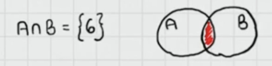{width="300"}

 

Yhdiste = kahden joukon yhdistelmä eli kaikki alkeistapaukset, jotka kuuluvat joukkoon A tai joukkoon B

- inklusiivinen TAI eli yhdisteeseen kuuluu kaikki alkiot, jotka kuuluvat jompaan kumpaan joukkoon tai molempiin.

<!-- -->

- merkataan normaalilla U:lla ∪

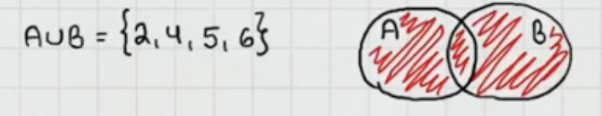

 

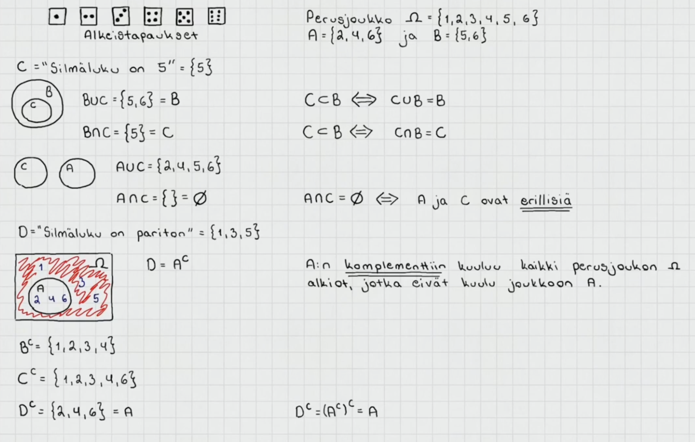

Tapahtuma C = "Silmäluku on 5" = {5}

- Tapahtuma C on tapahtuman B = {5,6} osajoukko

<!-- -->

- Joukkojen B ja C yhdiste on {5,6} = B

  - Eli osajoukon ja joukon yhdiste on sama kuin alkuperäinen joukko

 

Erilliset joukot ovat sellaisia, joilla ei ole yhtään yhteistä alkiota

- Esim joukot C ={5} ja A = {2,4,6} ovat erilliset

- C:n ja A:n leikkaus on tyhjä joukko eli siinä ei ole yhtään alkiota

- Tyhjää joukkoa merkitään ∅

Tapahtuma D = "Silmäluku on pariton" = {1,3,5}

- Tapahtuma D on tapahtuma A:n komplemetti (vastatapahtuma) eli siihen kuuluu kaikki perusjoukon alkiot, jotka eivät kuulu joukkoon A

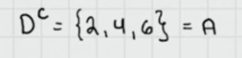{width="200"}

Joukon komplementin komplementti on alkuperäinen joukko itse

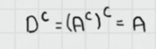{width="200"}

 

 

## De Morganin lait

A:n ja B:n leikkauksen komplementti on A:n komplementin ja B:n komplementin yhdiste

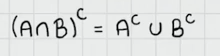

 

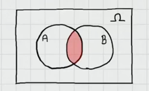

A:n ja B:n leikkaus

 

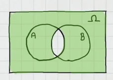

A:n ja B:n leikkauksen komplementti

- toisin sanottuna siis leikkauksen ulkopuolinen alue

 

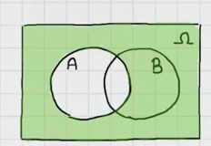

Pelkästään A:n komplementti väritettynä

 

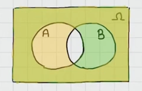

A:n komplementin ja B:n kompelentin yhdiste väritettynä

 

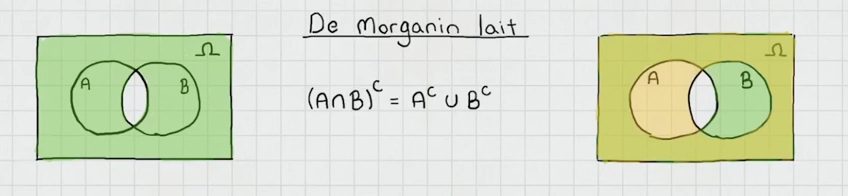

Vassen venn-diagrammi kuvaa yhtälön vasempaa puolta ja oikea diagrammi kuvaa oikeaa

- yhtälö siis pätee eli A:n ja B:n leikkauksen komplementti on sama kuin A:n komplementin ja B:n komplementin yhdiste

 

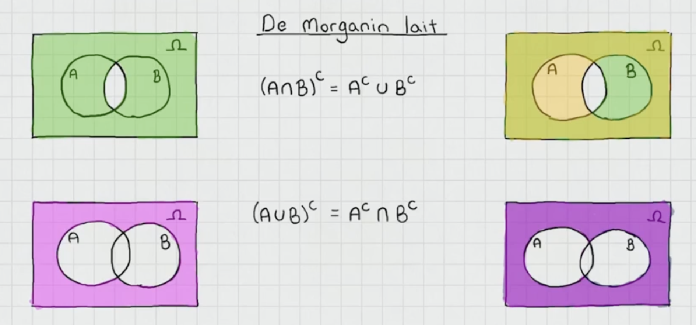

De morganin lait ovat siis

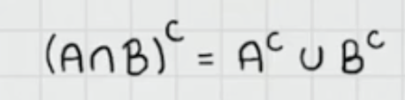{width="200"}

- A:n ja B:n leikkauksen komplementti on sama kuin A:n komplementin ja B:n komplementin yhdiste

Toinen sääntö

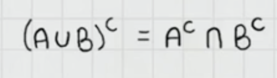{width="200"}

- A:n ja B:n yhdisteen komplementti on sama kuin A:n komplementin ja B:n komplementin leikkaus

   

## Todennäköisyyden ominaisuuksia 

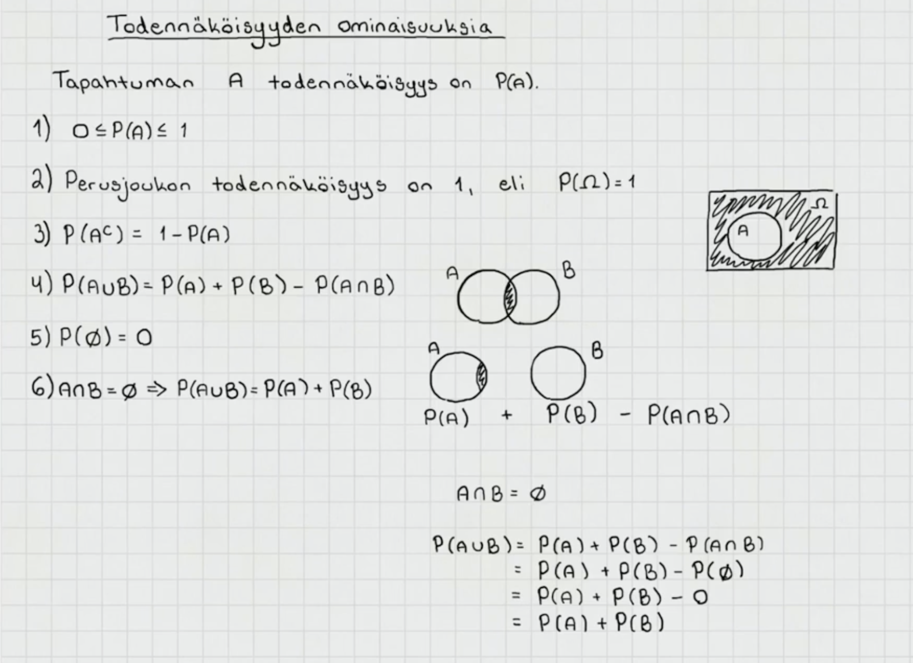Tapahtuman A todennäköisyyttä merkataan P(A)

1\) 0 ≤ P(A) ≤ 1

- Todennäköisyys on aina välillä 0 ja 1. 1 tarkoittaa varmaa tapahtumaa ja 0 mahdotonta

2\) P(Ω) = 1

- Perusjoukon todennäköisyys on 1, koska se sisältää kaikki alkeistapaukset ja on siksi varma tapahtuma

3\) P(A\^c) = 1 -P(A)

- A:n komplementin todennäköisyys on 1 - A:n todennäköisyys

4\) Tapahtumien A ja B yhdisteen todennäköisyys on tapahtumien A ja B todennäköisyyksien summa vähennettynä tapahtumien A ja B leikkauksella. Leikkaus vähennetään, koska se sisältyy molempien A ja B todennäköisyyteen, joten niiden summassa leikkaus on laskettuna kahteen kertaan. Kun se vähennetään, niin se on laskettuna vain kertaalleen ja saadaan yhdisteen oikea todennäköisyys.

5\) Tyhjän tapahtuman todennäköisyys on 0 eli se on mahdoton

6\) Kun tapahtumat A ja B ovat erilliset eli niillä ei ole leikkausta, niin tapahtumien A ja B yhdisteen todennäköisyys voidaan laskea summaamalla tapahtumien A ja B todennäköisyys.

   

Klassinen todennäköisyys

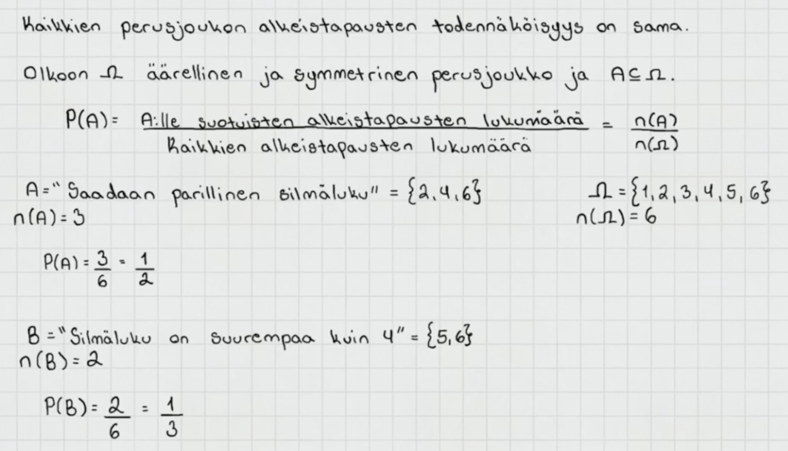

Klassisella todennäköisyydellä tarkoitetaan todennäköisyyttä tilanteissa, joissa alkeistapaukset ovat symmetrisiä. Se tarkoittaa, että perusjoukon kaikkien alkeistapausten todennäköisyys on sama. Esimerkiksi noppaa heitettäessä kaikki alkeistapaukset ovat yhtä todennäköisiä.

 

Klassisen todennäköisyys lasketaan jakamalla suotuisien alkeistapauksien lukumäärä koko perusjoukon alkeistapausten lukumäärällä.

P(A) = n(A) / n(Ω)

  

Esimerkkejä joukko-opin ja todennäköisyyslaskennan perusteista

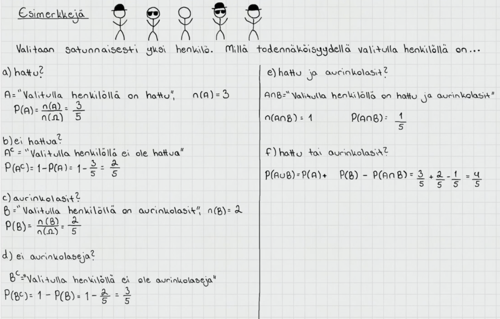

Tehtävässä valitaan perusjoukosta satunnaisesti yksi henkilö, eli kaikki alkeistapaukset ovat symmetrisiä eli yhtä todennäköisiä. Kyse on siis klassisesta todennäköisyydestä.

a\) verrataan suotuisten alkeistapauksien lukumäärää kaikkien alkioiden lukumäärään

b\) tapahtuma on tapahtuman A komplementti eli saadaan vastaus vähentämällä tapahtuman A todennäköisyys 1:stä.

c\) saadaan vastaus vertaamalla tapahtian B suotuisia alkeistapauksia kaikkiin tapauksiin

d\) saadaan vastaus komplementtisäännön avulla ¨

e\) "Valitulla henkilöllä on hattu ja aurinkolasit" –\> molempien täytyy toteutua. Kyse on siis tapahtumien A ja B leikkauksesta.

f\) "hattu tai aurinkolasit" –\> kelpaa kaikki alkiot, joissa on jompi kumpi tai molemmat. Kyse on siis tapahtumien A ja B yhdisteestä. Se saadaan laskemalla P(A) + P(B) - P(A∩B)

 

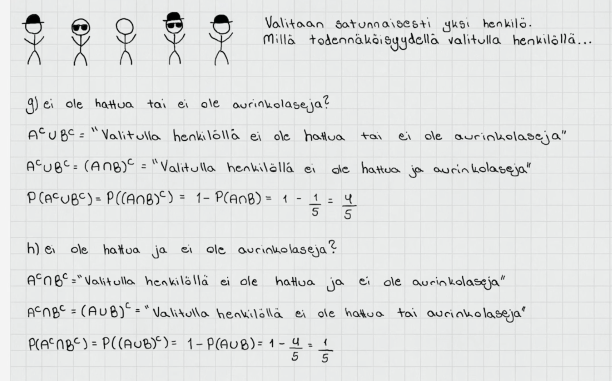

Kohdissa g ja h käytetään De morganin lakeja

g\) A:n ja B:n komplementtien yhdiste on sama kuin A:n ja B:n leikkauksen komplementti

- Lasketaan siis 1 - leikkauksen todnäk ja saadaan vastaukseksi leikkauksen komplementti

h\) A:n ja B:n komplementtien leikkaus on sama kuin A:n ja B:n yhdisteen komplementti

- Lasketaan yhdisteen komplementti vähentämälle A:n ja B:n yhdiste 1:stä
