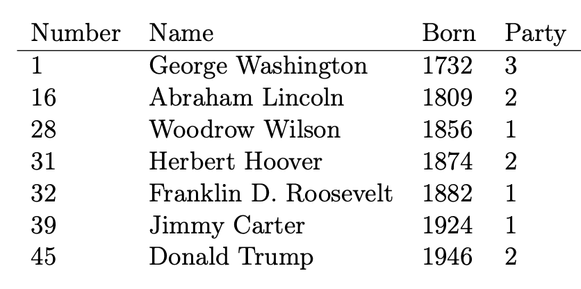
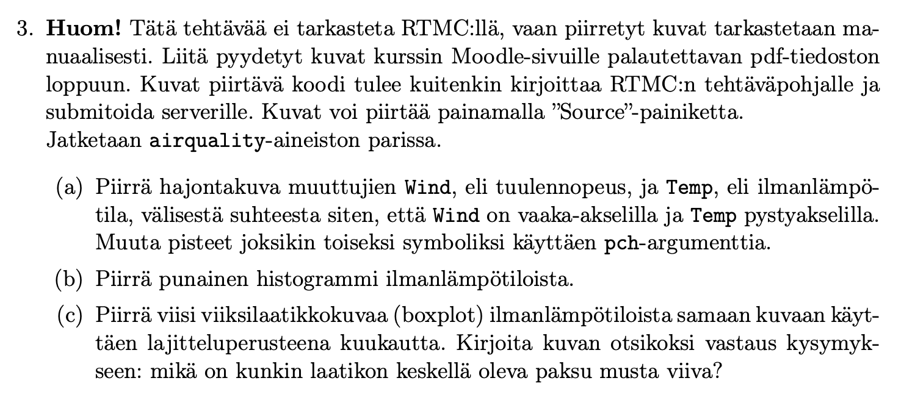
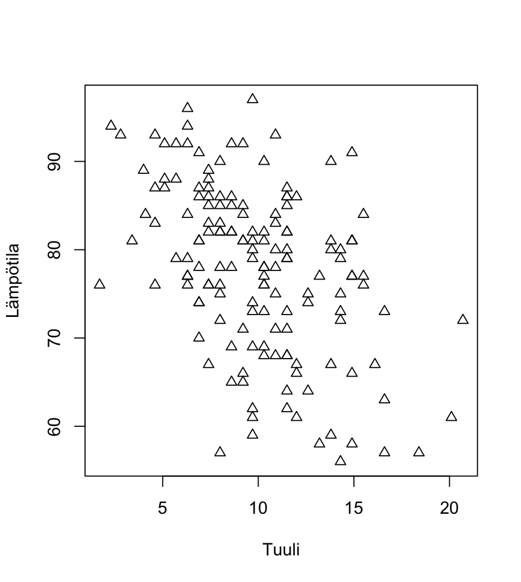
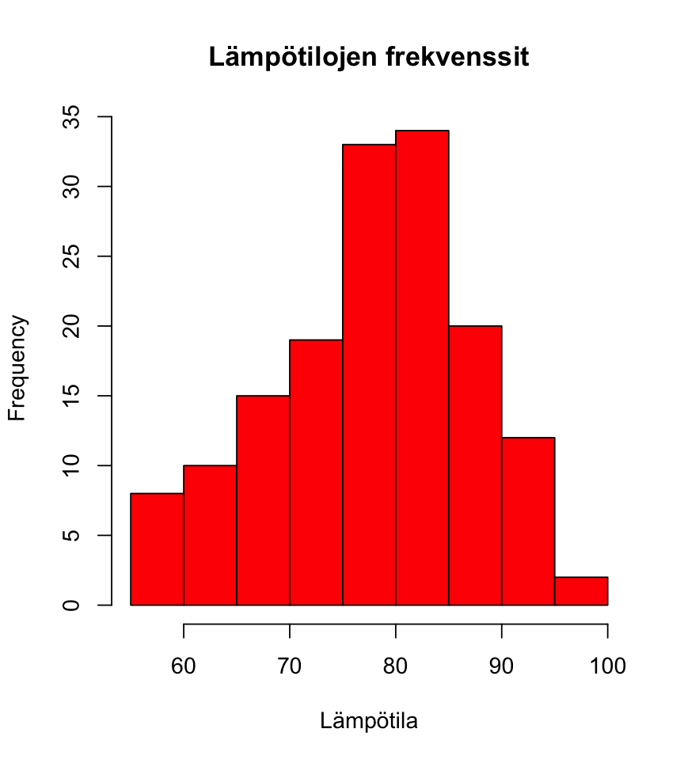
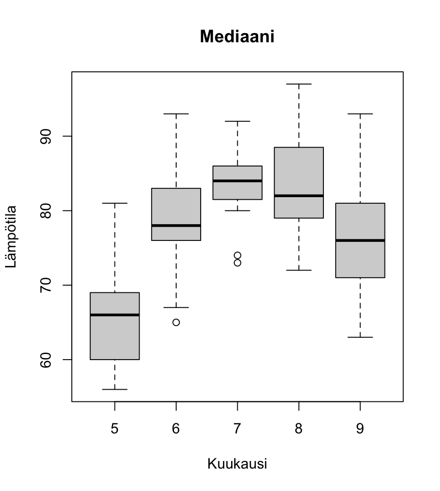

## Viikko 1

<br>

## Viikko 2

### Setti 0.1. Tietotyyppejä ja faktoreita

Tehtävänanto:

> \(a\) Tallenna kokonaisluvut yhdestä kymmeneen (1, 2, ..., 10) numeerina vektorina (jonka pituus on 10) muuttujaan a1.
>
> \(b\) Tallenna kokonaisluvut yhdestä kymmeneen (1, 2, ..., 10) merkkijonotyyppisenä vektorina (jonka pituus on 10) muuttujaan a2. Vihje: funktio as.character.
>
> \(c\) Määritä vektori (non, sense, sense, non, sense) merkkijonotyyppisenä muuttujaan b1.
>
> \(d\) Määritä vektori (non, sense, sense, non, sense) faktorina muuttujaan b2 siten, että faktorin tasoina ovat ”non” ja ”sense”. Vihje: funktio as.factor.

Vastaus:

```{r}
#| eval: false
#| code-fold: true
#| code-summary: "Näytä koodi"

# Week 2 Voluntary exercise 1


# a)
a1 <- seq(1,10, by=1)


# b)
a2 <- as.character(a1)


# c)
b1 <- c("non", "sense", "sense", "non", "sense")


# d)
b2 <- as.factor(b1)


```

<br>

### Setti 0.2. Osa-aineistoja.

Tehtävänanto:

> Määritä matriisi A komennolla A \<- matrix(1:100, nrow=10).
>
> \(a\) Valitse matriisista A sen ensimmäinen rivi, ja tallenna se vektorina muuttujaan v1.
>
> \(b\) Valitse matriisista A sen kolmas sarake, ja tallenna se vektorina muuttujaan v2.
>
> \(c\) Valitse matriisista A rivit 1-7, ja tallenna tuloksena oleva osamatriisi muuttujaan A2.
>
> \(d\) Valitse matriisista A sarakkeet 1, 3 ja 10, ja tallenna tuloksena oleva osamatriisi muuttujaan A3.

Vastaus:

```{r}
#| eval: false
#| code-fold: true
#| code-summary: "Näytä koodi"

# Week 2 Voluntary exercise 2

A <- matrix(1:100, nrow=10)

# a) 
v1 <- A[1, ]


# b)
v2 <- A[ ,3]


# c)
A2 <- A[1:7, ]


# d)
A3 <- A[ ,c(1,3,10)]
```

<br>

### Setti A.1

Tehtävänanto:

> Tarkastellaan oheista taulukkoa, johon on listattu Yhdysvaltain presidenttejä.
>
> \(a\) Syötä ylläolevien sarakkeiden arvot R:ään vektoreiksi Number, Name, Born ja
>
> Party.
>
> {width="396"}
>
> \(b\) Muuta muuttuja Party faktoriksi ja aseta tason 1 kuvaukseksi "Democrat", tason 2 kuvaukseksi "Republican" ja tason 3 kuvaukseksi "None". Vihje: funktio factor.
>
> \(c\) Yhdistä kaikki neljä muuttujaa taulukoksi presidents siten, että muuttujan
>
> Name tietotyyppi säilyy merkkijonona. Varmista komennolla str(presidents), että saat seuraavanlaisen tulosteen:
>
> ’data.frame’: 7 obs. of 4 variables:
>
> \$ Number: num 1 16 28 31 32 39 45
>
> \$ Name : chr "George Washington" "Abraham Lincoln" "Woodrow Wilson" ...
>
> \$ Born : num 1732 1809 1856 1874 1882 ...
>
> \$ Party : Factor w/ 3 levels "Democrat","Republican",..: 3 2 1 2 1 1 2
>
> Varmista erityisesti, että muuttujan Name tietotyyppi on chr.
>
> (TÄRKEÄ HUOMAUTUS. Jos käytät R 4.x.y:tä: Muutaman kokeilun jälkeen, koodisi alkaa toimia testatessa ja konsolilla, mutta yllättäen serveri ei hyväksykään sitä. Tämä johtuu siitä, että serverillä on R 3.x.y versio. Katso lisäsivu R-monisteeseen syksyltä 2020 ja pohdi, kuinka muokkaat koodisi toimimaan myös vanhemmilla R:n asennuksilla. Vihje: stringsAsFactors)

Vastaus:

```{r}
#| eval: false
#| code-fold: true
#| code-summary: "Näytä koodi"

# Week 2 Exercise 1

# In the Viewer tab:
# Press "Source" to run your code.
# Press "Run tests" to run local tests, that won't award any points but may help you to check your solutions. 
# Press "Submit to server" to submit your code and to run the tests that award points. 
# You can re-submit your code as many times you want in order to get any missing points. 

# a)
Number <- c(1,16,28,31,32,39,45)
Name <- c("George Washington", "Abraham Lincoln", "Woodrow Wilson", "Herbert Hoover", "Franklin D. Roosevelt",
          "Jimmy Carter", "Donald Trump")
Born <- c(1732, 1809, 1856, 1874, 1882, 1924, 1946)
Party <- c(3,2,1,2,1,1,2)


# b)

Party <- factor(Party, labels = c("Democrat", "Republican", "None"))


# c)
presidents <- data.frame(Number, Name, Born, Party) 
str(presidents)


```

<br>

### Setti A.2.

Tehtävänanto:

> Tarkastellaan R:n mukana tulevasta paketista datasets löytyvää aineistoa airquality, joka sisältää New Yorkin ilmanlaatumittauksia vuodelta 1973 toukokuusta syyskuuhun. Kun paketti on otettu käyttöön funktiolla library, aineistoon pääsee käsiksi kutsumalla muuttujaa airquality (itse asiassa datasets latautuu automaattisesti käyttöön, kun R:n avaa, koska se on ns. base-paketti). Tarkemman kuvauksen aineistosta saat näkyviin komennolla help(airquality, datasets).
>
> a\) Laske kuinka monta havaintoa eli riviä ja kuinka monta muuttujaa eli saraketta taulukossa airquality on, ja tallenna tulokset muuttujiin n_rows ja n_cols.
>
> b\) Tarkastellaan muuttujaa Ozone, joka kuvaa otsonin keskimääräistä esiintyvyyttä ilmassa. Laske muuttujan Ozone keskiarvo, mediaani ja suurin arvo, ja tallenna tulokset muuttujiin mean_val, median_val ja max_val. Huomaa, että mukana voi olla puuttuvia arvoja, joita ei haluta laskea mukaan.
>
> c\) Laske vain toukokuun ja kesäkuun (kuukaudet 5 ja 6) keskiarvot erikseen ja tallenna tulokset muuttujiin mean5 ja mean6. Kuukaudet on tallennettu integertyyppiseen muuttujaan Month.
>
> d\) Kuinka monta puuttuvaa arvoa Ozone-muuttujalla on toukokuussa, eli kuinka monena päivänä kyseinen arvo on NA? Entä kuinka monta puuttuvaa arvoa on kesäkuussa? Tallenna tiedot muuttujiin na5 ja na6. Vihje: is.na
>
> e\) Kuinka monena päivä Ozone on suurempaa tai yhtä suurta kuin 50? Tallenna vastaus muuttujaan n50. Varmista, että et laske puuttuvia mukaan.

Vastaus:

```{r}
#| eval: false
#| code-fold: true
#| code-summary: "Näytä koodi"

# Week 2 exercise 2

library(datasets)
airquality
# a) 
n_rows <- length(airquality[ ,1])
n_cols <- length(airquality[1, ])


# b) 
mean_val <- mean(airquality$Ozone, na.rm = TRUE)
median_val <- median(airquality$Ozone, na.rm = TRUE)
max_val <- max(airquality$Ozone, na.rm = TRUE)


# c) 

mean5 <-  mean(subset(airquality, airquality$Month == 5)[ ,1], na.rm = TRUE)
mean6 <- mean(subset(airquality, airquality$Month == 6)[ ,1], na.rm = TRUE)


# d)
toukokuu <- subset(airquality, airquality$Month == 5)
kesakuu <- subset(airquality, airquality$Month == 6)
na5 <- sum(is.na(toukokuu$Ozone))
na6 <- sum(is.na(kesakuu$Ozone))


# e)

yli50 <- subset(airquality, airquality$Ozone == 50 | airquality$Ozone > 50)
n50 <- length(yli50[ ,2])


```

<br>

### Setti A.3



Vastaus:

```{r}
#| eval: false
#| code-fold: true
#| code-summary: "Näytä koodi"


# Week 2 exercise 3

# This exercise is NOT TESTED WITH RTMC, but you should use this template to create
# the plots and SUBMIT YOUR CODE TO THE SERVER. After writing your code, the pictures
# can be plotted by pressing "Source" (the pictures will appear on the Plots tab). 

library(datasets)

# a) 
plot(airquality$Wind, airquality$Temp, xlab = "Tuuli", ylab = "Lämpötila", pch=2)

# b)
hist(airquality$Temp, col = "red", xlab = "Lämpötila")

# c)


boxplot(airquality$Temp~ airquality$Month, xlab = "Kuukausi", ylab = "Lämpötila", main = "Mediaani")

### piirretään kuvat pdf:n #### 

pdf("Viikko2_Tehtava_A3.pdf")

print(plot(airquality$Wind, airquality$Temp, xlab = "Tuuli", ylab = "Lämpötila", pch=2))

print(hist(airquality$Temp, col = "red",xlab = "Lämpötila", main = "Lämpötilojen frekvenssit"))

print(boxplot(airquality$Temp~ airquality$Month, xlab = "Kuukausi", ylab = "Lämpötila", main = "Mediaani"))

dev.off()


```

{width="411"}

{width="402"}

{width="380"}
