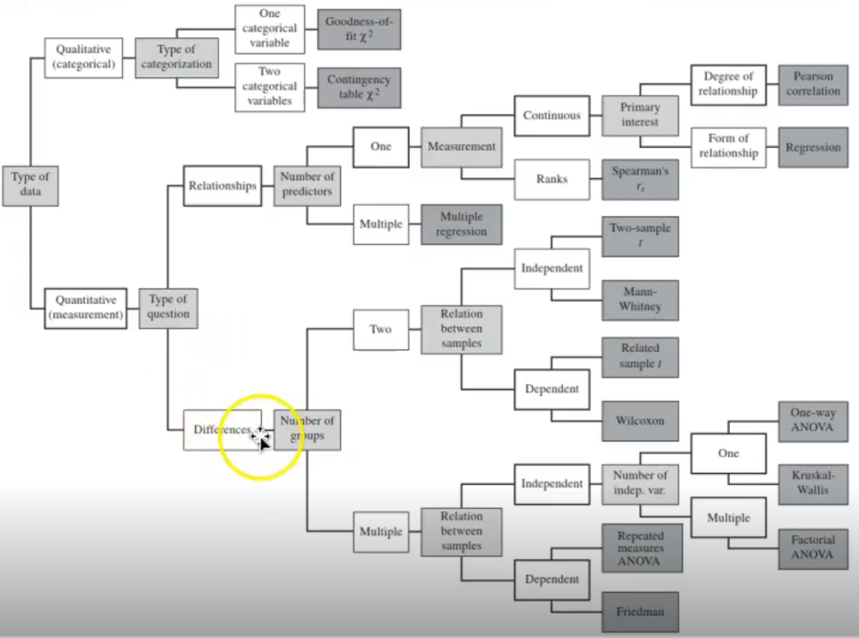
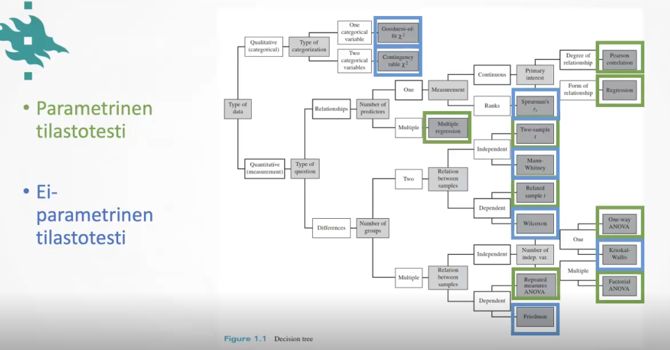
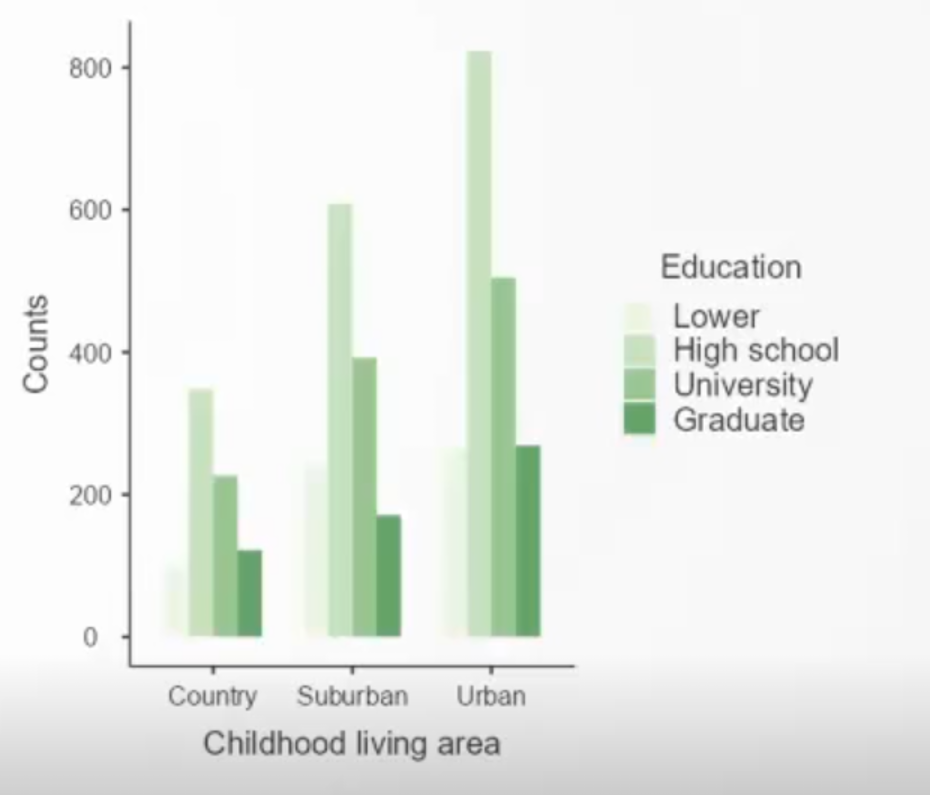
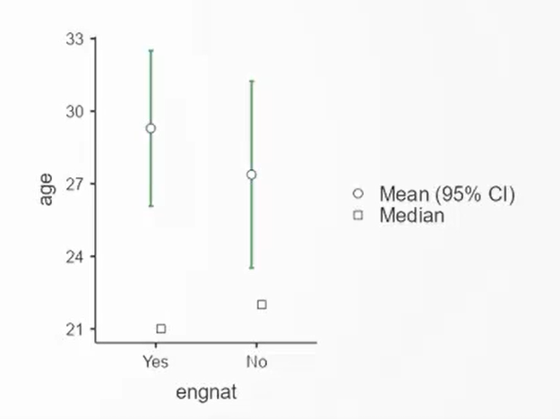
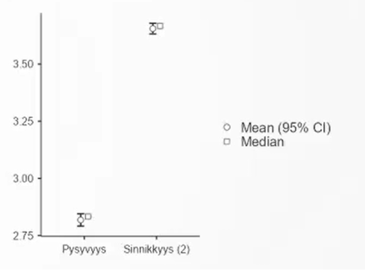
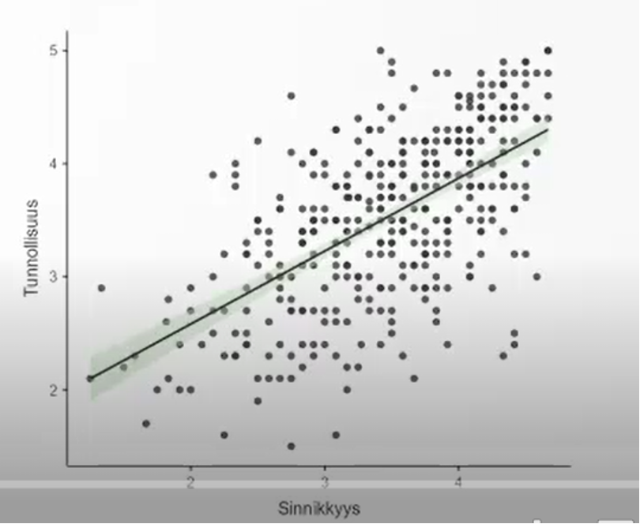
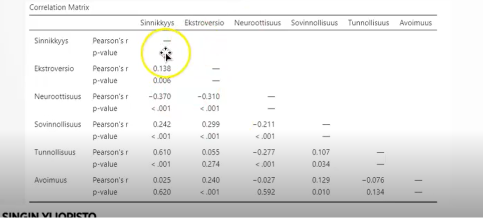
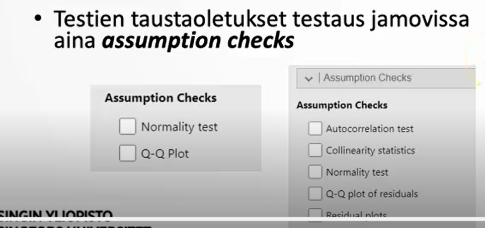

## Tilastotestin valinta 

Tilastotestin valinta

- Muuttujan tyypistä riippuu mitä tilastotestiä voi käyttää

- on tärkeää valita oikeanlainen tilastotesti, asiaan vaikuttavat

  -  Onko muuttuja kategorinen vai jatkuva

  - Onko vertailu koehenkilöiden sisäinen (within-subject) vai välillä (between subjects)

  - Tutkitaanko keskiarvojen eroja (esim. t-testit, anova), muuttujien välistä yhteyttä (esim. korrelaatio, regressio) vai jakauman eroja (chi-square)

 

### Parametrinen vs. ei-parametrinen testi 

parametrinen testi

- olettaa normaalisti jakautuneen aineiston

- otoksen perusteella estimoidaan populaation parametreja ja niiden luottamusvälejä

-  enemmän tilastollista voimaa

-  varmemmin löytää eron, jos sellainen todellisuudessa on

- voi tehdä monimutkaisemman tilastoanalyysin

  - esim. multiple regression

ei-parametrinen testi

-  ei tee oletuksia aineiston jakaumista; voi soveltaa melkein mihin vain aineistoon

- usein riittää, että saamme selville eron/yhteyden tilastollisen merkitsevyyden

 

### Kategoriset muuttujat – tee Chi square testi 

- yksi kategorinen muuttuja -\> ovatko lukumäärät samanlaisia/odotuksenmukaisia eri kategorioissa -\> x^2^ goodness of fit

  - esim. onko potilaiden ja kontrollien määrä sama? onko eri ikäryhmien koko samanlainen?

- kaksi tai useampi kategorinen muuttuja -\> ovatko lukumäärät eri kategorioissa odotuksenmukaisessa yhteydessä toisiinsa -\> x^2^ test of association

  - efektikoko Cramer’s V

  - esim. onko eri asuinalueilla samanlainen koulutustaso? Onko eri ikäryhmissä saman verran eri interventioihin osallistuneita?

- testit ei parametrisiä, jakaumavapaita, ei oletuksia

- visualisoi tulokset palkki/bar kuvalla

{width="500"}

Onko jokaisella asuinalueella eri koulutustasojen jakauma samanlainen?

 

### Yksi jatkuva muuttuja – yksi keskiarvo -\> tee yhden otoksen t-testi 

Yksi ryhmä ja yksi muuttuja, poikkeaako keskiarvo nollasta tai jostain tietystä arvosta -\> One sample T-test

- Studentin t-testi

- efektikoko Cohenin d

- Oletuksena muuttujan normaalijakautuneisuus

  - Shapiro-Wilk testi, jos pieni N

  -  Kolmogorov-Smirnov testi, jos on iso N

  - Q-Q-plot, histogrammi

- Voi laskea myös Bayes faktorin

- Jos normaalisuusoletus ei täyty niin tee ei-parametrinen Wilcoxon rank-testi

  - efektikoko Rank biserial correlation

 

### Yksi jatkuva muuttuja – between subjects – kahden rymän keskiarvojen ero -\> tee riippumattomien otoksien t-testi 

kaksi ryhmää ja yksi muuttuja, poikkeaako ryhmien keskiarvot toisistaan  Independent samples t-test

- Studentin t-testi

- efektikoko Cohenin d

-  Oletuksena muuttujan normaalijakautuneisuus

  - Shapiro-Wilk testi, jos pieni N

  - Kolmogorov-Smirnov testi, jos on iso N

  - Q-Q-plot, histogrammi

-  Oletuksena ryhmien homogeenisuus

  - eli, että ryhmissä on samantasoinen varianssi

  - Levenen testi

-  Voi laskea myös Bayes Faktorin

- Jos homogeenisuus oletus ei täyty, tee Welchin -testi

  - Tai tee aina Welchin testi

  - toimii vaikka homogeenisuusoletus täyttyisi eli voi käyttää aina

- Jos normaaliusoletus ei täyty, niin tee ei-parametrinen Mann Whitney U-testi

  - efektikoko Rank biserial correlation

- Visualisoi tulokset, keskiarvo JA keskiarvon keskivirhe tai luottamusväli

{width="432"}

 

### Jatkuva muuttuja – within subjects – kahden tilanteen keskiarvojen ero -\>  tee riippuvien otosten t-testi 

yksi ryhmä, yksi mitattu asia, kaksi koetilannetta, poikkeaako koetilanteiden keskiarvot toisistaan  Paired samples T-test

-  Studentin t-testi

- efektikoko Cohenin d

- Oletuksena muuttujan normaalijakautuneisuus

  - Shapiro-Wilk testi, jos pieni N

  - Kolmogorov-Smirnov testi, jos on iso N

  - Q-Q-plot, histogrammi

- Voi laskea myös Bayes Faktorin

- Jos normaalisuusoletus ei täyty niin tee ei-parametrinen Wilcoxon rank-testi

  - efektikoko Rank biserial correlation

- Visualisoi tulokset, keskiarvo JA keskiarvon keskivirhe tai luottamusväli

{width="358"}

 

### Kaksi jatkuvaa muuttujaa – within subjects – kahden muuttujan yhteys -\> Laske korrelaatio 

Yksi ryhmä, kaksi muuttujaa, ovatko muuttujat yhteydessä toisiinsa  Correlation

- jos muuttujilla lineaarinen yhteys, laske Pearson

  - Arvioi scatter-plotin perusteella

- Jos muuttujilla monotoninen yhteys, laske Spearman

  -  Ei-parametrinen testi, ei tee oletuksia, perustuu järjestykseen (rank)

- Korrelaatio itsessään efektikoko

- Visualisoi tulokset scatterplotilla

  - Lisää regressiosuora ja hajonta/keskivirhe/luottamusväli

 

### Kaksi jatkuvaa muuttujaa – within subjects – kahden muuttujan yhteys -\> laske regressio 

yksi ryhmä, kaksi muuttujaa, ennustaako ensimmäinen muuttuja toista muuttujaa -\> linear regression

- R^2^ selitysosuus kertoo ilmiön voimakkuudesta (efektikoko)

- muut mittarit: adjusted R^2^, AIC, BIC, RMSE, toimivat vain kun on useampia ennustajia / malleja

- Oletukset

  - ei residuaalien autokorrelaatiota, Durbin-Watson autocorrelation testi

  - Ei muuttujien kollineaarisuutta, Collinearity test

  - Residuaalien normaalijakautuneisuus

    - Shapiro-Wilk testi, jos pieni N

    - Kolmogorov-Smirnov testi, jos on iso N

    - Q-Q-plot, histogrammi

- Visualisoi tulokset scatterplotilla

  - Lisää regressiosuora ja hajonta/keskivirhe/luottamusväli

{width="591"}

 

### Enemmän kuin 2 muuttujaa

Correlation matrix

-  lisää niin monta jatkuvaa muuttujaa, kuin haluat

- Jos paljon korrelaatioita, kuva parempi kuin taulukko

{width="540"}

Korrelaatiomatriisi

 

### Enemmän kuin 2 muuttujaa ja muuttujien kontrollointi (adjustointi) 

Partial correlation

- testaa muuttujien välistä yhteyttä samalla kun kontrolloit muiden muuttujien vaikutuksen

Multiple linear regression

- lisää niin monta muuttujaa kuin haluat

  - ota huomioon ennustettavien muuttujien määrä, N, tilastollinen voima

- Voit lisätä jatkuvia muuttujia ja myös kategorisia muuttujia (dummy koodattuina)

- joko between tai within subjects

- Jokaisen muuttujan itsenäinen vaikutus, muiden muuttujien vaikutus kontrolloituu    

- Lisää muuttujia asteittain hierarkisesti (blocks), vertaile malleja

  - adjusted R^2^, AIC, BIC, RMSE

 

### Keskiarvojen ero kun enemmän kuin 2 ryhmää tai 2 koetilannetta 

Oletukset

- Oletuksena muuttujan normaalijakautuneisuus

  - Shapiro-Wilk testi, jos pieni N

  - Kolmogorov-Smirnov testi, jos on iso N

  - Q-Q-plot, histogrammi

- Oletuksena ryhmien homogeenisuus

  - eli, että ryhmissä on samantasoinen varianssi

  -  Levenen testi

Vain between subjects – ryhmiä 2 tai enemmän

- yksi ennustava (riippumaton) muuttuja -\> one-way ANOVA

  - jos normaaliusoletus ei täyty niin tee ei parametrinen Kruskal-Wallis

- kaksi tai useampia ennustavia (riippumattomia) muuttujia -\> ANOVA (factorial)

- Lisäksi kontrolloi häiriömuuttuja -\> ANCOVA

within subjects – koetilanteita 2 tai enemmän

- Yksi tai useampi ennustaja -\> Repeated measures ANOVA

  - jos normaaliusoletus ei täyty, tee ei-parametrinen Friedman Repeated Measures ANOVA

- Ennustavat muuttujat joko within tai between subjects

 

### Tilastotestien yhteyksiä toisiinsa 

kahden muuttujan välinen regressio vs. korrelaatio

- käytännössä sama asia, regressio -\> scatterplot-kuva suoran kulmakerroin

Kahden ryhmän ero; t-testi vs. ANOVA -\> sama asia

GLM = general linear model

- inear regression

- multiple regression

-  ANOVA

### Taustaoletukset 

- useat parametriset testit olettavat, että aineisto/muuttujat noudattavat suunnilleen normaalijakaumaa

  - normaalijakaumaoletus ei aina kriittinen

- käytännössä tilastotesteissä aina mukana useita muuttujia, tärkeintä silloin on residuaalien normaalijakautuneisuus – yksittäinen muuttuja voi poiketa normaalijakautuneisuudesta

- Testien taustaoletukset testaus jamovissa aina assumption checks

{width="494"}

 

Taustaoletukset

- mitä tehdä, kun oletukset eivät täyty?

  - Muuttujamuunnos

  -  Vaihto ei-parametrisiin testeihin

  - Oletuksen tarkastelu toisella tapaa

- Esim. Jos shapiro-wilk/kolmogorov-smirnov -testi merkitsevä, muuttuja ei normaali

  - tee testit ja raportoi kaikki mitä teit ja perustele valinta (miksi rikoit normaalisuusoletusta) ja pohdi sen vaikutusta)

  - Jos on epävarma, niin parempi tehdä vähemmän oletuksia, eli käyttää ei-parametrista testiä

  -  jos muuttujien välillä on aito ja voimakas yhteys niin tulee näkyviin sekä parametrisillä että ei-parametrisillä testeillä

  - ei-parametrisia testejä saa käyttää vaikka olisi normaalisti jakautuneet muuttujat; testin ero tilastollisessa voimassa

 

### Poikkeavat havainnot 

aineiston tarkastelun jälkeen poikkeavien havaintojen poisto tarvittaessa; usein ei tarvitse poistaa kuin selkeästi virheelliset arvot

- Q-Q-plot

- Mean +/- X\*sd

-  Median +/- X\*mad

- Trim, X% pienimmät / suurimmat arvot

Tilastotestin jälkeen, Q-Q-plotin tarkastelu, havaintojen poisto tarvittaessa

- lineaarinen regressio -\_\> Cook’s distance kertoo kuinka paljon yksittäinen havainto vaikuttaa tulokseen (talleta cook distances  visualisoi scatter plotilla)

Aineistoa ei saisi poistaa liikaa, poikkeavat havainnot yksittäisiä, koko aineistosta korkeintaan muutama prosentti

- virheelliset arvot ainoat, jotka täytyy aina poistaa

 

Aineiston käsittelyvaiheiden vaikutus

- Testin valinta, poikkeavat havainnot, muuttujamuunnokset yms. vaikuttavat tulokseen

- Aina pitää tehdä valintoja/korjauksia/muunnoksia, kaikki tutkijat tekevät niitä, tärkeää on

  - tiedostaa, että valinnat vaikuttavat lopputulokseen

  - selkeät kriteerit/perusteet valinnoille

  - valintojen tarkka raportointi

Testitulosten raportointi ja tulkinta

- Tulokset

  - keskiarvojen ero, suunta

  - muuttujien välinen yhteys

  - P-arvo, tilastollinen merkitsevyys

  - Efektikoko, selitysosuus

- Pohdinta

  - tuloksen merkityksellisyys, uutuus, odotustenmukaisuus jne.

  - Tehtyjen valintojen vaikutus

 

Yksinkertainen usein hyvä

- Parempi tehdä yksinkertainen analyysi, jonka ymmärtää ja osaa, kuin monimutkainen analyysi, jota ei osaa tai ymmärrä miten se toimii

  - parempi tehdä yksinkertaiset analyysit oikein ja kattavasti, kuin monimutkaiset analyysit väärin tai puutteellisesti

- Tilastoanalyyseja voi tehdä myös kahdessa vaiheessa: ensin adjustointi/mallinnus sitten tilastotesti – kaksi yksinkertaista tilastotestiä yhden monimutkaisen sijaan

  -  esim. fMRI ensin jokaiselle koehenkilölle oma regressioanalyysi, sitten t-testi onko kaikilla koehenkilöillä samanlaiset regression beta-kertoimet

  -  kontrolli ja koeryhmä, ikä vaihtelee, ensin adjustoidaan muuttujan arvot iän mukaan ja poistetaan iän vaikutus, sitten tehdään t-testi
