## Tilastotestin valinta

Tilastotestin valinta

- Muuttujan tyypistä riippuu mitä tilastotestiä voi käyttää

- on tärkeää valita oikeanlainen tilastotesti, asiaan vaikuttavat

  - Onko muuttuja kategorinen vai jatkuva

  - Onko vertailu koehenkilöiden sisäinen (within-subject) vai välillä (between subjects)

  - Tutkitaanko keskiarvojen eroja (esim. t-testit, anova), muuttujien välistä yhteyttä (esim. korrelaatio, regressio) vai jakauman eroja (chi-square)

 

### Parametrinen vs. ei-parametrinen testi

parametrinen testi

- olettaa normaalisti jakautuneen aineiston

- otoksen perusteella estimoidaan populaation parametreja ja niiden luottamusvälejä

- enemmän tilastollista voimaa

- varmemmin löytää eron, jos sellainen todellisuudessa on

- voi tehdä monimutkaisemman tilastoanalyysin

  - esim. multiple regression

ei-parametrinen testi

- ei tee oletuksia aineiston jakaumista; voi soveltaa melkein mihin vain aineistoon

- usein riittää, että saamme selville eron/yhteyden tilastollisen merkitsevyyden

 

### Kategoriset muuttujat – tee Chi square testi

- yksi kategorinen muuttuja -\> ovatko lukumäärät samanlaisia/odotuksenmukaisia eri kategorioissa -\> x^2^ goodness of fit

  - esim. onko potilaiden ja kontrollien määrä sama? onko eri ikäryhmien koko samanlainen?

- kaksi tai useampi kategorinen muuttuja -\> ovatko lukumäärät eri kategorioissa odotuksenmukaisessa yhteydessä toisiinsa -\> x^2^ test of association

  - efektikoko Cramer’s V

  - esim. onko eri asuinalueilla samanlainen koulutustaso? Onko eri ikäryhmissä saman verran eri interventioihin osallistuneita?

- testit ei parametrisiä, jakaumavapaita, ei oletuksia

- visualisoi tulokset palkki/bar kuvalla

{width="500"}

Onko jokaisella asuinalueella eri koulutustasojen jakauma samanlainen?

 

### Yksi jatkuva muuttuja – yksi keskiarvo -\> tee yhden otoksen t-testi

Yksi ryhmä ja yksi muuttuja, poikkeaako keskiarvo nollasta tai jostain tietystä arvosta -\> One sample T-test

- Studentin t-testi

- efektikoko Cohenin d

- Oletuksena muuttujan normaalijakautuneisuus

  - Shapiro-Wilk testi, jos pieni N

  - Kolmogorov-Smirnov testi, jos on iso N

  - Q-Q-plot, histogrammi

- Voi laskea myös Bayes faktorin

- Jos normaalisuusoletus ei täyty niin tee ei-parametrinen Wilcoxon rank-testi

  - efektikoko Rank biserial correlation

 

### Yksi jatkuva muuttuja – between subjects – kahden rymän keskiarvojen ero -\> tee riippumattomien otoksien t-testi

kaksi ryhmää ja yksi muuttuja, poikkeaako ryhmien keskiarvot toisistaan  Independent samples t-test

- Studentin t-testi

- efektikoko Cohenin d

- Oletuksena muuttujan normaalijakautuneisuus

- Shapiro-Wilk testi, jos pieni N

- Kolmogorov-Smirnov testi, jos on iso N

- Q-Q-plot, histogrammi

- Oletuksena ryhmien homogeenisuus

- eli, että ryhmissä on samantasoinen varianssi

- Levenen testi

- Voi laskea myös Bayes Faktorin

- Jos homogeenisuus oletus ei täyty, tee Welchin -testi

  - Tai tee aina Welchin testi

  - toimii vaikka homogeenisuusoletus täyttyisi eli voi käyttää aina

- Jos normaaliusoletus ei täyty, niin tee ei-parametrinen Mann Whitney U-testi

  - efektikoko Rank biserial correlation

- Visualisoi tulokset, keskiarvo JA keskiarvon keskivirhe tai luottamusväli

{width="432"}

 

### Jatkuva muuttuja – within subjects – kahden tilanteen keskiarvojen ero -\> tee riippuvien otosten t-testi

yksi ryhmä, yksi mitattu asia, kaksi koetilannetta, poikkeaako koetilanteiden keskiarvot toisistaan  Paired samples T-test

- Studentin t-testi

- efektikoko Cohenin d

- Oletuksena muuttujan normaalijakautuneisuus

  - Shapiro-Wilk testi, jos pieni N

  - Kolmogorov-Smirnov testi, jos on iso N

  - Q-Q-plot, histogrammi

- Voi laskea myös Bayes Faktorin

- Jos normaalisuusoletus ei täyty niin tee ei-parametrinen Wilcoxon rank-testi

  - efektikoko Rank biserial correlation

- Visualisoi tulokset, keskiarvo JA keskiarvon keskivirhe tai luottamusväli

{width="358"}

 

### Kaksi jatkuvaa muuttujaa – within subjects – kahden muuttujan yhteys -\> Laske korrelaatio

Yksi ryhmä, kaksi muuttujaa, ovatko muuttujat yhteydessä toisiinsa  Correlation

- jos muuttujilla lineaarinen yhteys, laske Pearson

  - Arvioi scatter-plotin perusteella

- Jos muuttujilla monotoninen yhteys, laske Spearman

  - Ei-parametrinen testi, ei tee oletuksia, perustuu järjestykseen (rank)

- Korrelaatio itsessään efektikoko

- Visualisoi tulokset scatterplotilla

  - Lisää regressiosuora ja hajonta/keskivirhe/luottamusväli

 

### Kaksi jatkuvaa muuttujaa – within subjects – kahden muuttujan yhteys -\> laske regressio

yksi ryhmä, kaksi muuttujaa, ennustaako ensimmäinen muuttuja toista muuttujaa -\> linear regression

- R^2^ selitysosuus kertoo ilmiön voimakkuudesta (efektikoko)

- muut mittarit: adjusted R^2^, AIC, BIC, RMSE, toimivat vain kun on useampia ennustajia / malleja

- Oletukset

  - ei residuaalien autokorrelaatiota, Durbin-Watson autocorrelation testi

  - Ei muuttujien kollineaarisuutta, Collinearity test

  - Residuaalien normaalijakautuneisuus

    - Shapiro-Wilk testi, jos pieni N

    - Kolmogorov-Smirnov testi, jos on iso N

    - Q-Q-plot, histogrammi

- Visualisoi tulokset scatterplotilla

  - Lisää regressiosuora ja hajonta/keskivirhe/luottamusväli

{width="591"}

 

### Enemmän kuin 2 muuttujaa

Correlation matrix

- lisää niin monta jatkuvaa muuttujaa, kuin haluat

- Jos paljon korrelaatioita, kuva parempi kuin taulukko

{width="540"}

Korrelaatiomatriisi

 

### Enemmän kuin 2 muuttujaa ja muuttujien kontrollointi (adjustointi)

Partial correlation

- testaa muuttujien välistä yhteyttä samalla kun kontrolloit muiden muuttujien vaikutuksen

Multiple linear regression

- lisää niin monta muuttujaa kuin haluat

  - ota huomioon ennustettavien muuttujien määrä, N, tilastollinen voima

- Voit lisätä jatkuvia muuttujia ja myös kategorisia muuttujia (dummy koodattuina)

- joko between tai within subjects

- Jokaisen muuttujan itsenäinen vaikutus, muiden muuttujien vaikutus kontrolloituu    

- Lisää muuttujia asteittain hierarkisesti (blocks), vertaile malleja

  - adjusted R^2^, AIC, BIC, RMSE

 

### Keskiarvojen ero kun enemmän kuin 2 ryhmää tai 2 koetilannetta

Oletukset

- Oletuksena muuttujan normaalijakautuneisuus

  - Shapiro-Wilk testi, jos pieni N

  - Kolmogorov-Smirnov testi, jos on iso N

  - Q-Q-plot, histogrammi

- Oletuksena ryhmien homogeenisuus

  - eli, että ryhmissä on samantasoinen varianssi

  - Levenen testi

Vain between subjects – ryhmiä 2 tai enemmän

- yksi ennustava (riippumaton) muuttuja -\> one-way ANOVA

  - jos normaaliusoletus ei täyty niin tee ei parametrinen Kruskal-Wallis

- kaksi tai useampia ennustavia (riippumattomia) muuttujia -\> ANOVA (factorial)

- Lisäksi kontrolloi häiriömuuttuja -\> ANCOVA

within subjects – koetilanteita 2 tai enemmän

- Yksi tai useampi ennustaja -\> Repeated measures ANOVA

  - jos normaaliusoletus ei täyty, tee ei-parametrinen Friedman Repeated Measures ANOVA

- Ennustavat muuttujat joko within tai between subjects

 

### Tilastotestien yhteyksiä toisiinsa

kahden muuttujan välinen regressio vs. korrelaatio

- käytännössä sama asia, regressio -\> scatterplot-kuva suoran kulmakerroin

Kahden ryhmän ero; t-testi vs. ANOVA -\> sama asia

GLM = general linear model

- inear regression

- multiple regression

- ANOVA

### Taustaoletukset

- useat parametriset testit olettavat, että aineisto/muuttujat noudattavat suunnilleen normaalijakaumaa

  - normaalijakaumaoletus ei aina kriittinen

- käytännössä tilastotesteissä aina mukana useita muuttujia, tärkeintä silloin on residuaalien normaalijakautuneisuus – yksittäinen muuttuja voi poiketa normaalijakautuneisuudesta

- Testien taustaoletukset testaus jamovissa aina assumption checks

{width="494"}

 

Taustaoletukset

- mitä tehdä, kun oletukset eivät täyty?

  - Muuttujamuunnos

  - Vaihto ei-parametrisiin testeihin

  - Oletuksen tarkastelu toisella tapaa

- Esim. Jos shapiro-wilk/kolmogorov-smirnov -testi merkitsevä, muuttuja ei normaali

  - tee testit ja raportoi kaikki mitä teit ja perustele valinta (miksi rikoit normaalisuusoletusta) ja pohdi sen vaikutusta)

  - Jos on epävarma, niin parempi tehdä vähemmän oletuksia, eli käyttää ei-parametrista testiä

  - jos muuttujien välillä on aito ja voimakas yhteys niin tulee näkyviin sekä parametrisillä että ei-parametrisillä testeillä

  - ei-parametrisia testejä saa käyttää vaikka olisi normaalisti jakautuneet muuttujat; testin ero tilastollisessa voimassa

 

### Poikkeavat havainnot

aineiston tarkastelun jälkeen poikkeavien havaintojen poisto tarvittaessa; usein ei tarvitse poistaa kuin selkeästi virheelliset arvot

- Q-Q-plot

- Mean +/- X\*sd

- Median +/- X\*mad

- Trim, X% pienimmät / suurimmat arvot

Tilastotestin jälkeen, Q-Q-plotin tarkastelu, havaintojen poisto tarvittaessa

- lineaarinen regressio -\_\> Cook’s distance kertoo kuinka paljon yksittäinen havainto vaikuttaa tulokseen (talleta cook distances  visualisoi scatter plotilla)

Aineistoa ei saisi poistaa liikaa, poikkeavat havainnot yksittäisiä, koko aineistosta korkeintaan muutama prosentti

- virheelliset arvot ainoat, jotka täytyy aina poistaa

 

Aineiston käsittelyvaiheiden vaikutus

- Testin valinta, poikkeavat havainnot, muuttujamuunnokset yms. vaikuttavat tulokseen

- Aina pitää tehdä valintoja/korjauksia/muunnoksia, kaikki tutkijat tekevät niitä, tärkeää on

  - tiedostaa, että valinnat vaikuttavat lopputulokseen

  - selkeät kriteerit/perusteet valinnoille

  - valintojen tarkka raportointi

Testitulosten raportointi ja tulkinta

- Tulokset

  - keskiarvojen ero, suunta

  - muuttujien välinen yhteys

  - P-arvo, tilastollinen merkitsevyys

  - Efektikoko, selitysosuus

- Pohdinta

  - tuloksen merkityksellisyys, uutuus, odotustenmukaisuus jne.

  - Tehtyjen valintojen vaikutus

 

Yksinkertainen usein hyvä

- Parempi tehdä yksinkertainen analyysi, jonka ymmärtää ja osaa, kuin monimutkainen analyysi, jota ei osaa tai ymmärrä miten se toimii

  - parempi tehdä yksinkertaiset analyysit oikein ja kattavasti, kuin monimutkaiset analyysit väärin tai puutteellisesti

- Tilastoanalyyseja voi tehdä myös kahdessa vaiheessa: ensin adjustointi/mallinnus sitten tilastotesti – kaksi yksinkertaista tilastotestiä yhden monimutkaisen sijaan

  - esim. fMRI ensin jokaiselle koehenkilölle oma regressioanalyysi, sitten t-testi onko kaikilla koehenkilöillä samanlaiset regression beta-kertoimet

  - kontrolli ja koeryhmä, ikä vaihtelee, ensin adjustoidaan muuttujan arvot iän mukaan ja poistetaan iän vaikutus, sitten tehdään t-testi

 

## Tilastollisen aineistonkäsittelyn vaiheet

Tutkimuksen ja tilasto

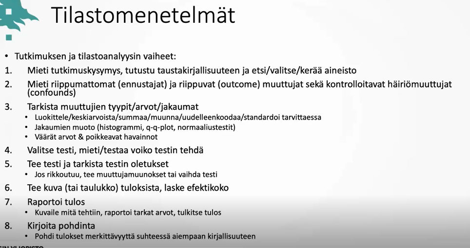

- tilastotestin teko ja oletusten tarkistus

- kuva kannattava, koska ihmiset lukevat niitä helpommin kuin taulukoita

- efektikoon laskeminen tärkeää

- tulosten raportointi ja tulkinta

 

## Chi square testit

X^2^ testi

- kategorisen datan frekvenssien arviointi

  - jos riippuva muuttuja on kategorinen, lähes aina tehdään x^2^ testi

  - tai logistinen regressio

- verrataan odotettuja ja havaittuja frekvenssejä toisiinsa

  - esim. onko sukupuoli edustettuna samalla tavalla kaikissa ikäryhmissä? Tai onko eri ryhmät samalla tavalla kouluttautuneita=

- Ristiintaulukointi

  - Contingency tables

- Chi-square goodness of fit

  - yhteensopivuustesti

  - yksittäinen muuttuja

- Chi-square test of association

  - riippumattomuustesti

  - useampi muuttuja

  - tehdään taulukointi

- Ei parametrinen testi eli ei taustaoletuksia muuttujasta

- perustuu frekvensseihin

- testisuure X^2^

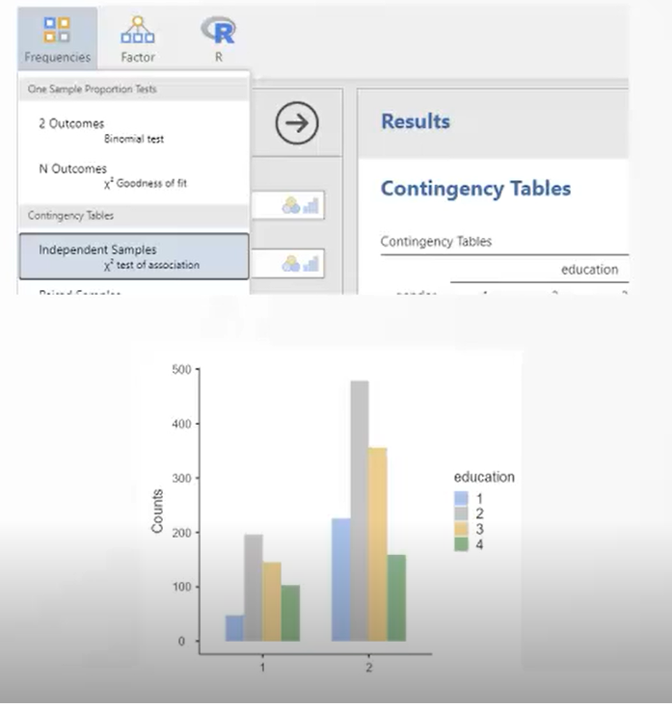{width="600"}

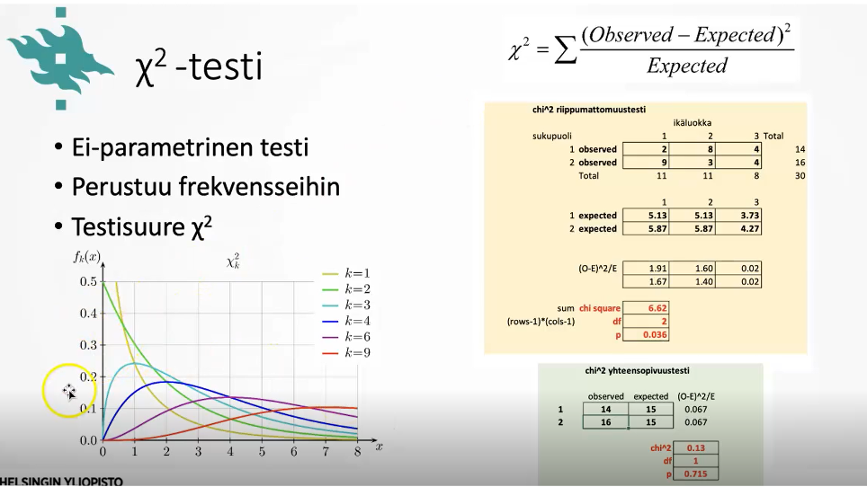

 

### Chi-toiseen riippumattomuustesti

- pienemmillä vapausasteilla jyrkempi, kun vapausasteet kasvaa muoto liikkuu kohti suurempia arvoja

- kun saadaan testisuurearvo, etsitään kuvaajasta p-arvo testisuureelle

- 1\. taulukkoon havaitut määrät

- 2\. taulukkoon odotetut määrät

  - asketaan: kokonaismäärät kerrottuna keskenään ja jaettuna koko aineiston koolla

  - Odotettu määrä -\> 11 (1. ikäluokan kokonaismäärä) \* (1. sukupuolen kokonaismäärä) 14 / 30 (koko aineiston koko) = 5,13

- Kun saatu odotetut määrät laskettua lasketaan havaittujen ja odotettujen määrien erotus, korotetaan se toiseen ja jaetaan se odotetulla määrällä. Tämä tehdään joka kohdalle ja niistä lasketaan summa.

  - 1\. sukupuolen 1. ikäluokka,

    - (2 – 5,13)^2^/5,13 = 1,91

    - (Havaittu arvo – odotettu arvo)^2^ / Odotettu arvo  tehdään kaikille ja summataan ne yhteen  saadaan chi square testisuure

- df =lasketaan riippumattomuustestistä   (rivien määrä – 1) \* (sarakkeiden määrä – 1) 

  - kuvassa -\> rivit 2-1 = 1, sarakkeet 3-1 = 2, eli 2 \* 1 = 2

  - vapausaste, df = 2

- kuvasta voidaan katsoa vapausasteen 2 eli vihreältä kuvaajalta testisuurearvon 6,62 kohdalta p-arvon suuruus

  - p-arvo vain 0,036 ja siis tilastollisesti merkitsevä mikä tarkoittaa, että sukupuolet eivät ole jakautuneet samalla tavalla eri ikäluokissa. Eli nollahypoteesin hylkäys tarkoitti sitä, että jakaumissa on eroa.

### Yhteensopivuustesti

- jos otoksessa 14 naista ja 16 miestä, jos haluttaisiin saman verran miehiä ja naisia odotettu määrä 15

- lasketaan (havaittu – odotettu)\*toiseen / odotettu = 0,067

  - lasketaan summa 0,067 + 0,067 = 0,13

  - df, vapausaste = 1

  - p yli 0,05, eli ei merkitsevä ja nollahypoteesi jää voimaan, joten voidaan todeta, että ryhmien välillä ei ole eroa

### Miten tehdään jamovissa?

Goodness of fit

- bugi jamovissa, kuvittelee, että on arvoja 0 ja 3 vaikka ne olisi merkitty puuttuviksi

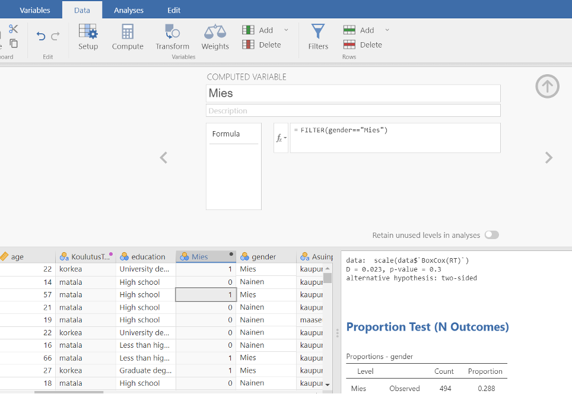{width="600"}

- voidaan korjata tekemällä uusi dikotominen muuttuja

  - polku: computed variable  function FILTER(gender==”Mies”)

 

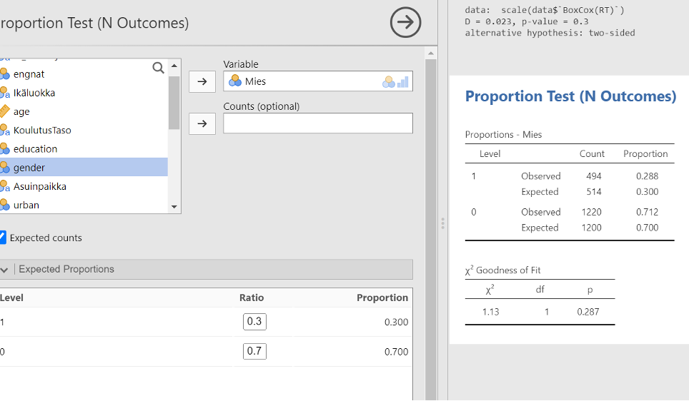

 

jos lisää tietoa, niin ratio kohtaan voidaan tehdä muutoksia, joka muuttaa odotettuja lukumääriä

- esim. videolla, että vain 30% miehistä vastasi kyselyyn ja 70% naisisista

- vaatii vahvaa teoreettista perustelua

Goodness of fit vastasi kysymykseen miten hyvin havaittu aineisto noudattaa odotettua jakaumaa

 

Chi-square test of association, riippumattomuustesti

- ei bugia jamovissa eli toimii suoraan alkuperäisillä muuttujilla

- alla kuvasta näkee odotetut ja havaitut lukumäärät

- high school ja university luokissa ne ovat suht samat, mutta alle high school ja graduate tasoilla eroja havaituissa ja odotetuissa

- tilastotestin p-arvona alle 0,05 eli nollahypoteesi hylätään, mikä tarkoittaa että luokat ovat jakautuneet eri tavalla luokkiin. Eli sukupuolet ovat jakautuneet eri tavoin eri koulutustasoille. Jos testistä tulisi yli 0,05 p-arvona se tarkoittaisi, että jakautuminen on samanlaista.

- jos aineistosta löytyy solu, jossa hyvin pieni lukumäärä tai nolla niin sitä ei pysty kunnolla tekemään. Alle 5 on tällainen lukumäärä.

  - continuity correctionilla pystyy kokeilla korjaamaan

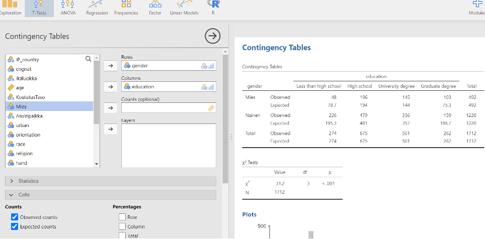

Statistics kohdasta continuity correction

Hypothesis kohdasta voi muuttaa hypoteesin suuntaa

Cramerin V, kuvaa efektikokoa (tsekkaa netistä miten lukuarvoa tulkitaan)

- 1 ja 0 välillä, kuvassa siis efektikoko suht pieni

 

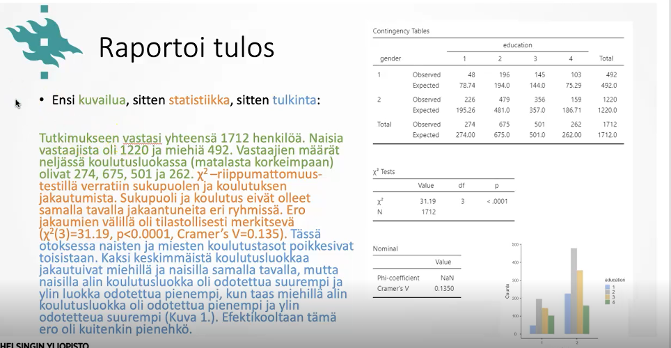

- x^2^ chi square testisuure, (vapausaste), p-arvo ja efektikoko

### Chi square testi r-kielellä

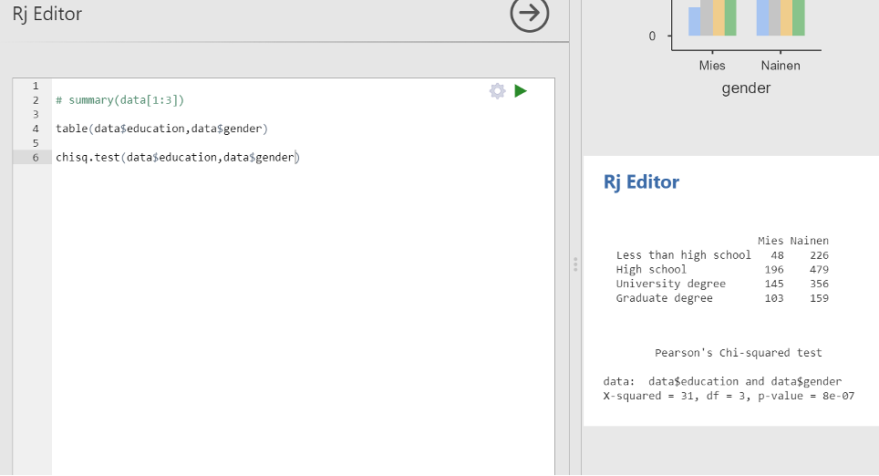{width="600"}

r kielellä chi-square test of association:

- table(data\$education,data\$gender)

- chisq.test(data\$education,data\$gender)  testifunktio

R-kielellä chi-square goodness of fit testi:

- summary(data\$gender)

- chisq.test( c(494, 1220), p=c(.5,.5))  testifunktio, 494 ja 1220 ovat ryhmien lukumäärät

 

Chi-square excelissä

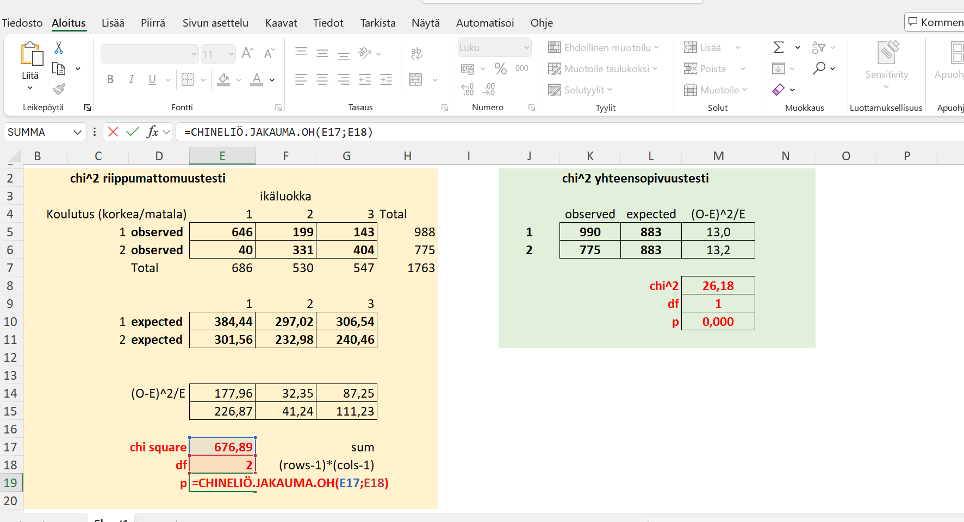{width="600"}

Excelissä chi-square testin p-arvo lasketaan kaavalla: CHINELIÖ.JAKAUMA.OH(x;df)

- englanniksi: CHISQ.DIST.RT(x;df)

- x kohdalle chi-square testisuure ja df kohdalle vapausaste

Riippumattomuustestissä odotusarvojen laskenta

- sarakkeen summa \* rivin summa / kaikkien summalla

  - esim. sarake 1 ja rivi 1

  - 686\*998  / 1763 =

- tehdään kaikille soluille

- sitten lasketaan kaikille soluille

- Linkki exceltiedostoon

 

Chi-square testin nollahypoteesi:

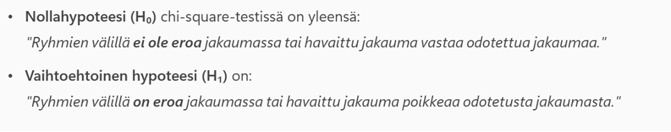{width="600"}

- eli, jos p-arvo on merkitsevä (\<0.05)  ryhmien välillä on eroa tai havaittu jakauma poikkeaa odotetusta

- jos taas p-arvo ei ole merkitsevä (\>0.05)  ryhmien välillä ei ole eroa, tai havaittu jakauma vastaa odotettua.

 

## T-testit

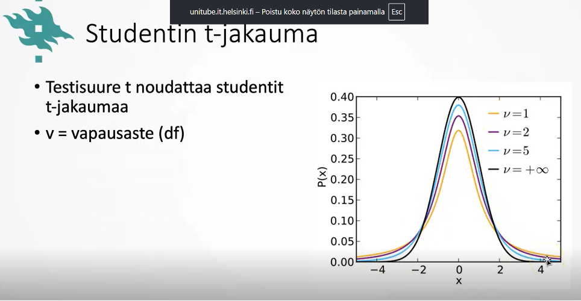{width="600"}](images/clipboard-4073433710.png){width="600"}

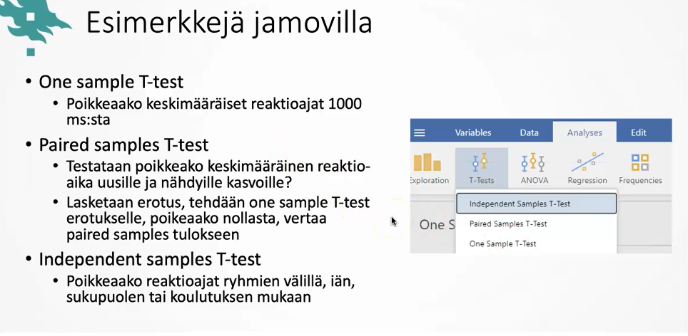{width="600"}

### One sample T-test jamovissa

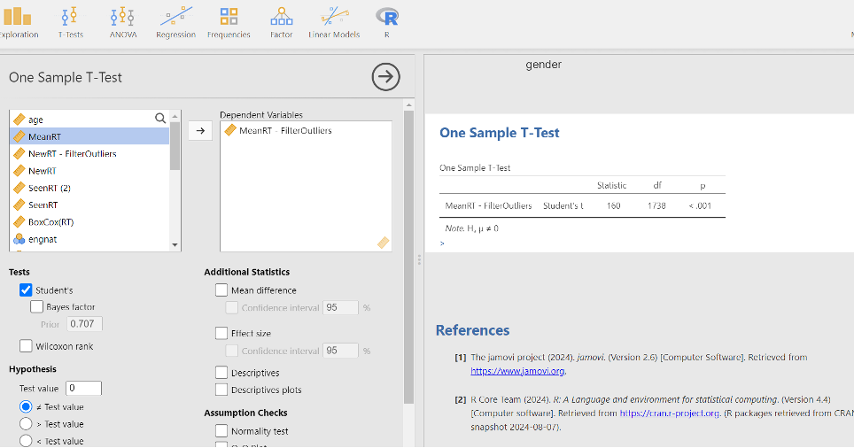

 

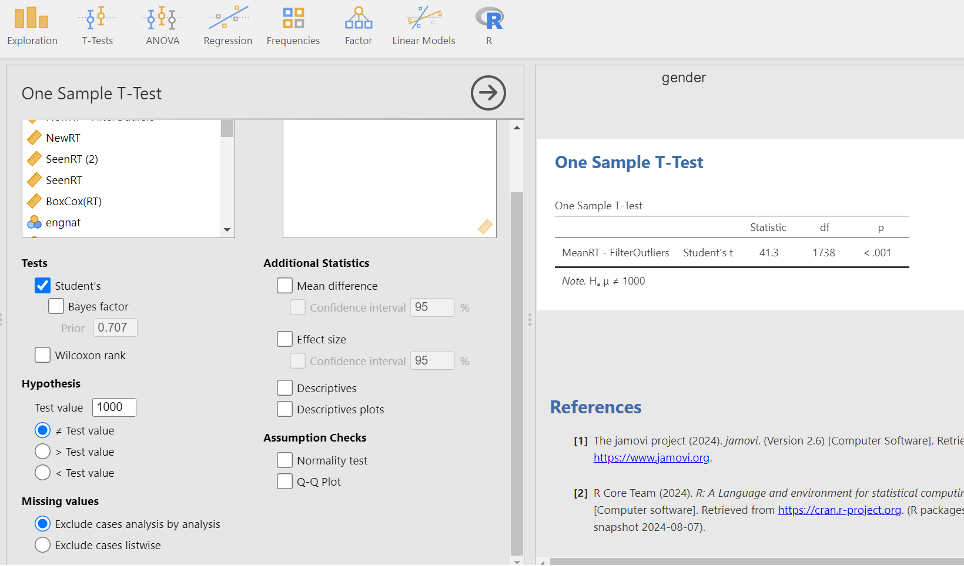

tässä kuvassa test valuena 0, alhaalla voi valita sen, jos testataan useampaa muuttujaa ja jossakin on puuttuvia arvoja niin poistetaanko silloin muuttuja kaikista analyyseistä vai vain siitä, josta se puuttuu

 

Testin tulkinta

- statistic tarkoittaa t-arvoa eli testisuuretta

- df tarkoittaa vapausastetta

- p- arvo on p-arvo

- esim. toisessa kuvassa testisuure t-arvo on 41,3, joka on hyvin suuri arvo, mikä tarkoittaa, että muuttujan keskiarvo poikkeaa paljon 1000 millisekunnista

- efektikoko Cohen’s d

  - kertoo montako keskihajontaa ryhmien keskiarvot eroavat toisistaan

 

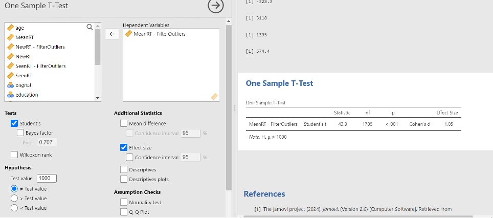{width="600"}

- kuvassa cohen’s d on 1,05 eli vähän keskiarvojen ero on vähän yli 1 keskihajonta, mikä tulkitaan isoksi eroksi

- HUOM! aiemmissa kuvissa minulla oli eri aineistoversio käytössä, joten älä ihmettele lukujen pieniä eroja

 

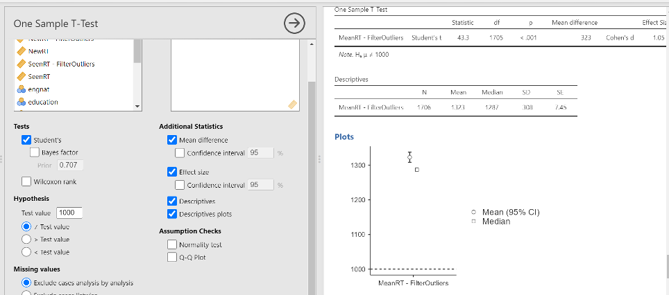

- descriptivesisistä saa esille N, keskiarvon, mediaanin, keskihajonnan ja keskivirheen

- descriptive plotsista kuvaajan, josta näkee keskiarvon ja sen luottamusvälit ja mihin se sijoittuu suhteessa vertailtuun arvoon

 

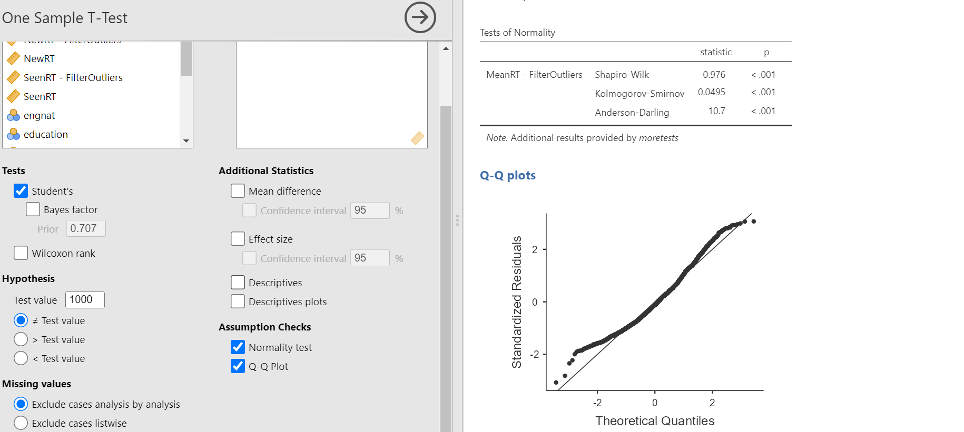Assumption checks

- saa tarkastettua noudattaako muuttujan jakauma normaalisuusoletusta

- kuvassa jakauma rikkoo normaalisuusoletusta

  - testien tulokset ovat p-arvoltaan merkitseviä  nollahypoteesi hylätään eli vaihtoehtoinen hypoteesi astuu voimaan, joka normaalisuustesteissä on ettei jakauma ole normaalisti jakautunut

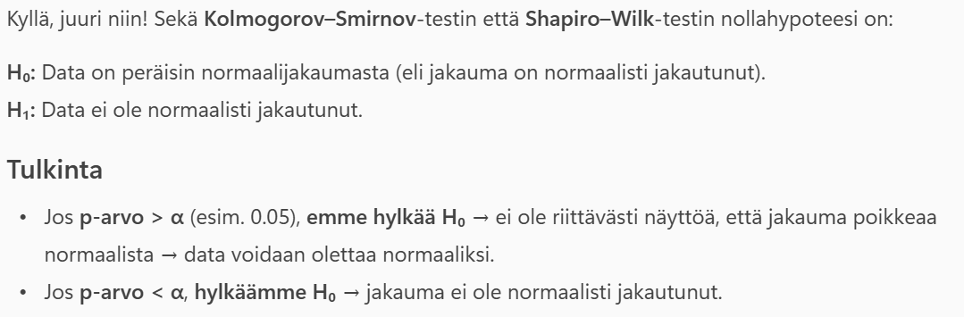{width="600"}

- koska muuttuja poikkeaa normaalijakaumasta pitäisi harkita muuttujamuunnosta, ei-parametrista testiä tai sitten perustella miksi pystytään silti käyttämään kyseistä testiä

Ei-parametrinen testi: Wilcoxon rank

- efektikoko: rank biserial correlation

 

### Paired samples T-testi

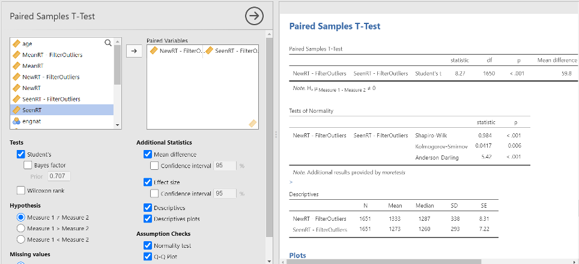

- tähän pätee samat asiat asiat jamovissa kuin one sample t-testiin

- tulos kertoo poikkeavatko kahden mittauskerran keskiarvot toisistaan

- kuvan normaalisuusoletus rikkoutuu, joten täytyisi tehdä muuttujamuunnos, ei-parametrinen testi tai perustella miksi kuitenkin voidaan käyttää testiä

 

### Independent samples T-test

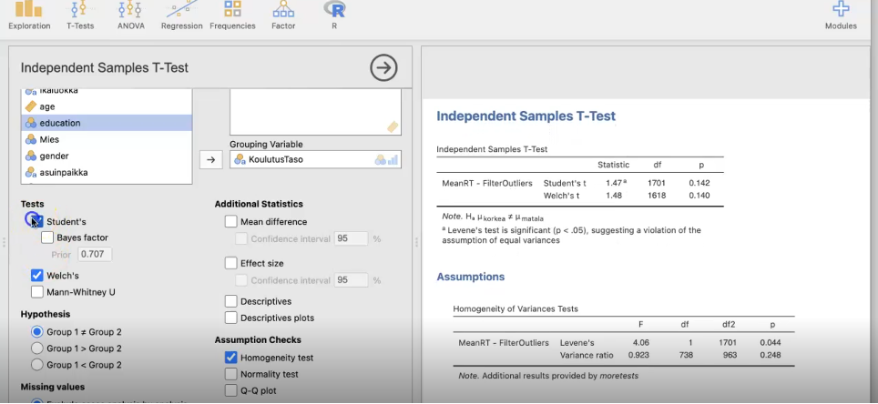

- testataan homogeenisuustestillä

- Levene’s testi, jos p\<.05 eli merkitsevä tarkoittaa, että varianssit eivät ole samanlaiset

- Levenen testin nollahypoteesi: Varianssit ovat samanlaiset

- Welchin testi -\> käytetään, jos varianssit ovat erilaiset

  - osaa ottaa huomioon varianssien erilaisuuden

- Toimii myös silloin kun varianssit ovat samanlaiset eli sen voi tehdä variansseista riippumatta. Silloin kun varianssit ovat samat se on täsmälleen samanlainen kuin Studentin t-testi

Mann-Whitney U testi ei parametrinen vaihtoehto

 

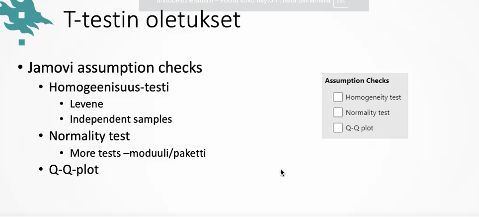

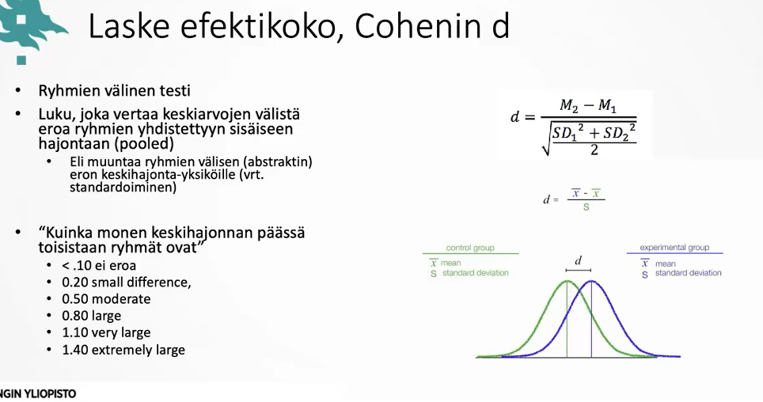

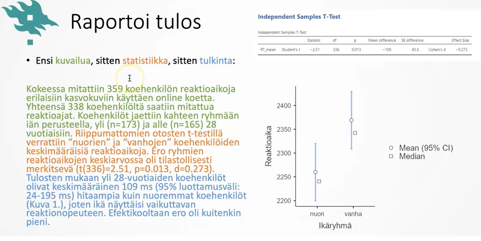

- kuvaillaan ryhmät

- kerrotaan testisuure, vapausasteet suluissa, p-arvo ja efektikoko

- viimeiseksi tulkinta siitä mitä tulos tarkoittaa

 

### Ei-parametriset testit

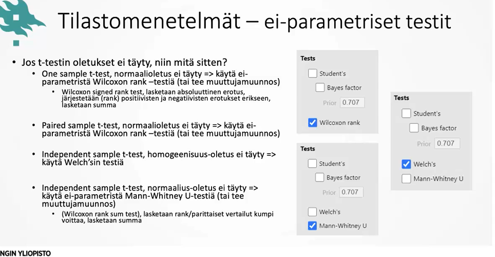

- one sample, normaalisuusoletus ei täyty -\> wilcoxon rank, tai muuttujamuunnos

- paired sample (within subjects), normaalisuusoletus ei täyty -\> wilcoxon rank tai muuttujamuunnos

- independent sample (between subjects), homogeenisuusoletus ei täyty -\> käytä Welch’sin testiä

- independent sample (between subjects), normaalisuusoletus ei täyty -\> Mann-Whitney U testi tai muuttujamuunnos

 

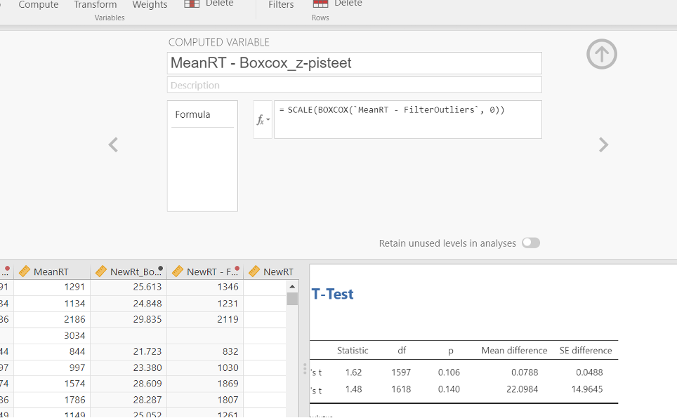

- SCALE funktiolla saadaan normalisotua.

- Tällöin keskiarvoero mean difference näkyy z-pisteinä

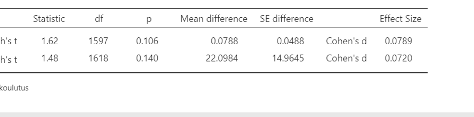

 

## Korrelaatio

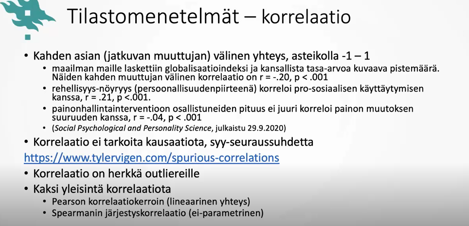{width="600"}

<https://www.tylervigen.com/spurious-correlations>

- Pearson -\> Lineaarinen yhteys oletuksena

- Spearman -\> ei-parametrinen

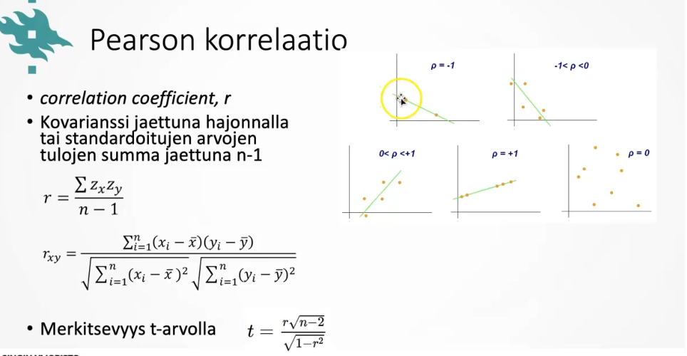{width="600"}

- kaikki pisteet laskevalla suoralla -\> korrelaatio = -1

- kaikki pisteet nousevalla suoralla -\> korralaatio = 1

- pisteet laskevan suoran ympärillä -\> korrelaatio välillä -1 \< p \< 0

- pisteet nousevan suoran ympärillä -\> korralaatio välillä 0 \< p \< 1

- pisteet täysin hajautuneet -\> korrelaatio = 0

 

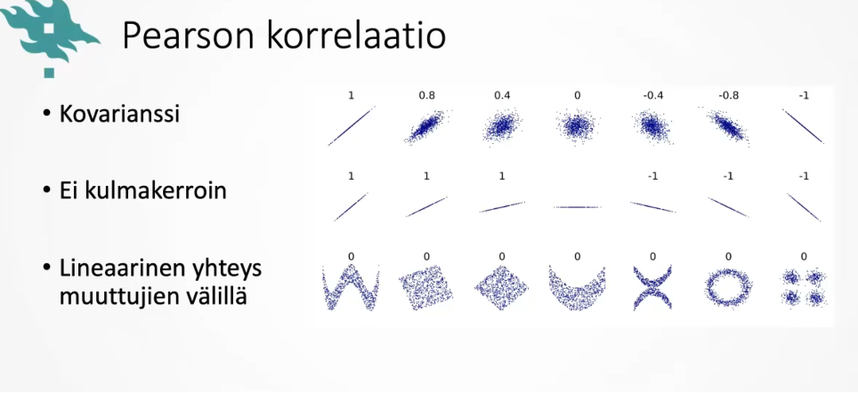

Pearsonin korrealaatio mittaa kovarianssia eli sitä vaihteleeko muuttujat samalla tavalla toistensa funktiona

- ei tarkoita kulmakerrointa! keskimmäisessä kuvassa eri kulmakertoimella olevia suoria ja jokaisessa korrelaation on +1 tai -1

- olettaa lineaarisen yhteyden -\> alimmassa kuvassa pearsonin korrelaatiokerroin 0, koska yhteydet eivät lineaarisia

 

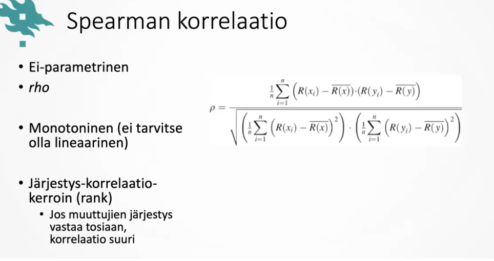{width="600"}

Spearmanin korrelaatio: vertailee kahden muuttujien järjestyksiä

- korrelaatio iso, jos molemmat muuttujat suuria samoissa kohdissa ja pieniä samoissa kohdissa suhteessa järjestykseen

- Ei-parametrinen

 

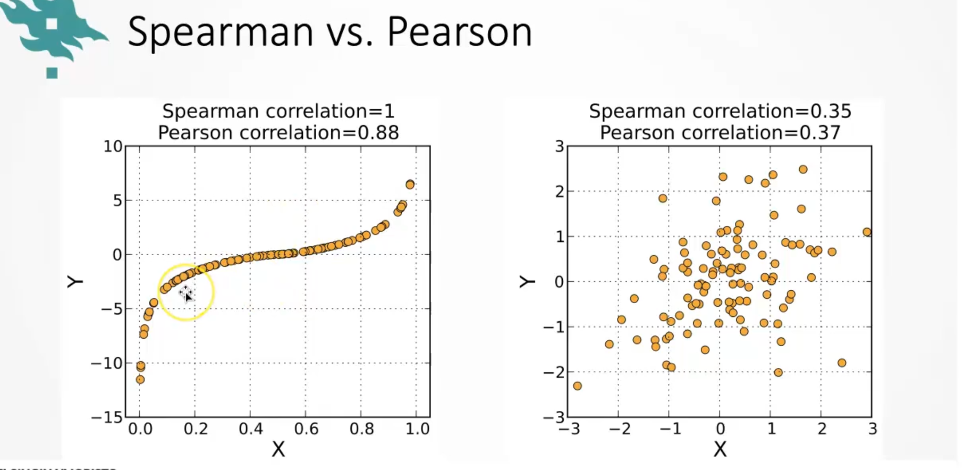

### Korrelaatio Jamovissa

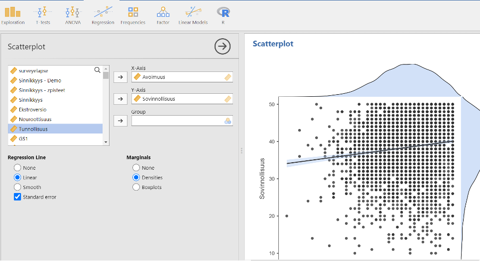{width="600"}

Tässä piirretty scatterplot kahdesta muuttujasta (avoimuus, sovinnollisuus)

- hiukan vaikea tulkita, koska niin paljon päällekkäisiä pisteitä ja kaikki piirretty mustiksi, joten vaikea arvioida paljonko kussakin kohdassa on vastauksia

 

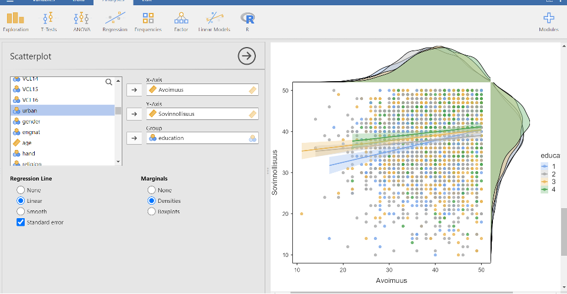

- tällä voi vertailla ja katsella olisiko jokin tausamuuttuja vaikuttava tekijä, joka täytyisi tarkistaa ja kontrolloida

 

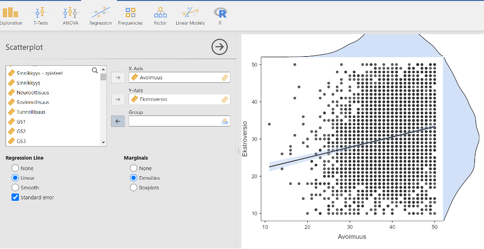

Tässä avoimuus ja ekstroversio, mitä scatterplotista nähdään on se, että muuttujien arvoilla on paljon hajontaa, joten korrelaatioiden laskeminen on ihan järkevää

 

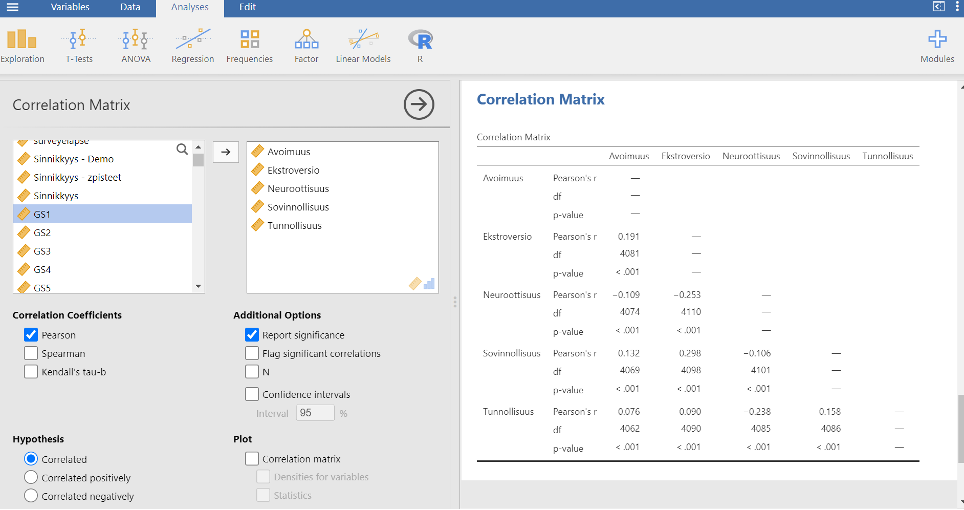

- kendall’s tau-b vähän samantyylinen kuin Spearman, perustuu myös järjestykseen

- taulukosta näkee korrelaatiokertoimen, vapausasteet ja p-arvon

- oli paljon hajontaa, joten Pearsonin korrelaatiokertoimen käyttäminen perusteltua

- taulukosta voi vertailla miten kaikki valitut muuttujat korreloivat pareissa keskenään

- flag significant correlations -\> merkkaa p-arvojen merkitsevyyksiä tähdillä

- (kaikki ovat hyvin merkitseviä, koska ainesto suuri -\> N vaikuttaa p-arvon syntyyn -\> selvitä itsellesi tarkemmin miten p-arvo laskettiinkaan)

- Vapausasteet df- lasketaan seuraavalla tavalla

  - kun kaksi muuttujaa df = N-2

  - esim. Ekstroversion N = 4083

  - vapausaste, df = 4083 – 2 = 4081

- voi myös plotata

### Partial correlation

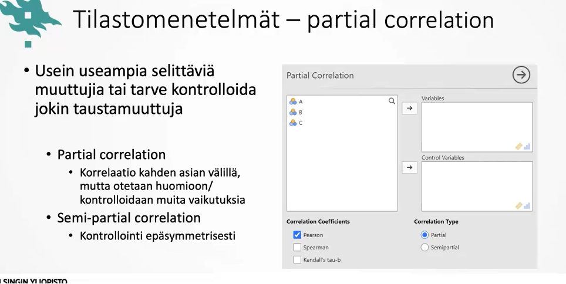

- mitä taustalla tapahtuu: tehdään regressioanalyysi, jonka avulla poistetaan kontrolloitavan muuttujan vaikutus, jonka myötä pystytään laskemaan korrelaatio tarkemmin

- Partial -\> ottaa huomioon kontrolloitavan muuttujan vaikutuksen kaikkiin suuntiin

- Semi-partial -\>epäsymmetrinen eli kontrolloitavan muuttujan vaikutus otetaan huomioon vain toiseen suuntaan

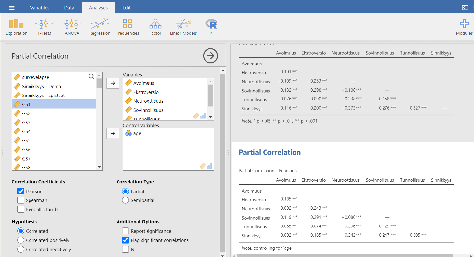

- oikealla kaksi taulukkoa, ylempänä korrelaatiot ilman iän kontrollointia ja alempana ikä kontrolloituna

- huomataan, että korrelaatiot heikkenivät hiukan joka kohdassa, kun iän vaikutus kontrolloitiin pois

 

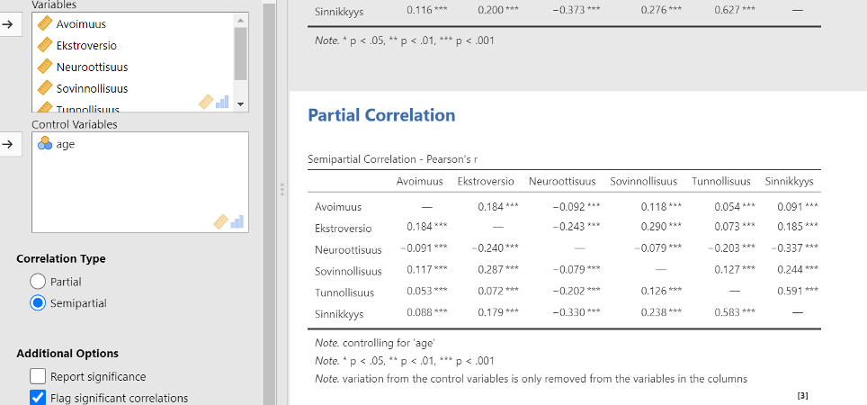

Tässä tehty semipartial correlation, tarkoittaa, että poistetaan kontrolloitavan muuttujan vaikutus vain toisesta muuttujasta. Kuvassa iän vaikutus poistettu vain sarakkeiden muuttujista.

- voi olla perusteltua käyttää esim. jos ikä on vain toisen muuttujan kannalta olennainen, mutta ei liity toiseen mitenkään

 

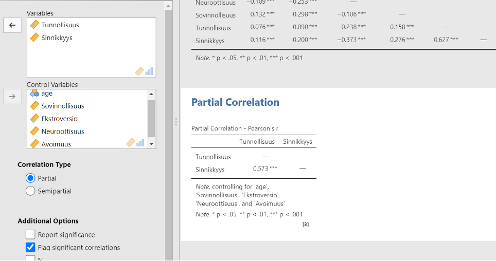

- saadaan vastauksena korrelaatio, josta poistettu muiden muuttujien vaikutukset molempiin muuttujiin

- huomataan, että tällöin korrelaatio on 0,573, kun ilman mitään kontrollointeja se oli 0,627 eli korrelaatio hiukan heikompi

 

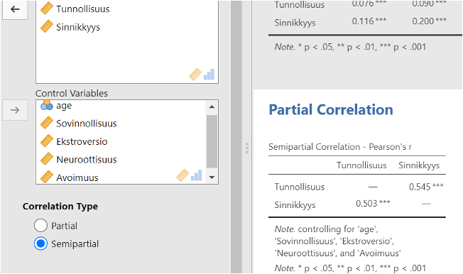

 

## Yksinkertainen regressio. regressiosuora, excel

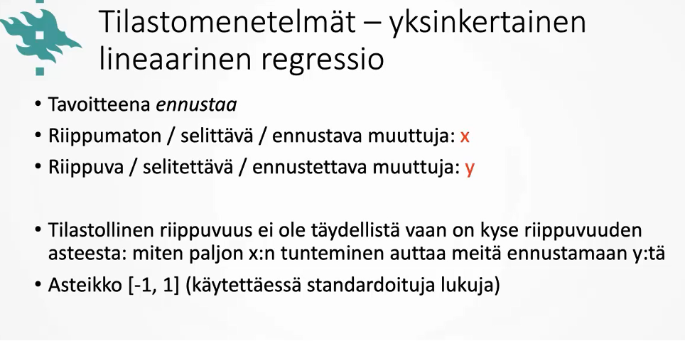

- tutkitaan kuinka paljon ennustava muuttuja selittää ennustettavan muuttujan vaihtelua

- painokerrointen asteikko \[-1,1\] käytettäessä standardoituja lukuja

 

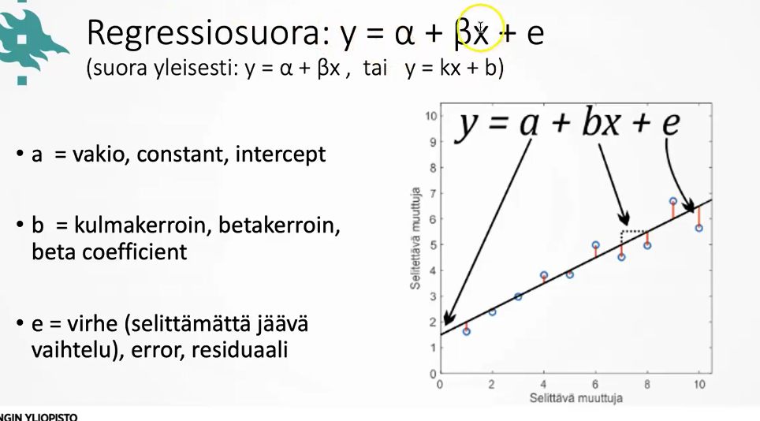

y = a + bx + e

- a = vakio = piste, jossa y-akseli leikataan

- b = kulmakerroin, betakerroin, beta coefficient,

- e = virhe (selittämättä jäävä vaihtelu), error, residuaali

  -  -\> ero joka jää suoran ja datapisteen väliin, kuvassa punaiset viivat

 

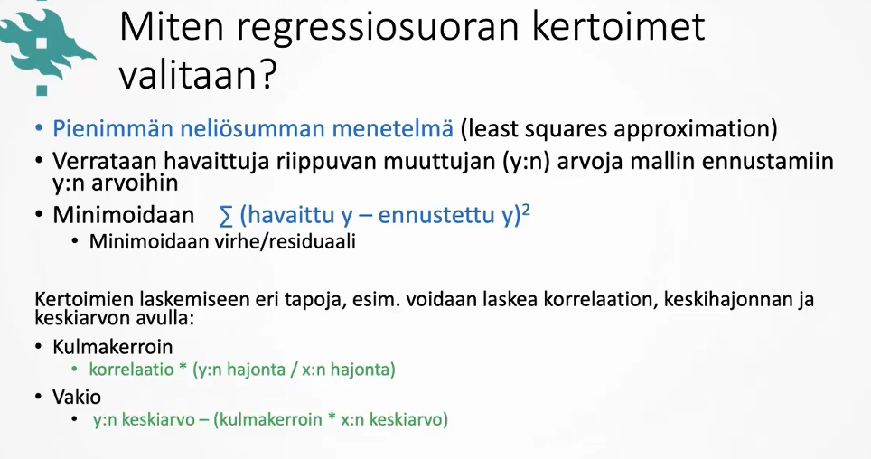

 

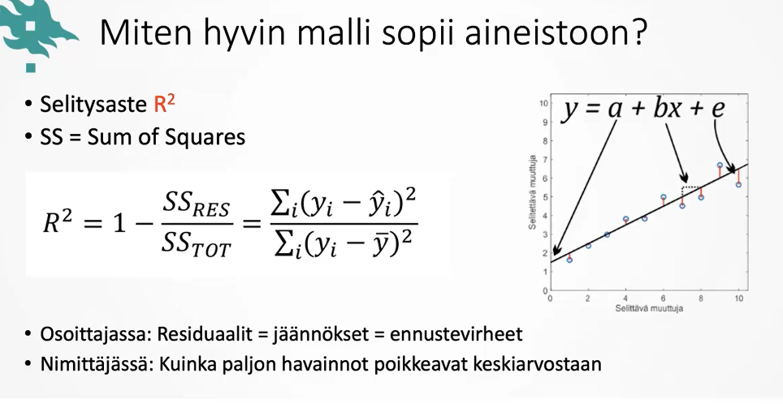

Selitysaste eli kuinka hyvin malli/viiva sopii aineistoon

- voidaan laskea vertaamalla residuaalien neliösummaa kokonaisneliösummaan

- arvioidaan sitä, kuinka monta prosenttia jää residuaaliin eli selittämättä ja se mitä pystymme selittämään on selitysaste eli R^2^

 

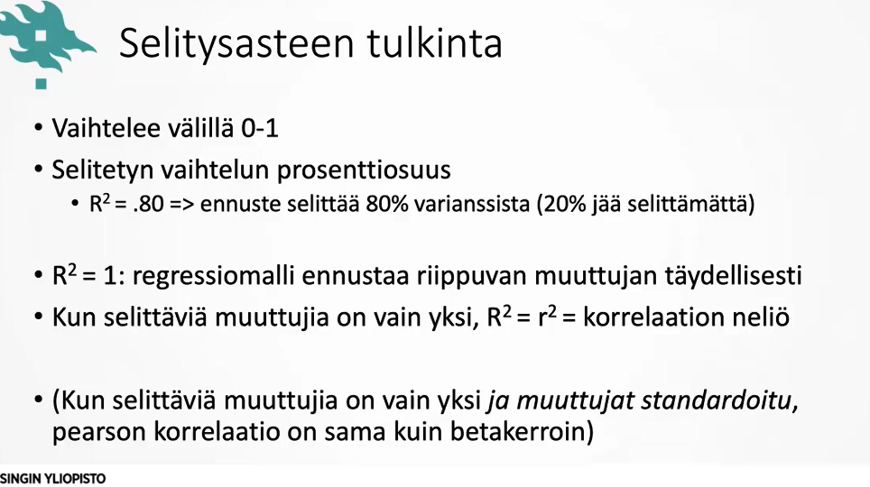

 

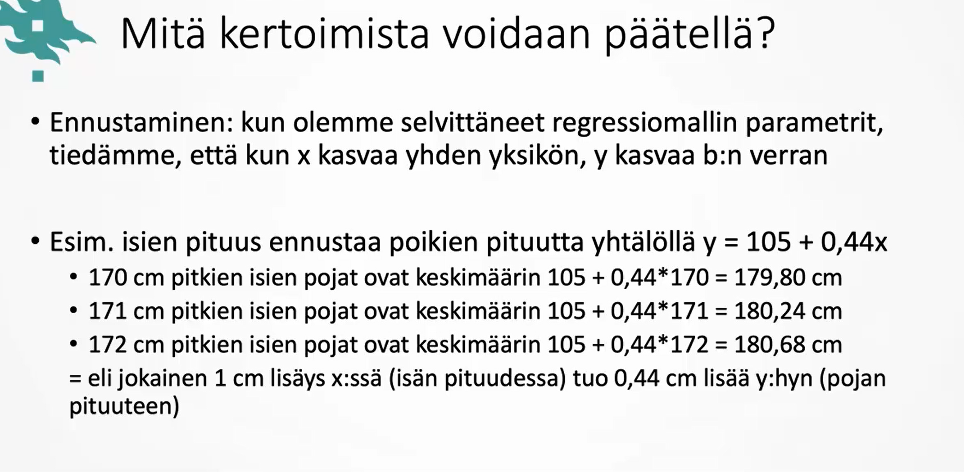

- betakertoimesta eli kulmakertoimesta voi suoraan laskea kuinka suuri vaikutus on

 

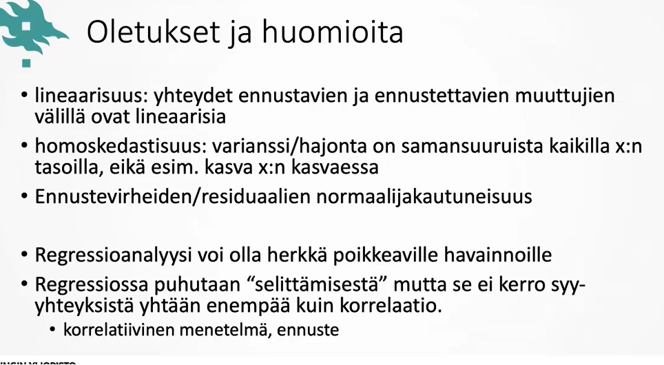

- herkkä outliereille

- korrelatiivinen menetelmä eli ei kerro syy-seuraussuhteista yhtään enempää kuin korrelaatio

 

### Regressiosuora excelillä 

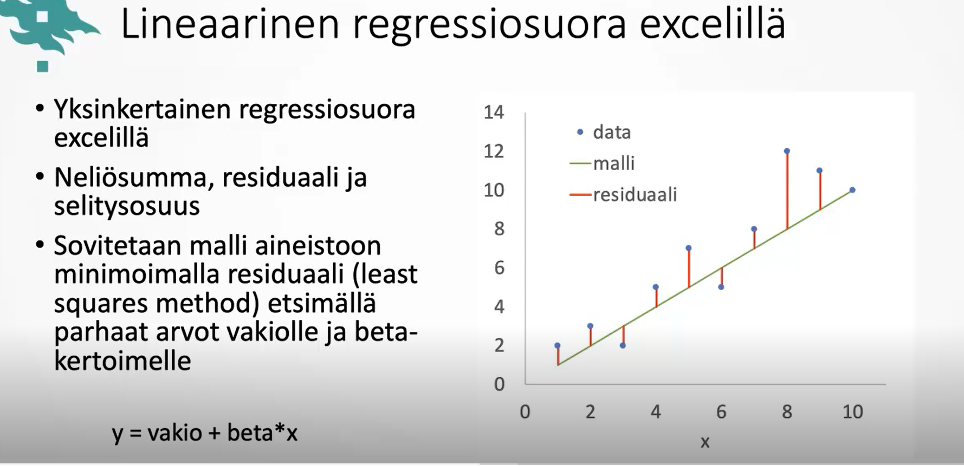

 

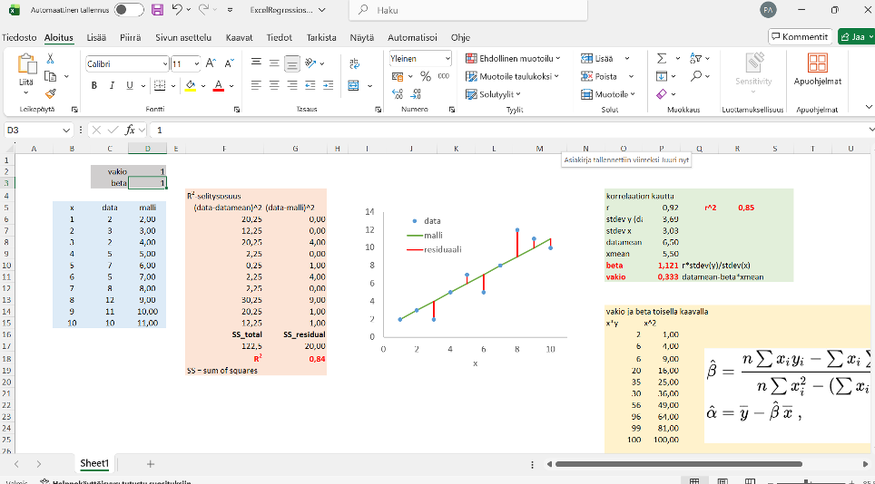

 

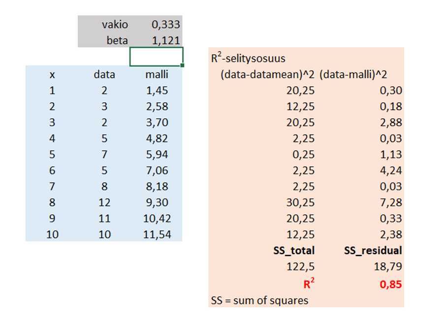

sinisessä näkyy datan oikeat arvot ja mallin ennustamat arvot tietyille x:n pisteille

SS = sum of squares = neliösumma

R^2^ = selitysaste

- lasketaan 1-SS_residual/SS_total

- eli yhdestä vähennetään residuaalien neliösumma / datan keskiarvopoikkeamien neliösummalla

SS_total = neliösumma datapisteiden poikkeamista omasta keskiarvostaan korotettuna neliöön

- (data-datamean)^2^

- esim. kun x = 1, data = 2, datan keskiarvo = 6,5

  - (2 - 6,5)\^2 = 20,25

- Lasketaan jokaisesta x:n kohdasta (data-datamean)\^2 ja summataan ne yhteen

SS_residual = neliösumma erotuksesta datan ja mallin antaman arvon välillä korotettuna toiseen

- (data-malli)\^2

- kun x = 1, data = 2, malli = 1,45

  - (2 – 1,45)\^2 = 0,30

- lasketaan jokaisesta x:n kohdasta (data-malli)\^2 ja summataan ne yhteen

 

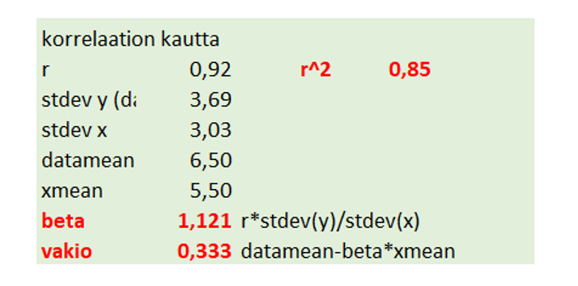

vakion ja betakertoimen selvittäminen laskemalla

- betakerroin = korrelaatio \* (datan keskihajonta / x:n keskihajonta)

- vakio = datan keskiarvo – (betakerroin \* x:n keskiarvo)

 

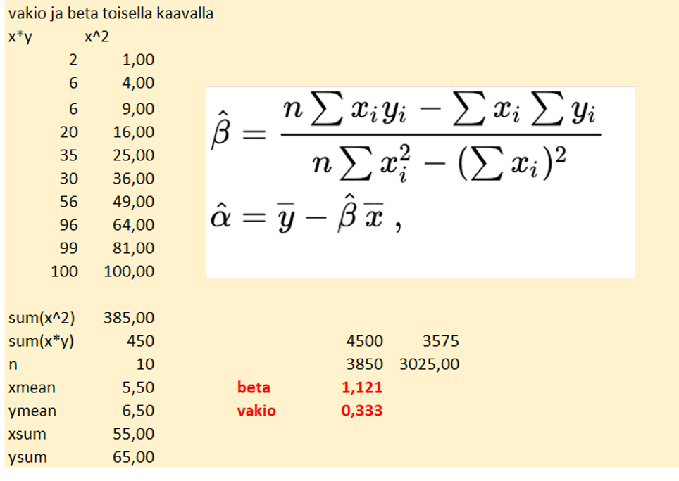

Toinen laskutapa regressiosuoran betakertoimelle ja vakiolle, jota en jaksanut opetella

 

### Regressioanalyysit jamovilla

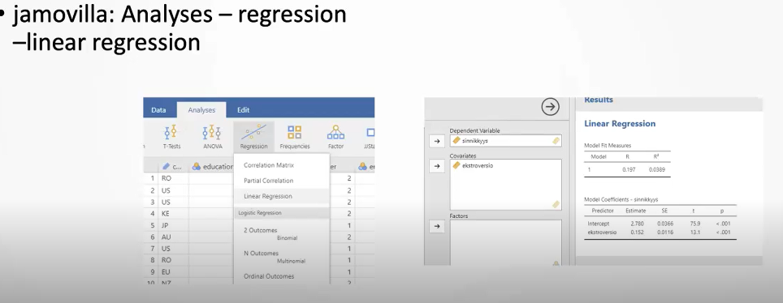

 

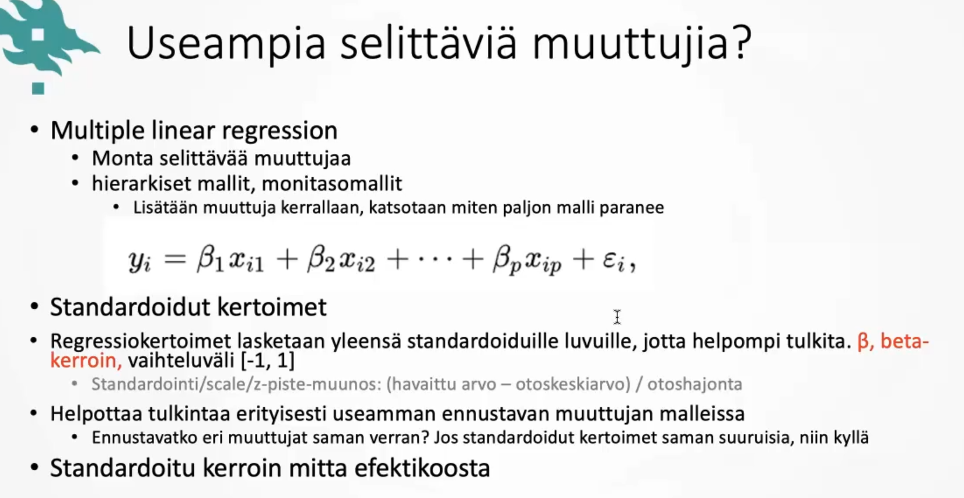

Jos enemmän muuttujia niin lisätään betakertoimia, joka muuttujalle

- voidaan lisätä niin monta kuin halutaan

- hiearkinen malli, monitasomalli

- verrataan, miten malli paranee

 

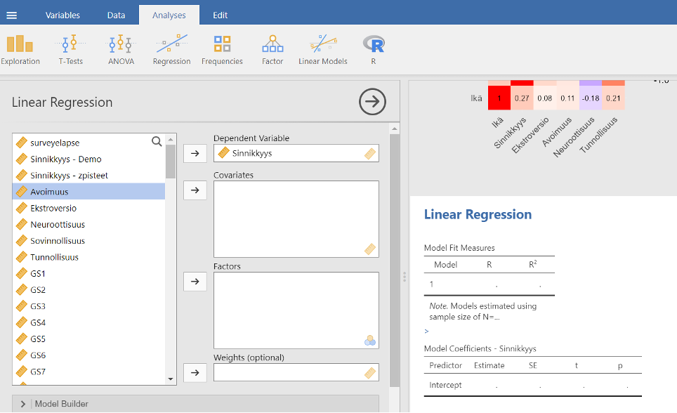

- dependent -\> ennustettava muuttuja

- covariates -\> ennustava muuttuja, kun jatkuva

- factors -\> ennustava muuttuja, kun kategorinen

 

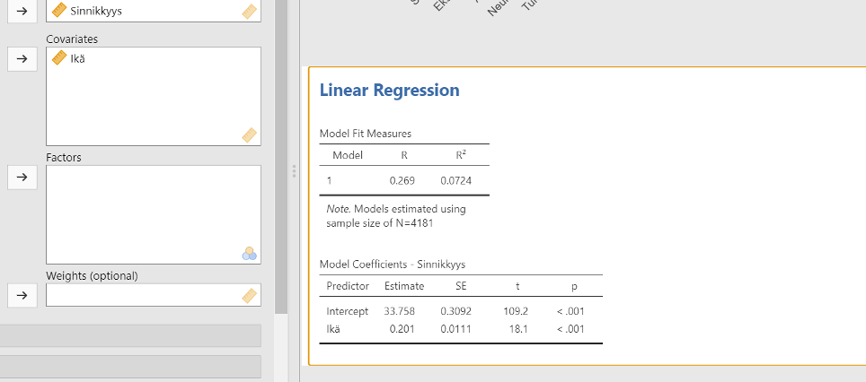

- R = korrelaatio

- R\^2 = selitysaste, 7 % kuvassa

- Estimate = mallin antamat arviot eli estimaatit?

- intercept = vakio

- iän betakerroin näkyy estimate sarakkeessa ikä rivillä

  - kuvassa 0,201

- eli jos halutaan ennustaa mallin perusteella sinnikkyyttä malli menee seuraavalla tavalla:

  - vakio (33,8) + betakerroin (0,2) \* ennustavan muuttujan arvo (ikä)

- p- arvo, jälleen kertoo onko yhteys tilastollisesti merkitsevä

  - nollahypoteesi: ei ole yhteyttä

  - eli kun p-arvo alle 0,05 tarkoittaa, että löytyy yhteys

 

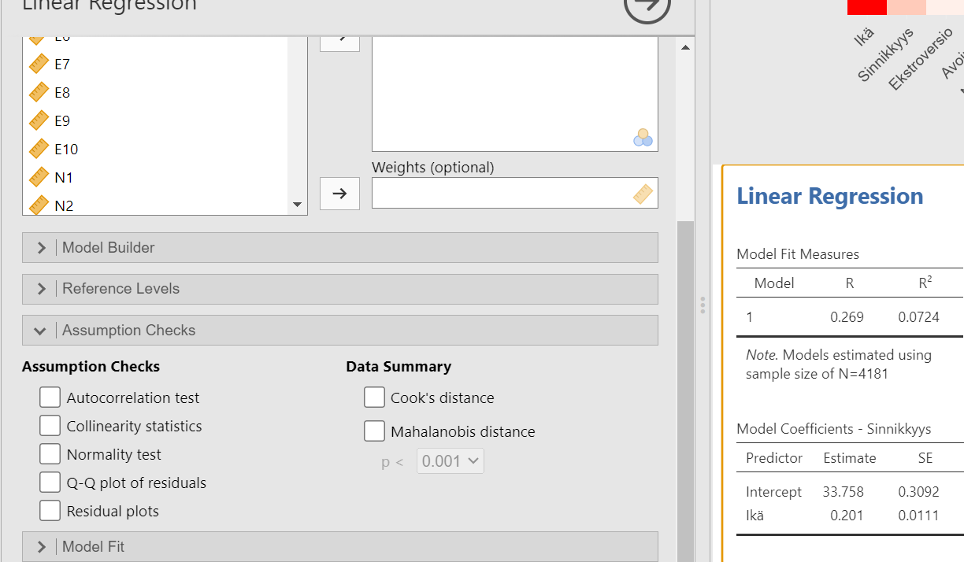

autocorrelation ja collinearity

- tarkistetaan, etteivät muuttujat liian samankaltaisia

Normality test ja q-q-plot

- normaalisuustestit

- huom! nollahypoteesi sekä wilkshapirossa että kolmogorov smirnovissa: ”on jakautunut normaalisti”

  - kun p\<0.05, muuttuja ei ole jakautunut normaalisti

 

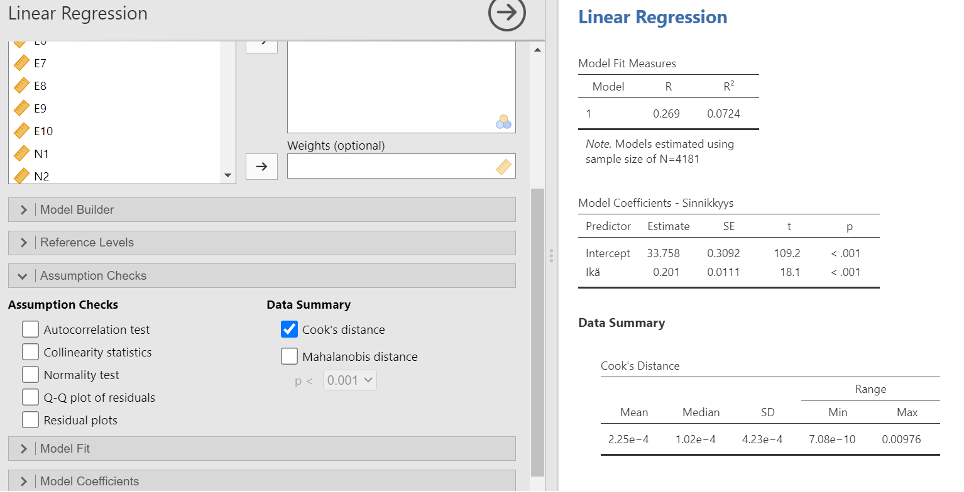

Cook’s distance

- voidaan tarkistaa, kuinka paljon mallin hyvyys muuttuu, kun yksittäinen havainto poistetaan regressiosta

- maximi ehkä kiinnostavin, jos se on todella suuri voi pohtia onko kyseessä outlier ja olisiko syytä poistaa

- alhaalta voi tallettaa cook’s distance arvot ja ne ilmestyvät muuttujana data sivulle

- voi tehdä scatterplotin ja jos jokin arvo ihan eri skaalalla kuin muut niin voi miettiä sen poistamista

 

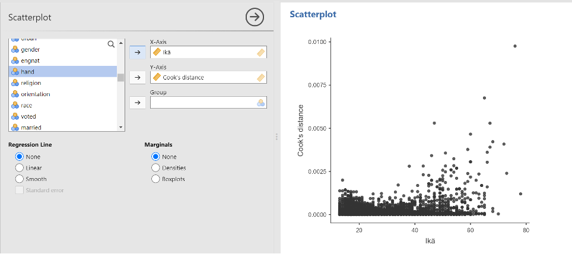

scatterplot cook’s distance arvoista ja iästä

 

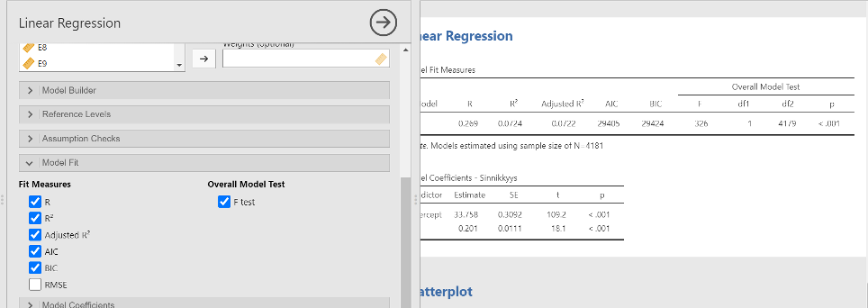

Adjusted R\^2 -\> käytetään, kun useampi muuttuja. Ottaa silloin huomioon myös muut muuttujat

AIC -\> Acaice informaatio kriteeri, ottaa huomioon muuttujien määrän selityksessä, arvo merkityksellinen vain, kun on useampi eri malli. Silloin pienin mahdollinen arvo tarkoittaa parasta mahdollista mallia

BIC -\> Bayesilainen informaatiokriteeri, ottaa huomioon muuttujien määrän selityksessä, arvo merkityksellinen vain, kun on useampi eri malli. Silloin pienin mahdollinen arvo tarkoittaa parasta mahdollista mallia.

Overall Model Test, F-test

- jos merkitsevä niin tarkoittaa, että testi läpi

- onko malli ylipäänsä sopiva datalle

 

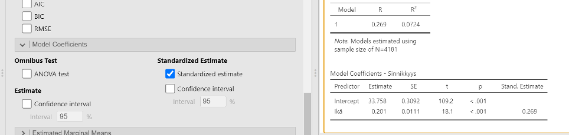

standardoitu estimaatti

- jos useampia muuttujia voidaan arvioida niiden keskinäisiä suhteita

- saadaan jonkinlainen efektikoon mitta

- myös luottamusvälit katsottua standardoidulle estimaatille

Estimaatti

- tästä kohdasta varsinaiselle (ei-standardoidulle) estimaatille saadaan katsottua luottamusvälit

 

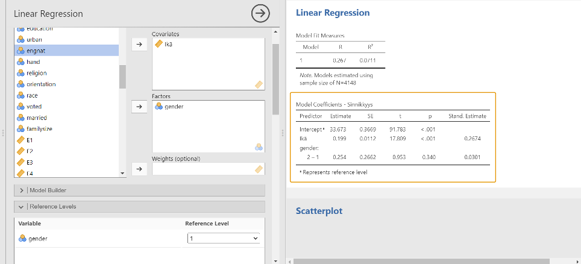

Lisättiin gender kategoriseksi muuttujaksi

- täytyy valita reference level

  - se on muuttujan taso, johon verrataan, vaikuttaa tulosten tulkinnan suuntaan

  - kun vaihdetaan genderin referenssitaso 1 -\> 2 niin betakerroin muuttuu 0,254 negatiiviseksi eli – 0,254

- videolla täytyi muuttaa referenssitaso 0 -\> 1, koska 0 oli merkattu puuttuviksi arvoiksi. Lisäksi poistettiin 3. taso, koska 3. sukupuolivaihtoehdon arvoja oli niin vähän ettei haluttu niitä analyysiin mukaan

 

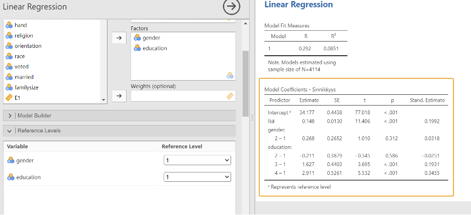

Kuvasta tulkittavaa

- Lisättiin education muuttuja myös selittämään

- selitystaso silti matala vain noin 8,5 %

- p-arvot kertovat tilastollisen merkitsevyyden mallissa

  - voi olla siis eri, kuin olisi yksittäisenä

- nähdään, z-pistemuunnetuista estimaateista, että iällä ja 4 tason koulutuksella on isoimmat kertoimet eli ne vaikuttavat eniten selitystasoon

 

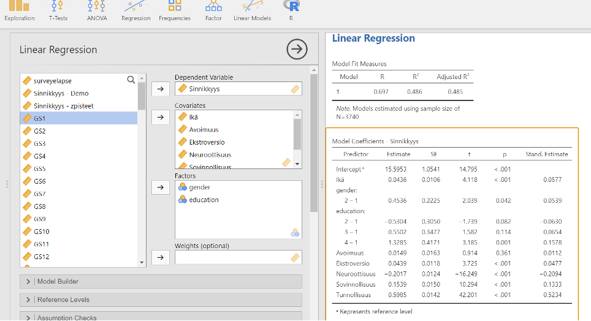

- Lisättiin malliin persoonallisuuspiirteet: avoimuus, ekstroversio, neuroottisuus, sovinnollisuus ja tunnollisuus

- Lisättiin myös adjusted R\^2 , joka ottaa huomioon muuttujien vaikutukset toisiinsa

- Huomataan, että aiempien muuttujien betakertoimet ja standardoidut betakertoimet muuttuvat uusia muuttujia lisättäessä

  - koska niillä on yhteistä varianssia

- myös p-arvot muuttuvat

 

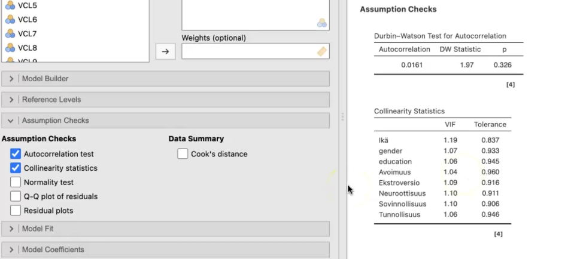

autocorrelation test

- sanottiin vaan et korreloi vähän keskenään

- kun p-arvo ei merkitsevä niin eivät korreloi liikaa keskenään

collienarity statistics

- VIF

  - jos arvo 1 paikkeilla se on hyvä

  - jos on päälle 3 alkaa olla ongelmia

  - 3 - 5 välillä kipuraja milloin ei voi enää käyttää

    - kannattaa silloin tiputtaa se muuttuja, jolla on suurin VIF arvo ja sitten katsoa tuloksia uudestaan

 

Durbin-watson

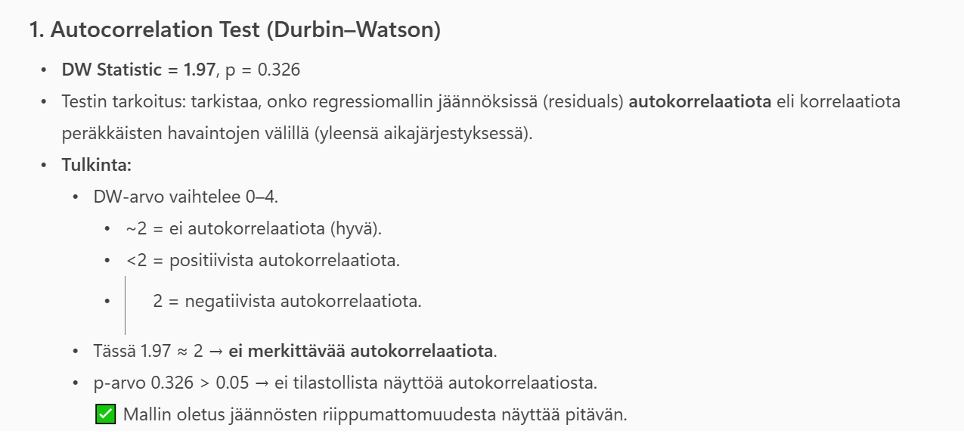

 

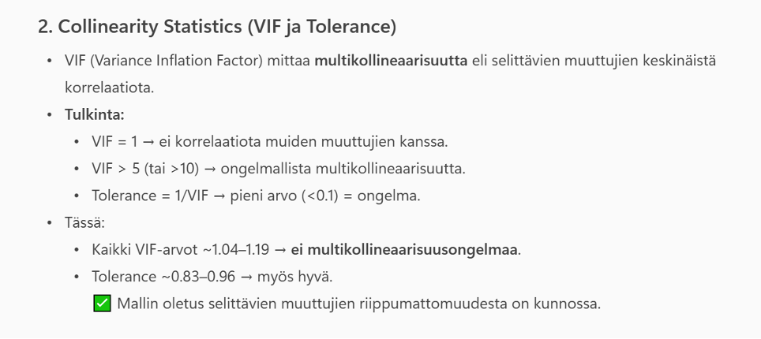

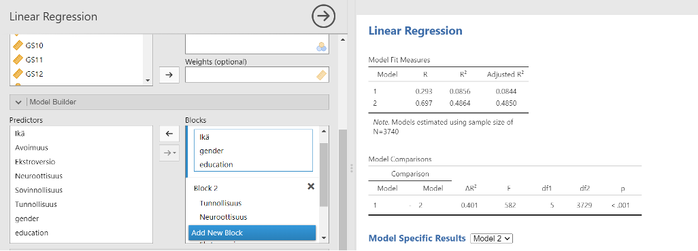

Malliin lisättiin blokki, jolloin siitä tulee hierarkkinen malli

- 1\. blokkiin jäi demografiset tekijät

- 2\. blokkiin tuli persoonallisuuspiirteet

nyt ylhäällä näkyy 2 eri mallia ja selitysastetta

- 1\. malli kertoo selitysasteen, kun vain 1. blokki on mukana

- 2\. malli kertoo selitysasteen, kun lisätään mukaan 2. blokki (eli kaikki mukana)

Model comparison kohdasta näkee delta R\^2 kohdasta mikä on mallien selitysasteiden ero

 

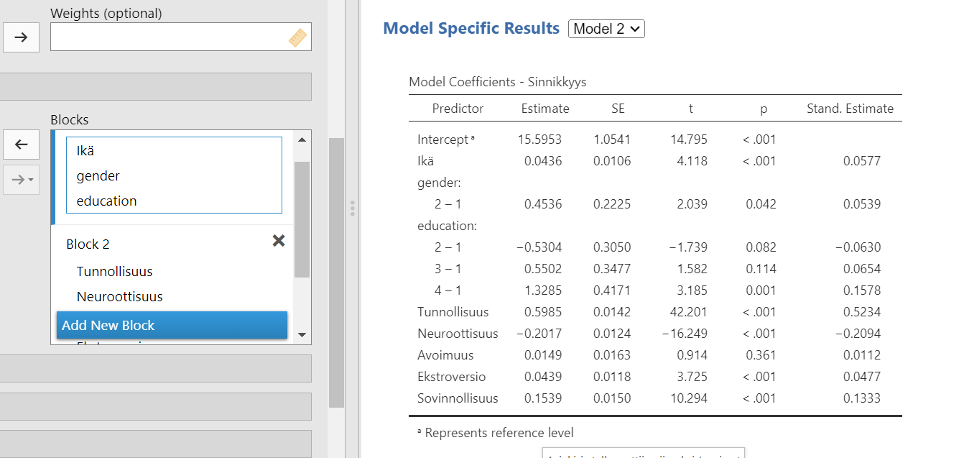

Model specific results kohdasta voidaan tarkastella tarkemmin

- valitsemalla model 1. vain se mukana

- valitsemalla model 2. modeli 1:n lisätään blokki kaks (eli kaikki mukana)

- betakertoimet muuttuvat, kun enemmän muuttujia

- Huomataan, että tunnollisuudella isoin standardoitu betakerroin

 

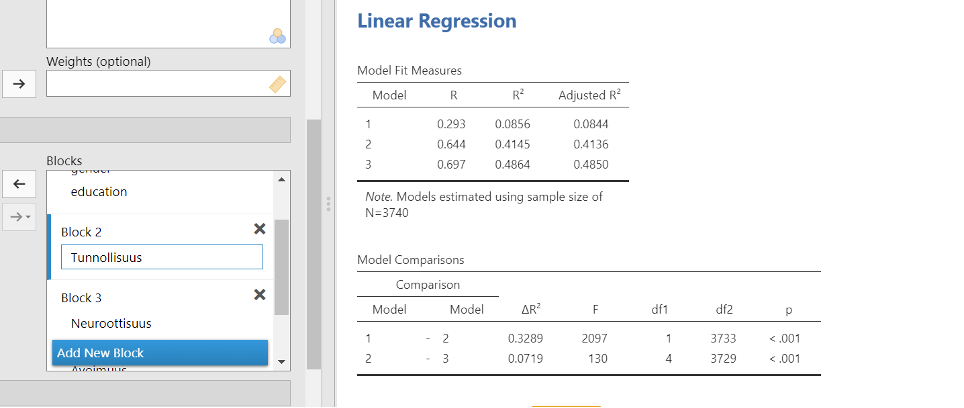

Lisättiin 3. blokki, johon siirrettiin muut persoonallisuuspiirteet kuin tunnollisuus eli blokki 2. jäi vain tunnollisuus. Blokki 1. jäi ennalleen eli siellä on demografiset tekijät

- pelkästään demografisten tekijöiden selitysaste 8,5 %

- Kun siihen lisätään tunnollisuus, selitysaste on 41,5 %

- Kun vielä lisätään muut persoonallisuuspiirteet, niin selitysaste on 48,6 %

Alempaa model comparisonista nähdään:

- 1\. ja 2. modelin selitysaste-ero on 32,89 %-yksikköä

- 2\. ja 3. modelin selitysaste-ero 7,19 %-yksikköä

- tulkinta siis mallista seuraava:

  - demografiset tekijät selittävät 8,5 %

  - tunnollisuus 32,89 % ja

  - muut persoonallisuuspiirteet 7,19 % vaihtelusta

 

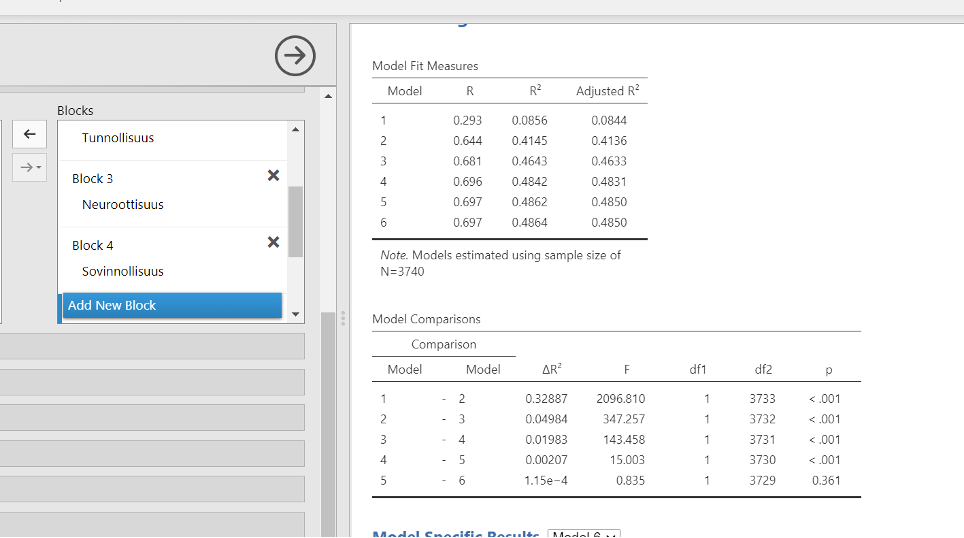

- Persoonallisuustekijät jaettiin omiin blokkeihinsa, jolloin voidaan tarkastella jokaisen omaa selitysosuutta

- Viljami teki järjestyksessä siten, että isoimmasta betakertoimesta pienimpään, jolloin ne menevät loogisessa järjestyksessä isommasta selittäjästä pienempään

 

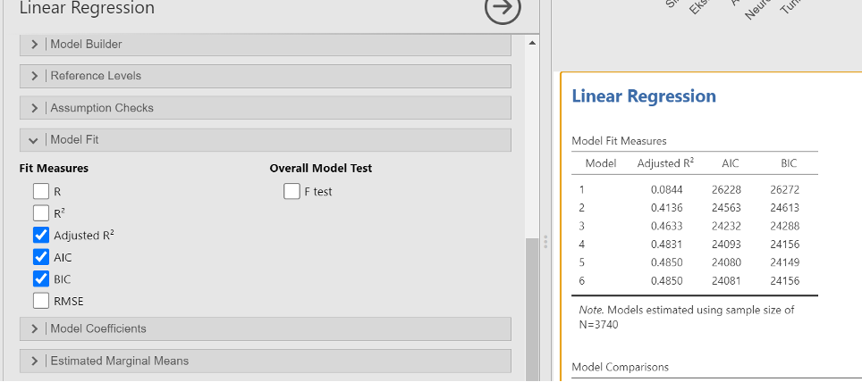

Katsotaan AIC ja BIC kriteereitä. 

- molemmissa pienin luku tarkoitti parasta mahdollista mallia

- eli malli 5. on paras -\> 6. muuttuja/blokki ei enää parantanut selitysastetta ja oli siis turha

  - täsmää sen kanssa, mikä nähdään ylemmästä kuvasta, että 6. malli oli ainoa, jonka selitysaste-ero ei ollut merkitsevä

 

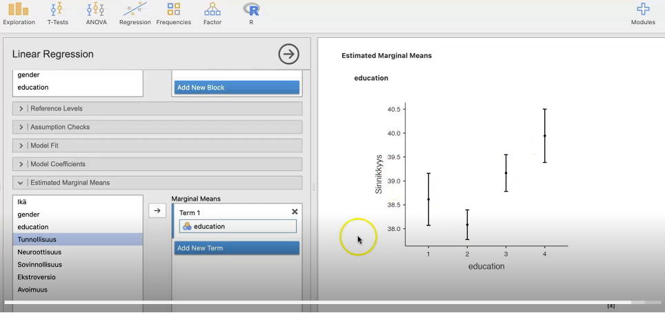

Estimated marginal means

- estimoidut keskiarvot

- voi vaihdella ennustavaa muuttujaa, jonka mukaan sinnikkyyden keskiarvoa ennustetaan

- onnistuu kategorisilla helpommin kuin jatkuvilla

Alhaalta saa residuaalit tallennettua, joita voi käyttää mallin vakioinnissa

 

## Logistinen regressio

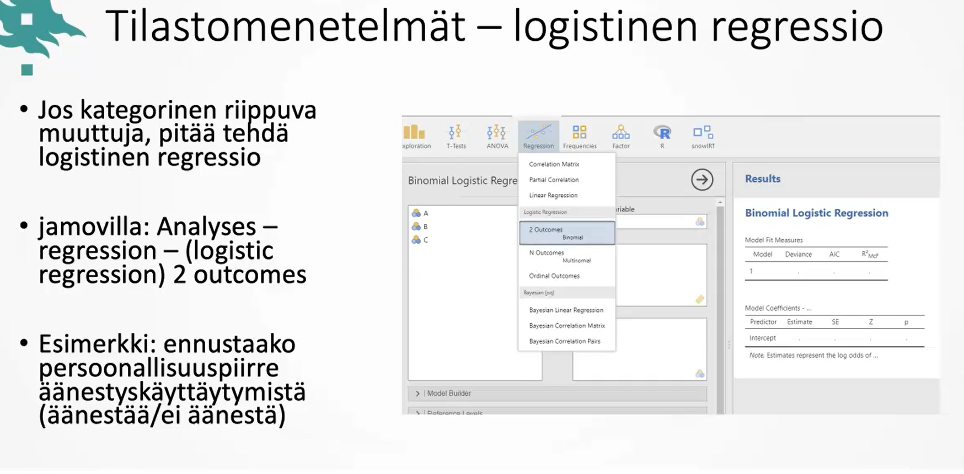

- Eli tehdään logistinen regressio, kun riippuvana eli ennustettavana muuttujana on kategorinen muuttuja

 

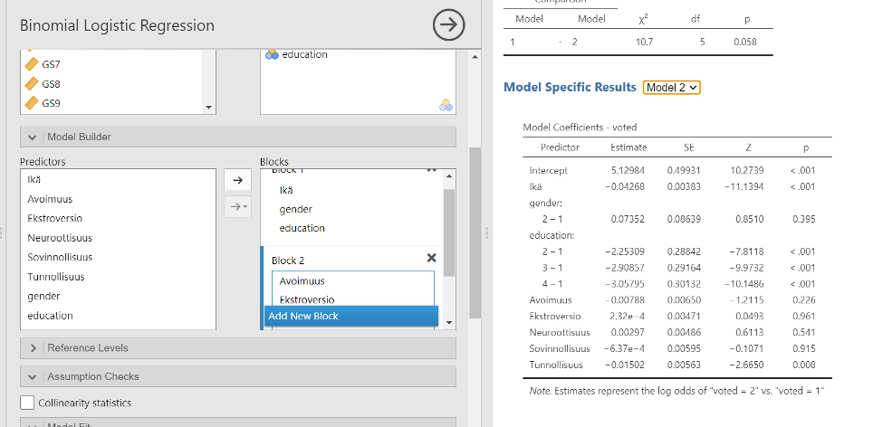

- Ennustettavana muuttujana dikotominen voted ja ennustavina samat kuin lineaarisessa regressioesimerkissä

- p-arvoista nähdään, onko tilastollisesti merkitseviä yhteyksiä ennustettavaan muuttujaan

- AIC ja BIC toimivat samalla tavalla

- Assumption checkeissä on vain statistics, jossa VIF arvot toimii samalla tavalla

- R\^2 arvo ns. pseudo R\^2 arvo, mikä tarkoittaa, että se on laskettu monimutkaisemmalla matemaattisella kaavalla, koska kyseessä kategorinen riippuva muuttuja

 

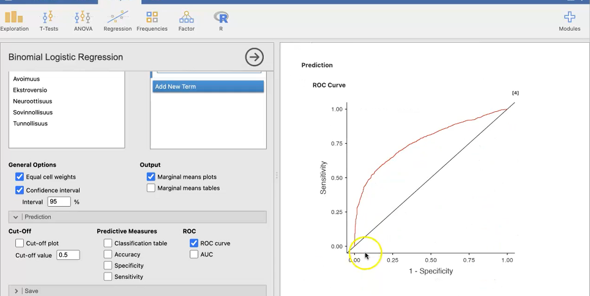

ROC-käyrä

 

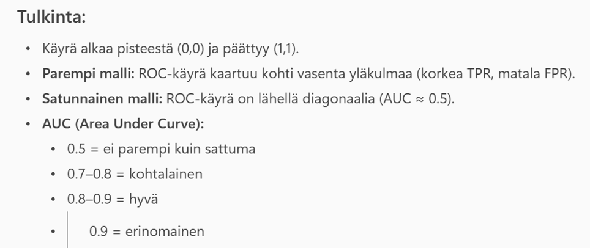](images/clipboard-162863330.png)

## Mallivakiointi / adjustointi

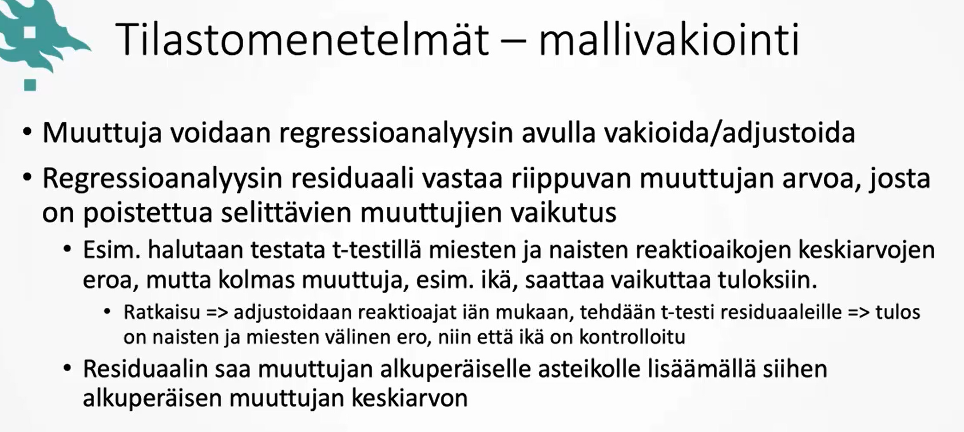

Poistetaan toisen muuttujan vaikutus toisesta regressioanalyysin avulla

 

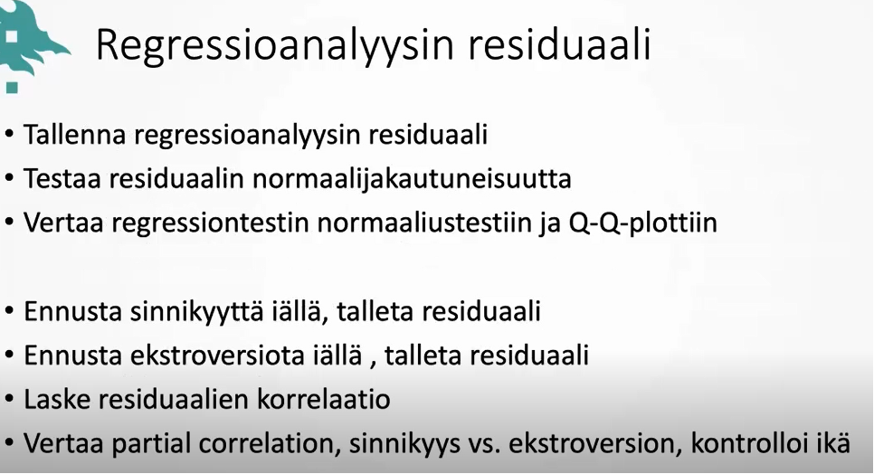

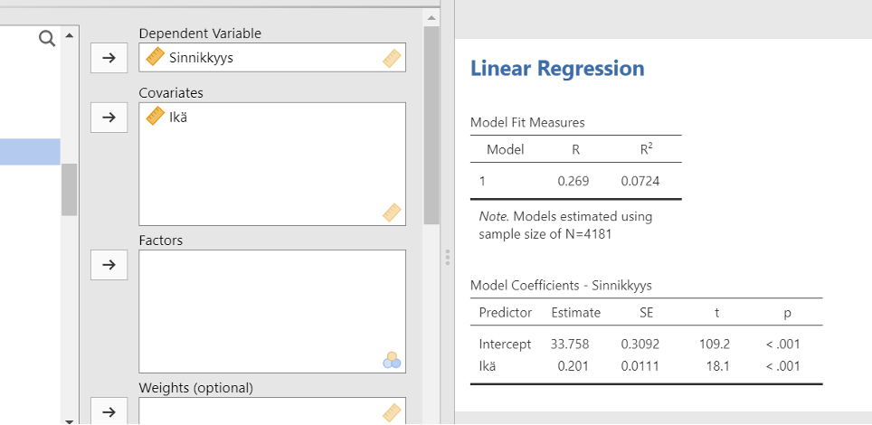

Lineaarinen regressio, jossa sinnikkyyttä ennustetaan iällä

- mallin mukaan 7,24 % sinnikkyydestä selittyy siis iällä

- Residuaali eli selittämättä jäävä osuus toisin sanottuna ei siis selity iällä

- Eli 92,76 % vaihtelusta vielä selittämättä

- Residuaali on siis adjustoistu sinnikkyys, missä ikä ei vaikuta

 

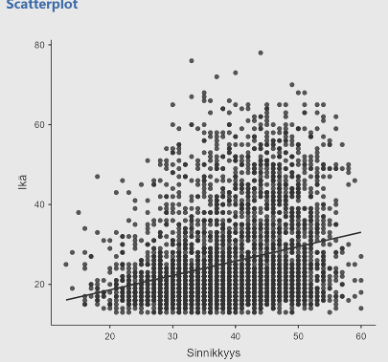

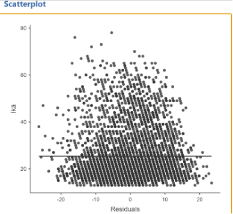

- Ylemmässä scatterplotissa iän ja sinnikkyyden regressiolinja. Eli suurempi ikä ennustaa suurempaa sinnikkyyttä. Alemmassa scatterplotissa ikä ja edellisen mallin residuaalit. Eli toisinsanottuna näkyvästä regressioviivasta on poistettu iän vaikutus.

- adjustoimalla saadaan kontrolloitua sekoittavan muuttujan vaikutus

  - eli tehdään regressiomalli -\> tallennetaan residuaalit

  - kun käytetään residuaaleja, niin siitä on kontrolloituna niiden alkuperäisen mallin riippumattoman muuttujan vaikutus

- Kun katsotaan normaalisuustestiä lineaarisessa regressioanalyysissa ja sitten verrataan sitä residuaalista tehtyyn normaalisuusanalyysiin huomataan, että ne on identtiset.

 

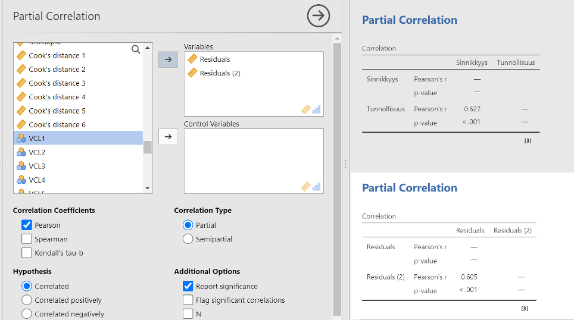

Tässä katsottu tunnollisuuden ja sinnikkyyden korrelaatiota. Ylemmässä Partial correlation kohdassa on sinnikkyyden ja tunnollisuuden korrelaatio, josta ei ole kontrolloitu ikää. Alemmassa on katsottu iän ja tunnollisuuden sekä iän ja sinnikkyyden regressiomallien residuaalien korrelaatiota. Eli alemmassa on kontrolloitu molemmista muuttujista iän vaikutus pois.

- saman voi tehdä suoraan partial correlation kohdassa lisäämällä iän control variables kohtaan 

 

## ANOVA

### Yksisuuntainen ANOVA

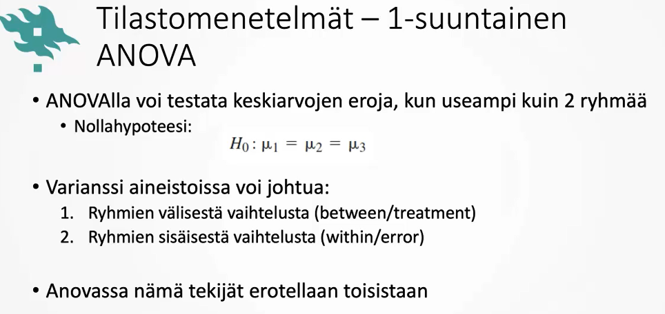

 

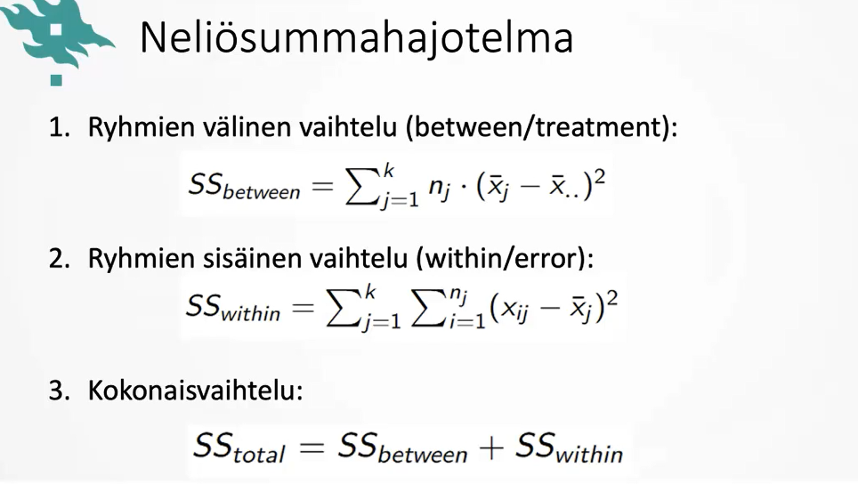

Neliösummahajotelma

 

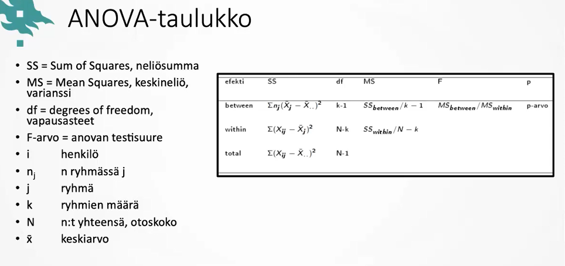

F-arvo = anovan testi suure

- saadaan keskineliöiden suhteesta eli MS between / MS within

 

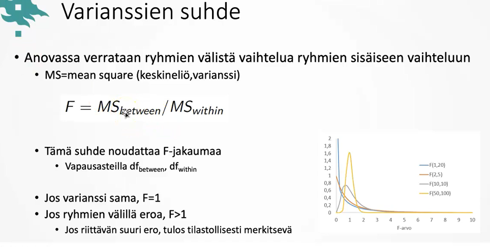

F = 1

- ryhmien välinen vaihtelu on täsmälleen sama kuin ryhmien sisäinen vaihtelu

F \> 1

- rymien välillä on eroa

 

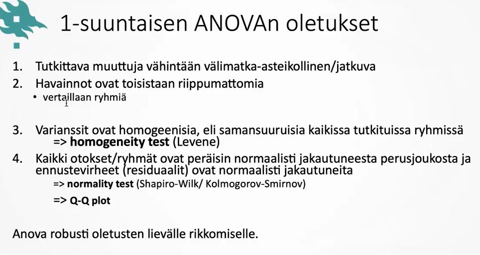

 

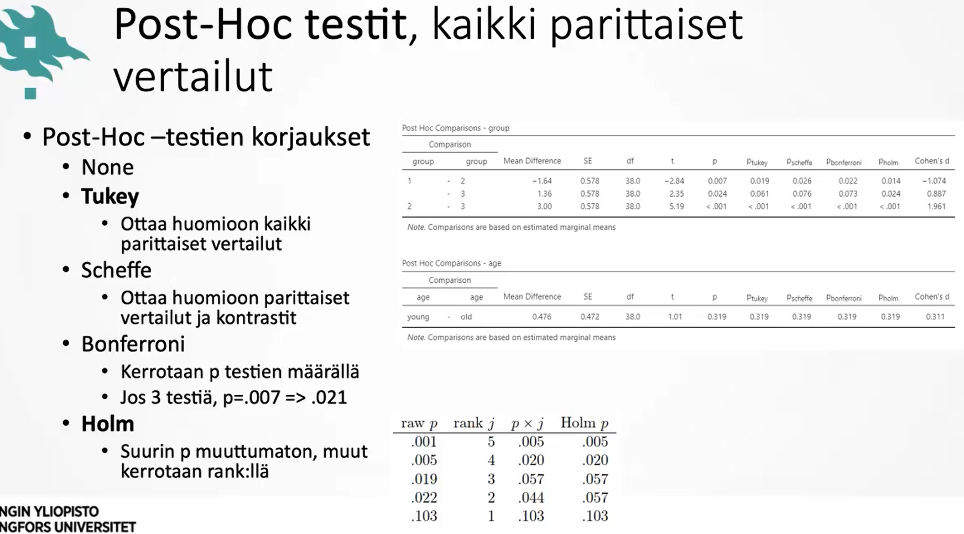

Jos anova on merkitsevä, niin sen jälkeen tehdään kaikki parittaiset vertailut

- kun tehdään monta vertailua niin tyypin 1 virhe kasvaa (eli väärä positiivinen, hylätään nollahypoteesi, vaikka se on totta)

- monivertailukorjaus, post-hoc testin korjaus -\> muutetaan p-arvoja, jollain seuraavista menetelmistä: Tukey, Scheffe, Bonferroni, Holm 

  - otetaan huomioon sattumalta merkitsevän tuloksen saaminen usean testin toiston takia eli p-arvoja suurennetaan

 

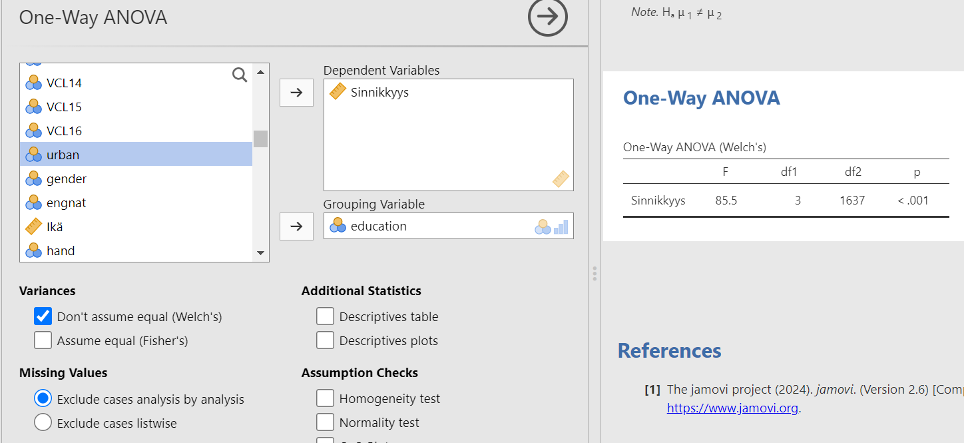

Yksisuuntainen ANOVA, jossa riippuvana muuttujana sinnikkyys ja riippumattomana koulutus

- tuloksista nähdään F-arvo, vapausasteet (df1 ja df2) sekä p-arvo

- Welchin testissä ei oleta ryhmien variansseja samanlaisiksi

- Fisherin testissä oletetaan varianssit samanlaisiksi

- Voidaan testata varianssien homogeenisuutta Levenen testillä

 

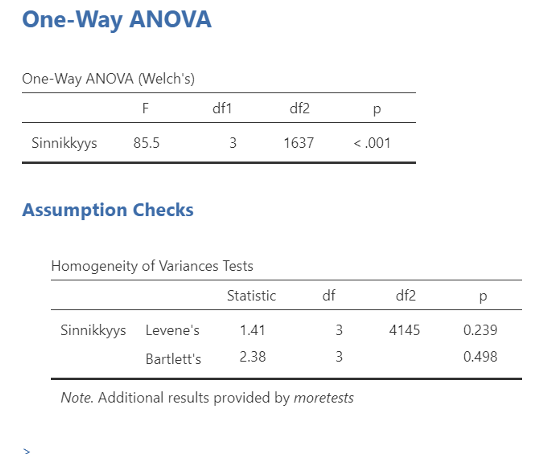

- p-arvo ei ole merkitsevä eli toisinsanottuna testillä ei löydetty riittävästi todisteita varianssien eroavaisuudesta. Eli voitaisiin käyttää myös Fisherin testiä

 

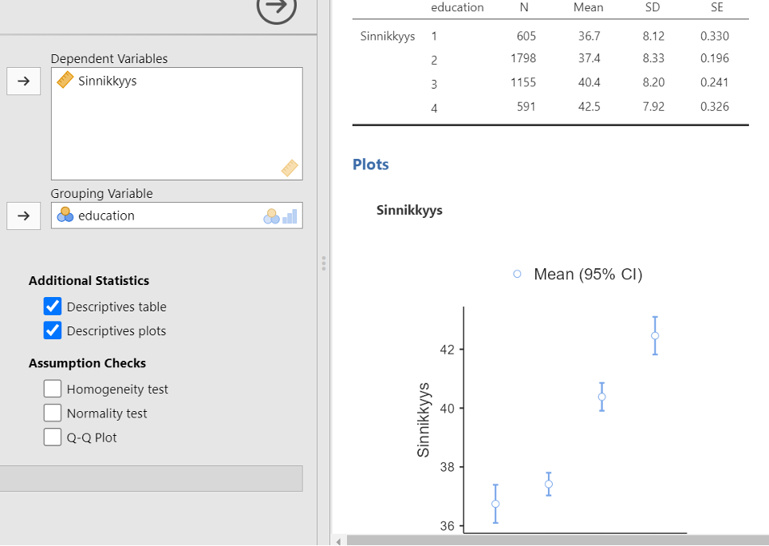

Voidaan piirtää plotti, mistä nähdään eri ryhmien keskiarvosinnikkyydet ikäryhmittäin ja niiden luottamusvälit. Tästä ei kuitenkaan voi tehdä lopullisia tulkintoja vaan täytyy tehdä jatkotestit (post-hoc vertailut), koska ANOVA kertoo vain, että eroa joko löytyy tai ei löydy. Se ei kerro sitä minkä ryhmien välilä ero on.

 

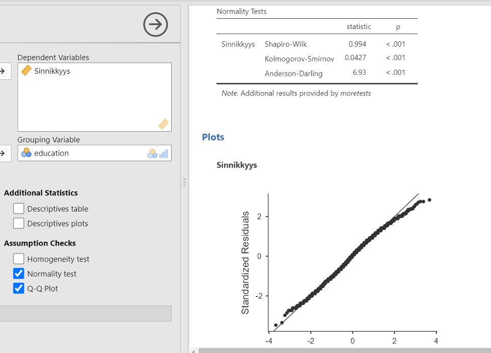

Anova on robusti eli vaikka normaalisuusoletus rikkoutuu testien mukaan (shapiro-wilk, kolmogorov-smirnov) niin, koska q-q-plot näyttää suht ok:lta voisi uskaltaa käyttää tuloksia. Mutta täytyy tutkia ja harkita onko rikkoutuminen liian vakavaa vai ei.

 

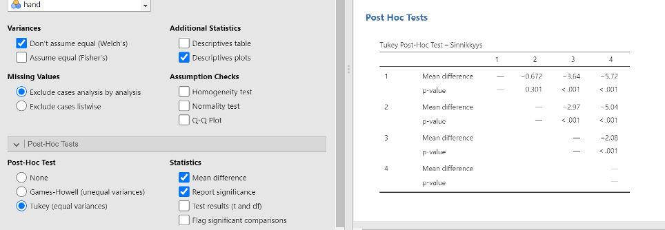

Post-hoc testillä saadaan selville minkä ryhmien välillä on tilastollisesti merkitseviä eroja

Tukeyn testi olettaa varianssien homogeenisyyden ja Games-Howell ei oleta

kuvassa tehty Tukeyn testi ja siitä nähdään, että ryhmien

- 1\. ja 2. välillä ei tilastollisesti merkitsevää eroa p-arvo = 0.301

- 1\. ja 3. sekä 1. ja 4. välillä tilastollisesti merkitsevät erot p-arvo \< 0.001

- 2\. ja 3. välillä sekä 2. ja 4. välillä merkitsevät erot, p-arvot \< 0.001

- 3\. ja 4. välillä tilastollisesti merkitsevä ero, p-arvo \< 0.001

tulkinta on hyvin looginen, jos vertaa aiempaan kuvaan ylempänä, jossa näkyy ryhmien keskiarvot

Yksisuuntaiseen ANOVAAN voi ottaa riippuvaksi muuttujaksi useampia muuttujia. Tällöin jokaisesta tulee vain oma testinsä, missä näkee miten keskiarvot eroavat ryhmittelevän muuttujan jaottelemana.

 

### Faktoriaalinen ANOVA

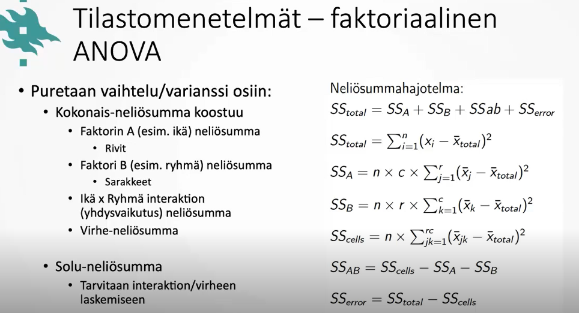

Yksisuuntaisella ANOVAlla pystyy testaamaan vain yhden taustatekijän vaikutusta keskiarvojen vaihteluun. Faktoriaalisella anovalla useampia.

 

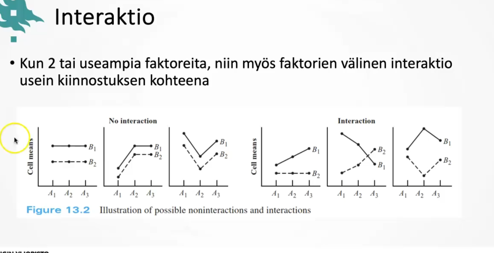

Jos on kaksi tai useampaa faktoria (selittävää muuttujaa) niin mukana on interaktio

Faktori = kategorinen riippumaton eli selittävä muuttuja

Kuvassa on eri tilanteita, joissa kaikissa faktorilla B on kaksi tasoa ja faktorilla A on 3

- 1\. kuva -\> ei muutoksia B:n tasoilla 1. eikä 2. -\> ei interaktiota

-  2. ja 3. kuva -\> muutokset ovat B:n tasoilla 1 ja. 2. samanlaiset ja samansuuntaiset -\> ei interaktiota

  - Ainoastaan, jos toisen faktorin B tasot poikkeavat toisistaan siten, että A:n tasot vaikuttavat, voidaan sanoa olevan interaktiota

  - kuvissa 4., 5 ja 6. on interaktiota, koska B:n tasot ovat erilaiset ja muuttuvat eri suuntiin A:n tasojen mukaan

- Kuva 4.

  - B2 kohdalla A:n tasolla ei mitään vaikutusta

  - B1 kohdalla A:n taso vaikuttaa

  - eli on interaktiota

<!-- -->

- Kuva 5.

  - B1 ryhmällä tulokset laskee A:n kasvaessa

  - B2 ryhmällä tulokset nousee A:n kasvaessa

  - on interaktiota

<!-- -->

- Kuva 6.

  - alussa ja lopussa B1 ja B2 samanlaiset A:n suhteen

  - keskellä kuitenkin B1 nousee ja B2 laskee

  - on interaktiota

Ei interaktiota

- Toisen faktorin muuttuminen ei aiheuta muutosta toiseen faktoriin

- kuvassa vasemmalla

Interaktio

- jos toisen muuttujan (faktorin) vaikutus riippuu toisen (faktorin) vaikutuksesta, silloin on interaktiota

- kuvassa oikealla

 

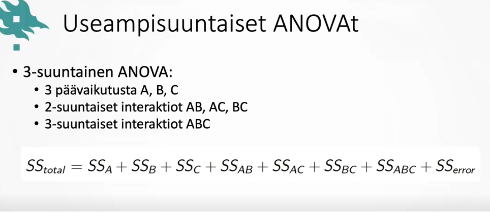

Jo kolmisuuntainen interaktio on haastava tulkita, joten tästä syystä useimmiten ANOVAT ovat kaksi tai kolmesuuntaisia

 

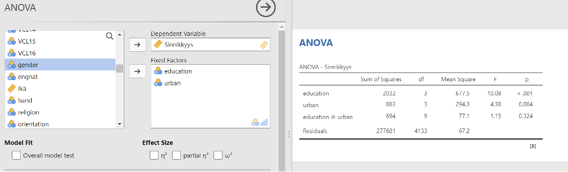

Faktoriaalinen ANOVA (jamovissa: ANOVA) riippuva muuttuja sinnikkyys. Riippumattomat koulutus ja asuinpaikka

- tuloksissa nähdään p-arvoista onko koulutusluokkien välillä tilastollista eroa, asuinpaikkaryhmien välillä tilastollista eroa ja onko interaktiovaikus tilastollisesti merkitsevä

- Päävaikutus: education tai urban itsekseen

- interaktiovaikutus: vaikuttaako toinen faktori toiseen

 

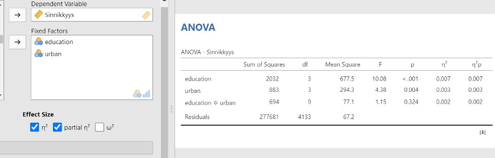

- efektikoosta näkee kuinka suuri on vaikutuksen koko

- partial η\^2 ottaa huomioon muiden faktoreiden vaikutuksen

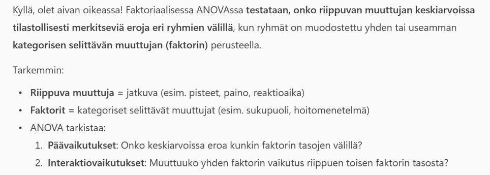

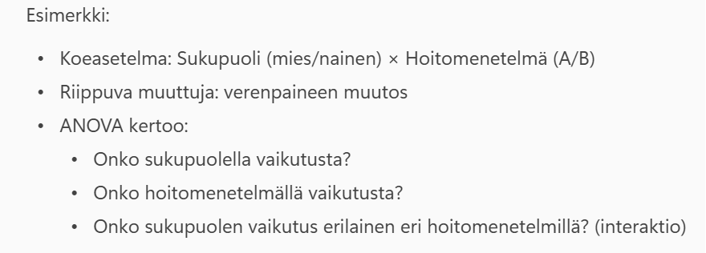

 

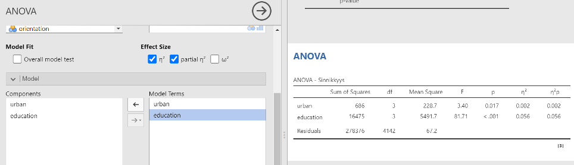

Model kohdasta voidaan muokata mallia ja esim. poistaa interaktiovaikutus

Faktorisumman / neliösumman laskuun käytetään tyypillisesti tyypin kolme kaavaa. Näkyy model kohdassa myös.

 

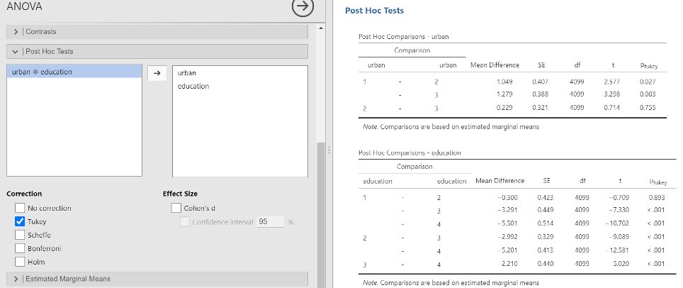

Kuvassa tehty post-hoc testit, joista voi katsoa minkä ryhmien välillä oli tilastollisesti merkitsevää eroa

- p-arvot ovat tukeyn menetelmällä korjattuja

  - menetelmän voi vaihtaa vasemmalta

- interaktiovaikutus ei ollut tilastollisesti merkitsevä ja siksi se ei ollut mukana jälkitesteissä

- efektikoon saa näkyviin Cohen’s d kohdasta

- parittaisvertailut ovat käytännössä T-testejä jokaiselle parille

 

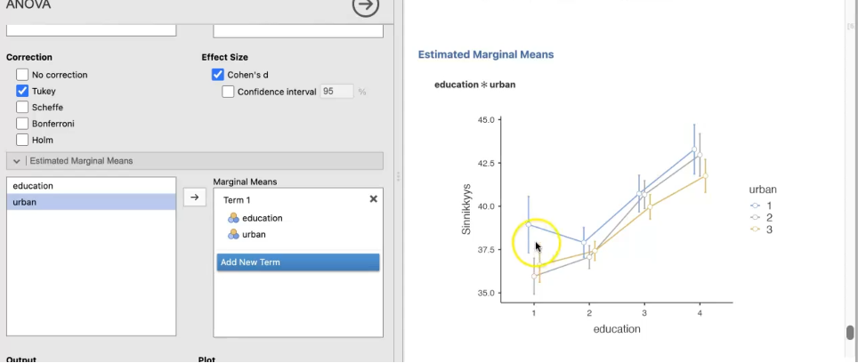

Pystyy plottaamaan kuvan keskiarvoista ja niiden eroista

 

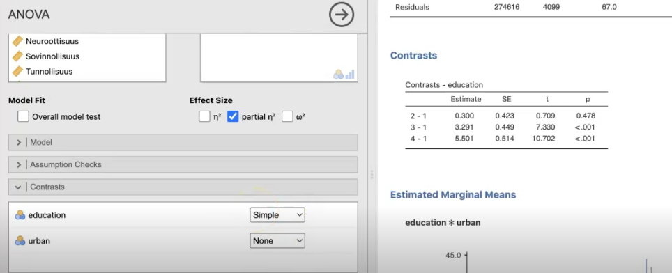

Contrasts kohdasta voi tehdä vertailuja rajoittaen niiden määrää

- se hyöty, että jos vertailuja vähemmän niin pienempi vaikutus p-arvoon

 

### ANCOVA, MANOVA; ei-parametrinen Kruskall-Wallis

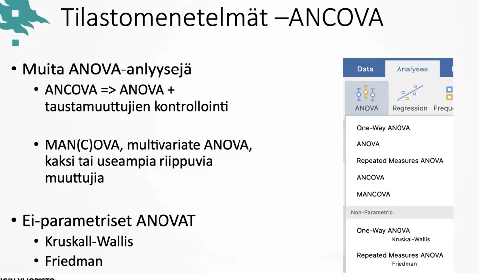

ANCOVA periaatteessa sama kuin faktoriaalinen anova, mutta mahdollisuus kontrolloida taustamuuttujia

 

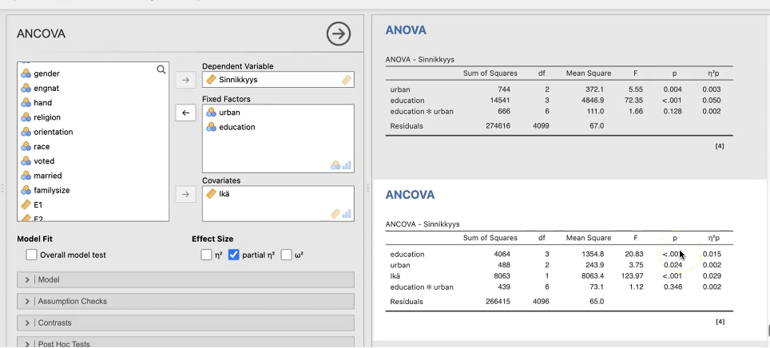

Ancova, sama faktoriaalinen anova kuin aiemmin, mutta ikä lisätty kontrolloiduksi muuttujaksi. Nähdään, että iän vaikutus taustalla on merkitsevä

 

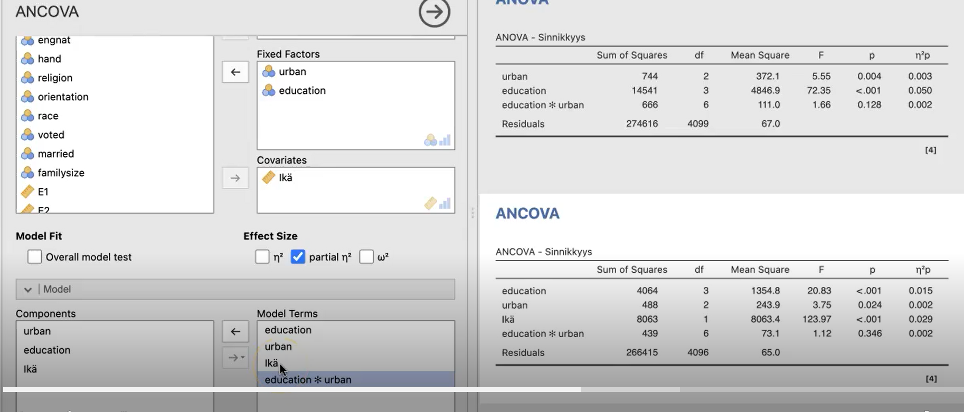

Models kohtaan tulee pelkästään iän päävaikutus näkyviin. Jos haluaa esim. iän ja educationin interaktiovaikutuksen niin täytyy vasemmasta laatikosta maalata molemmat ikä ja education ja nuolella siirtää ne oikealle, jolloin niiden interaktiovaikutus tulee mukaan malliin.

MANCOVA -\> pystyy laittamaan useamman riippuvan muuttujan

- tällä kurssilla ei kuitenkaan syvennytä sen enempää siihen

Ei parametriset ANOVAT

- käytetään jos normaalisuusoletukset eivät täyty

- one way -\> Kruskal-Wallis

- repeated measures -\> Friedman

 

### Toistomittaus-ANOVA

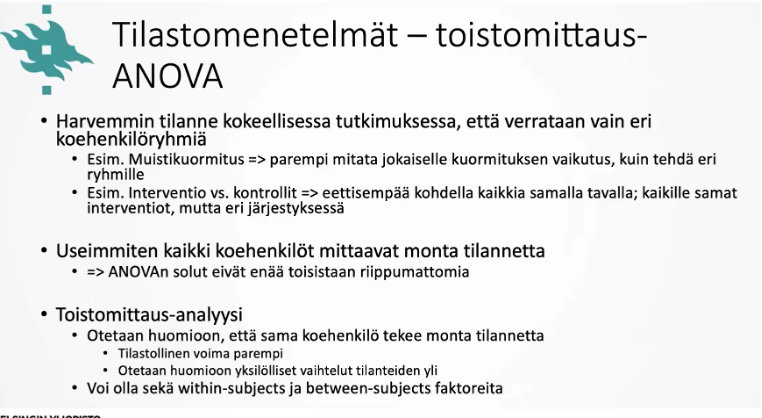

 

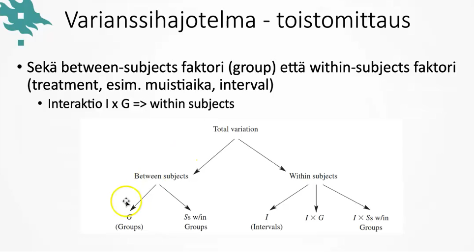

varianssihajotelma

 

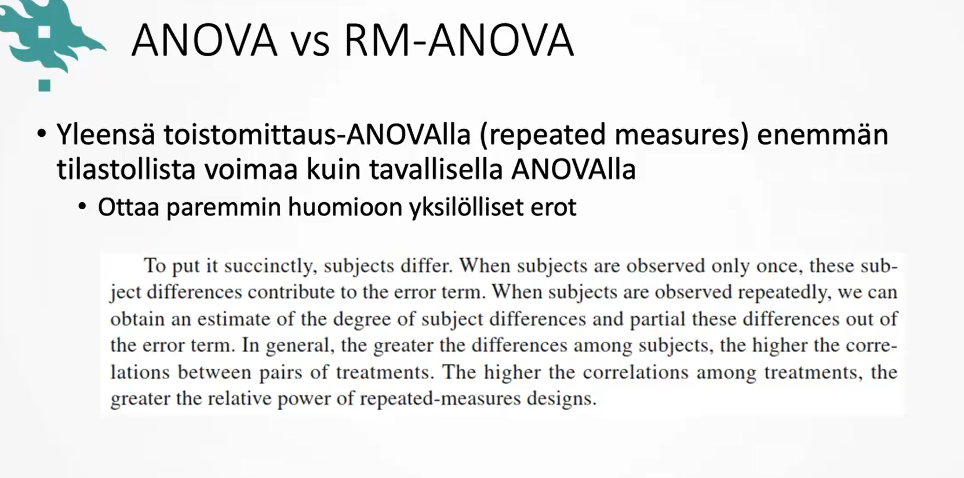

Anova vs. toistomittausanova

- enemmän tilastollista voimaa kuin tavallisella anovalla

  - johtuu siitä, että jokainen koehenkilö itsessään toimii omana kontrollinaan

  - ottaa paremmin huomioon yksilölliset erot

- Howellin kirjasta ote

 

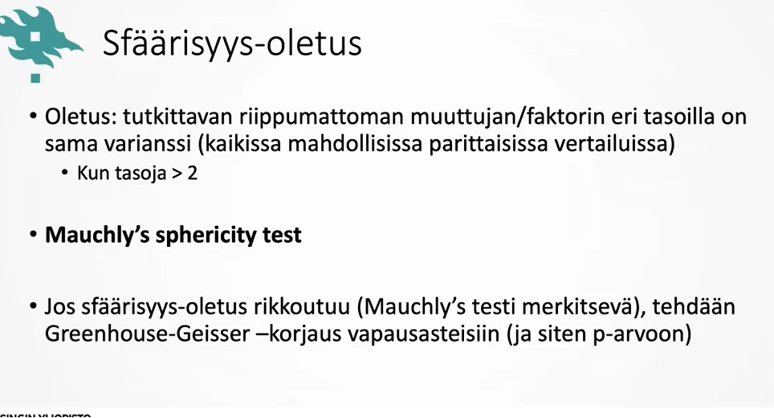

Sfäärisyysoletus

- vähän samantyyppinen kuin homogeenisuus (ryhmien välillä sama varianssi) oletus

- Oletus siis se, että riippumattoman muuttujan (tai faktorin) eri tasoilla on sama varianssi kaikissa mahdollisissa parittaisissa vertailuissa

  - kun tasoja on 2 tai enemmän

- testataan Mauchly’s sphericity testillä

  - Nollahypoteesi Mauchlyn sfäärisyystestissä on eri tasojen yhtenevä varianssi eli

  - jos merkitsevä p\<.05  tarkoittaa että muuttujan eri tasojen välillä varianssissa on eroa ja oletus rikkoutuu

  - jos ei merkitsevä p\>.05  oletus täyttyy ja varianssit samat muuttujan eri tasojen välillä

- Jos sfäärisyys oletus rikkoutuu

  - tehdään Greenhouse-Geisser-korjaus vapausasteisiin, joka muuttaa myös hiukan p-arvoa

 

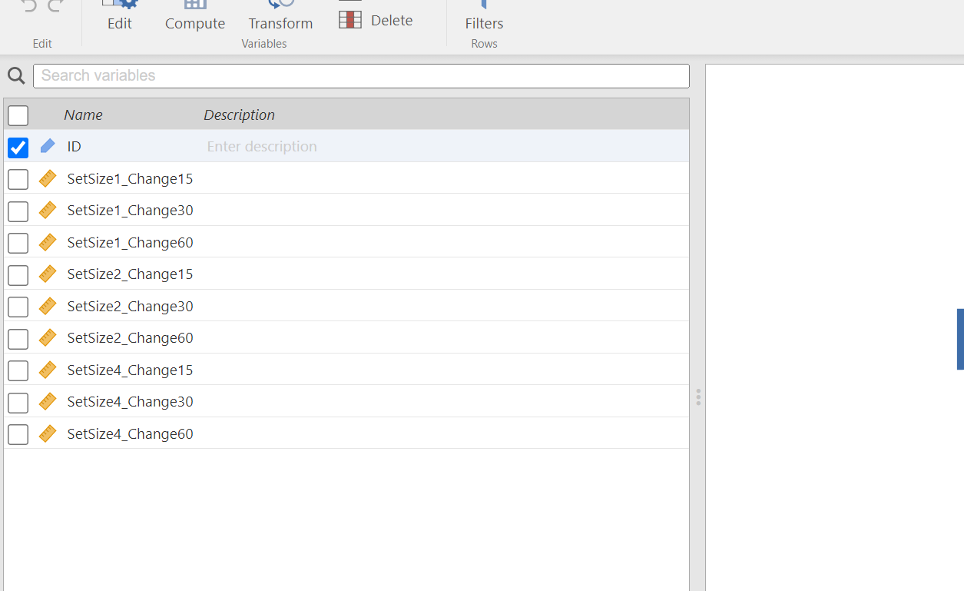

tutkimuksessa näytettiin koehenkilölle viivoja joko 1, 2 tai 4 kpl

tehtiin muutoksen tunnistuskoe siten, että viivat hävisivät sekunniksi ja sitten näytettiin niitä uudestaan siten, että niistä jokin kääntynyt joko 15,30 tai 60 astetta

- yhteensä siis 9 koeasetelmaa

- mitattiin d´asteikolla, joka vaihtelee suurinpiirtein 0-5 asteikolla

- 0 vastaa satunnaisuutta

- ja lähemmäs 5 lähestyy täydellistä suoritusta  

koska kyseisessä tutkimuksessa ja aineistossa samat koehenkilöt tekivät useamman mittauksen, täytyy ottaa toistomittaus-anova

 

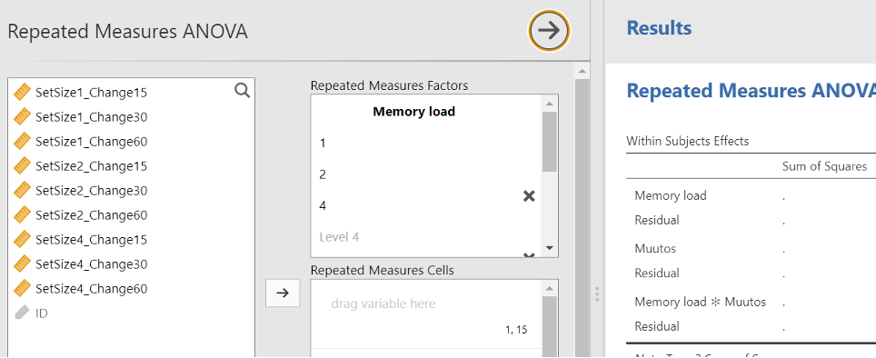

määritellään faktorit

 

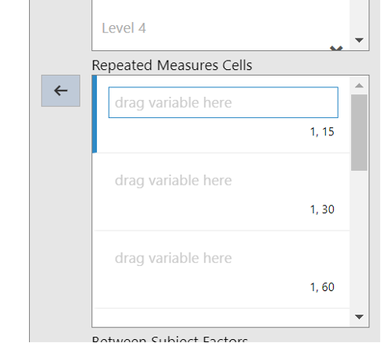

määritellyt faktorit näkyvät alemmassa laatikossa

oikean alaindeksin numerot ovat faktorien määritellyt arvot

 

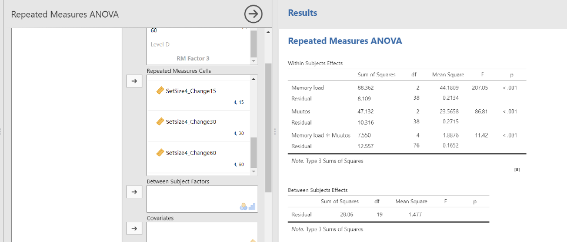

tuloksista nähdään, että memory loadissa (muistikuormitus) ja muutoksen havaitsemisessa oli koetilanteiden välillä merkitsevä ero

- p\<.05

löytyy myös interaktio memory loadin ja muutoksenhavaitsemisen välillä

between subject factors kohtaan voisi laittaa muuttujia, jos olisi myös kohenkilöiden välisiä vertailuja

 

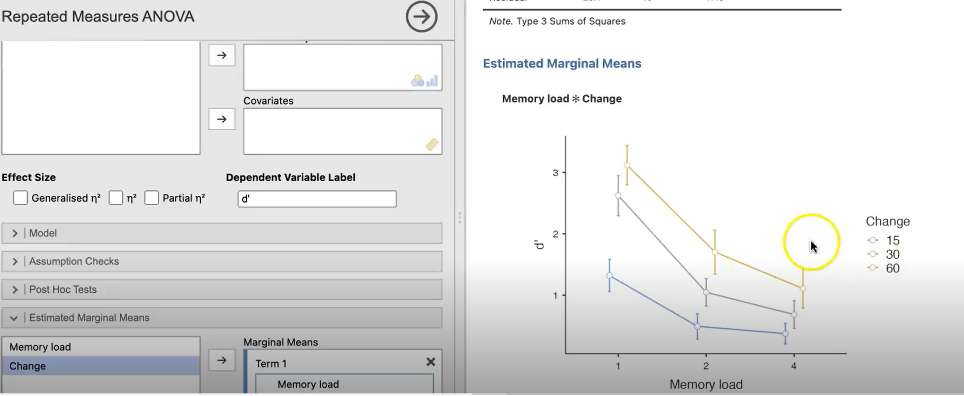

- Voidaan piirtää estimated marginal means

- dependent variable label kohdasta voi määritellä riippuvan muuttujan otsikon

- kuvaajasta nähdään, että kun muistikuormitus kasvaa niin muutos havaitaan huonommin joka muutostasolla

- interaktio hiukan vaikea nähdä kuvasta, mutta kun muistikuormitus on pieni niin muutoksen suuruudella on tilastollisesti merkitsevä ero suoriutumiseen. Kun taas kuormitus on suurempi niin, muutoksella ei enää ole suoriutumiseen eli muutoksen havaitsemiseen selkeää vaikutusta. Eli muutoksen vaikutus on erilainen kuormituksen eri tasoilla, joten löytyy interaktiota

 

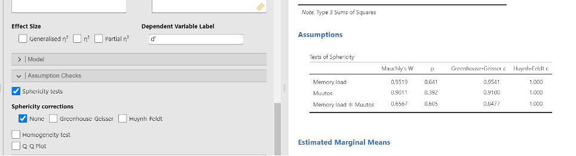

toistomittaus-Anovan oletukset

- within subjects asetelmassa homogeenisuusoletusta ei tarvita

- sfäärisyysoletus testataan Mauchly´s sphericity testillä

- kuvassa oletus täyttyy, sillä p-arvot ovat ei-merkitseviä

- jos sfäärisyysoletus rikkoutuisi, niin saataisiin greenhouse-geisser kohdasta klikkaamalla lisättyä sfäärisyyskorjaukset p-arvoon

 

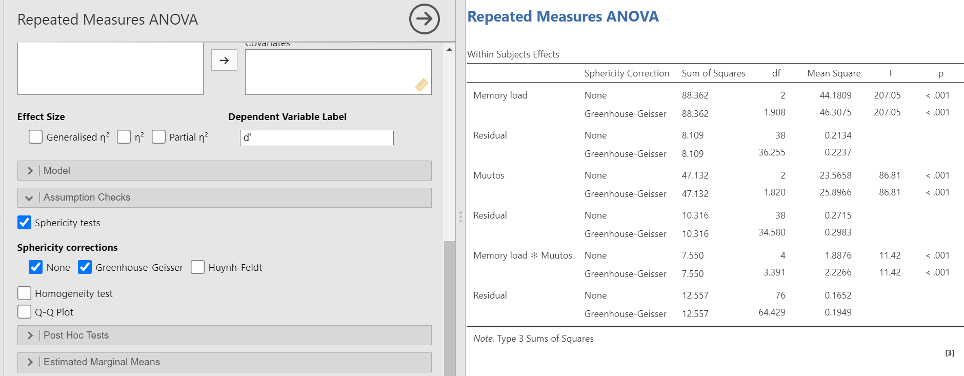

tuloksiin lisättynä Greenhouse-Geisser sfäärisyyskorjatut p-arvot

 

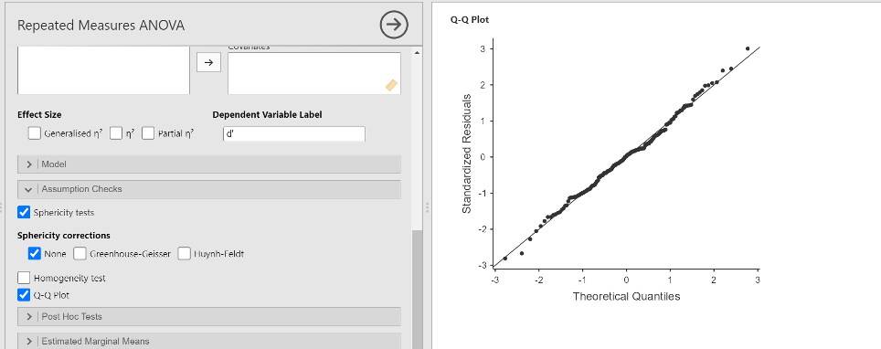

residuaalien normaalijakautuneisuus syytä tarkastaa q-q plotista

- kuvan residuaalit hyvin nätisti diagonaalilla

 

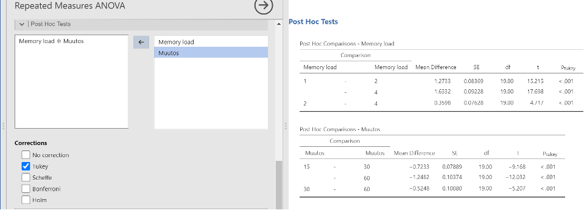

Post hoc testillä voidaan katsoa, mistä erot johtuvat

- t-testit eli tehdään parittaisvertailut joka testistä

- nähdään, että kaikki erot ovat merkitseviä

 

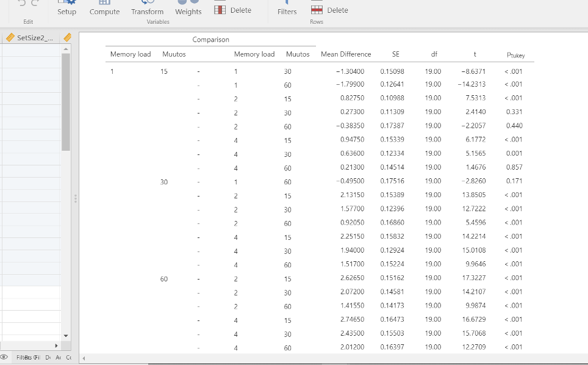

- interaktioiden parittaisvertailuita voi katsoa, mutta tilanteita tulee niin paljon, että hyvin haastavaa ja harvoin mielekästä tulkita niitä

- esim. 9 koetilanteen kanssa vertailuja tulee paljon

- mielekkäämpää tulkita interaktiota kuvaajasta

 

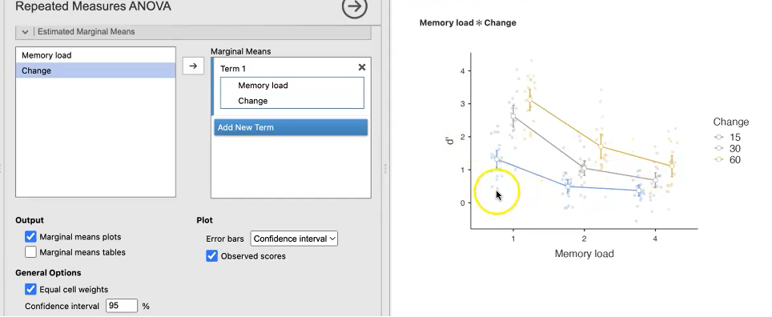

observed scores kohdasta saa havaintoarvot näkyviin kuvaajaan

 

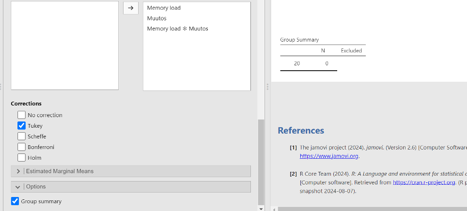

Options kohdasta group summary valitsemalla saa N ja poistetut koehenkilöt näkyviin

- anovassa koehenkilöillä täytyy olla joka tilanteessa arvoja tai poistuu analyysistä

 

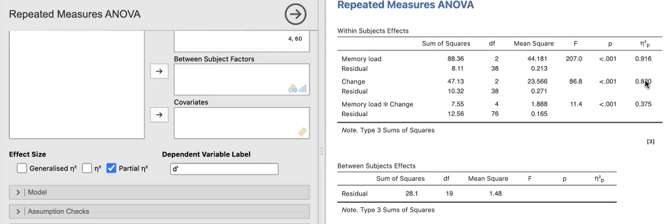

- partial n\^2 kertoo efektikoon

 

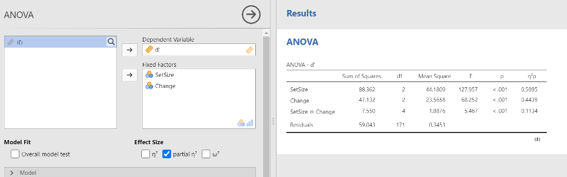

Tässä aineistona betweensubjects asetelmalla mitattuna samoja asioita 180 koehenkilön tutkimuksessa

- kuitenkin nähdään, että efektikoko ja testisuure F on pienemmät kuin 20 koehenkilön within subjects tutkimuksessa

<!-- -->

- kuvastaa sitä, että within subjects anovalla suurempi tilastollinen voima

- kannattaa siis suosia toistomittaus koeasetelmia paremman tilastollisen voiman vuoksi sekä helpomman tulosten tulkinnan takia

 

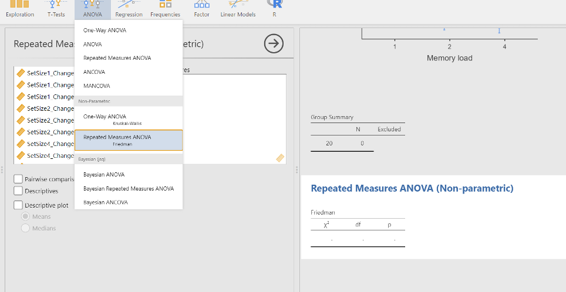

Mikäli qq-plot näyttäisi siltä, ettei normaalisuusoletus täyty, niin löytyy Friedmanin ei parametrinen toistomittaus-Anova

- suht vähän vaihtoehtoja valittavissa jamovissa tai ylipäätään

yleensä koeasetelmat suunnitellaan niin, että pystytään käyttämään parametrisiä testejä

 

## Faktorianalyysi 

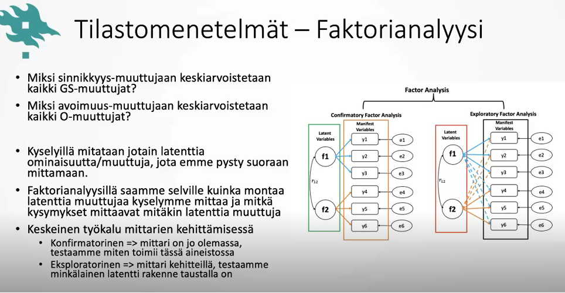

latentti rakenne

- ominaisuus, jota ei pystytä suoraan mittaamaan, vaan sitä voidaan esimerkiksi arvioida esimerkiksi useita kysymyksiä esittämällä

- voidaan kehittää mittari mittaamaan latenttia rakennetta ensiksi pohtimalla teoreettisen perustan avulla joukko kysymyksiä ja kysymällä ne. Sitten faktorianalyysillä selvitetään, mitkä kysymykset mittaavat sitä nimenomaista latenttia rakennetta parhaiten.

kaksi erilaista faktorianalyysia

- konfirmatorinen faktorianalyysi

  - on jo olemassa oleva mittari ja katsotaan, miten se sopii kyseiseen aineistoon

- Eksploratorinen faktorianalyysi

  - mittari kehitteillä ja kysymykset laitetaan faktorianalyysiin. Katsotaan analyysistä, minkälainen latentti rakenne taustalta löytyy.

 

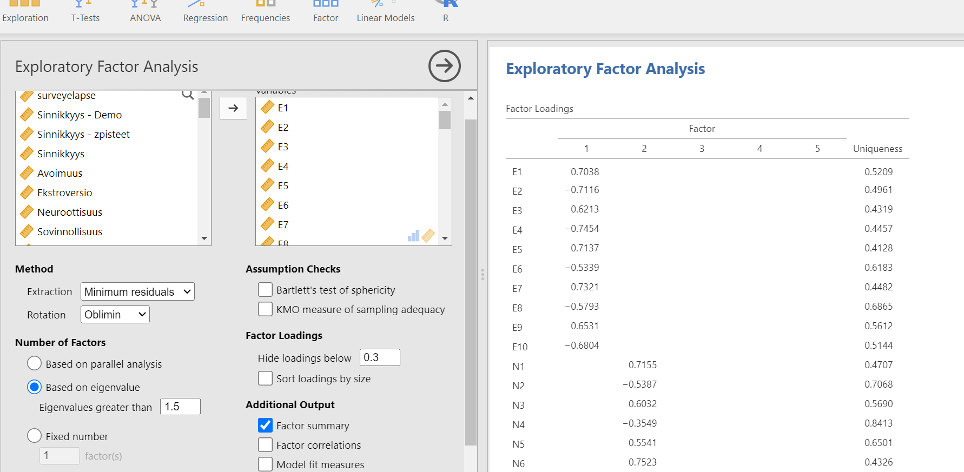

exploratorinen faktorianalyysi

- faktorilataukset ovat painokertoimia eli kertovat kuinka paljon tietty kysymys latautuu tietylle faktorille

  - positiivisuus tai negatiivisuus riippuu siitä, miten päin kysymys on aseteltu

  - kysymykset, jotka korreloivat voimakkaasti keskenään mittaavat samaa faktoria

  - kiinnostavaa on faktorien latauksen voimakkuus

  - kaikki faktorit latautuu tietylle kysymykselle jollain tavalla, mutta määritetään raja-arvo, jonka alittavat lataukset piilotetaan

  - yleensä raja-arvo on 0.3, joka on oletuksena jamovissa

    - eli ainoastaan 0.3 ylittävät lataukset ovat tuloksissa näkyvissä

- kiinnostavin tietyn kysymyksen kohdalla on lähinnä se faktori, jolle painokerroin on suurin. Eli kaikilla kysymyksillä on jonkin suuruinen painokerroin joka faktorille, mutta ainoastaan suurin kiinnostaa.

 

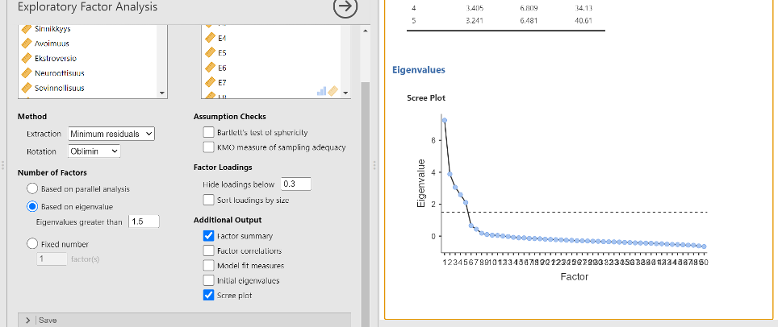

Eigenarvot näkee screeplotista

- mitä korkeampi eigenarvo, niin sitä korkeampi niin sitä enemmän kyseinen faktori selittää vaihtelusta

- screeplotista näkee faktorit x-akselilta ja y-akselilta eigenarvon

- kuvasta voi tulkita, että faktorit 1, 2, 3, 4 ja 5 selittävät - selkeästi enemmän vaihtelusta kuin loput faktorit

Number of factors kohdasta voi päättää, kuinka monta faktoria analyysissä on

- sen voi päättää eigenarvojen mukaan (kuvassa laitettu 1,5 screeplotin tulkinnan myötä)

- tai aineiston mukaan (based on parallel analysis)

- tai valita tietyn lukumäärän (fixed number)

  - esim. jos teoreettinen perusta antaa antaa perusteen tietylle faktorien määrälle

 

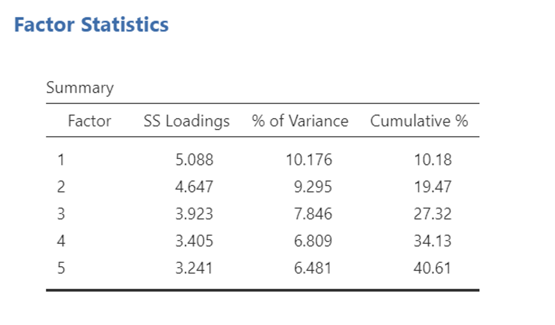

- \% of variance kertoo faktrorin varianssistä selittämän osuuden

 

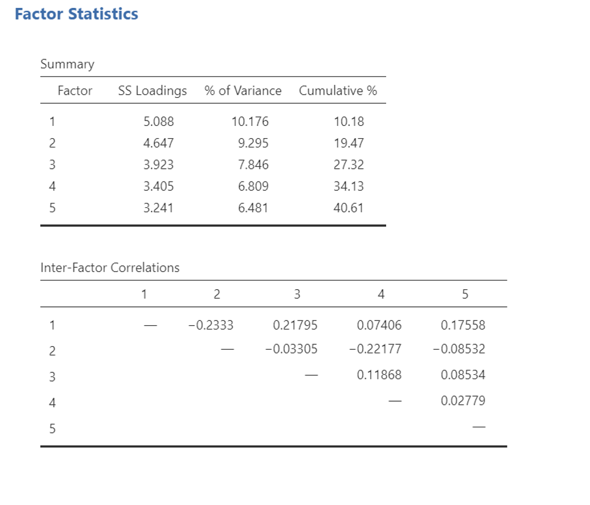

- faktoreiden korrelaatiot

 

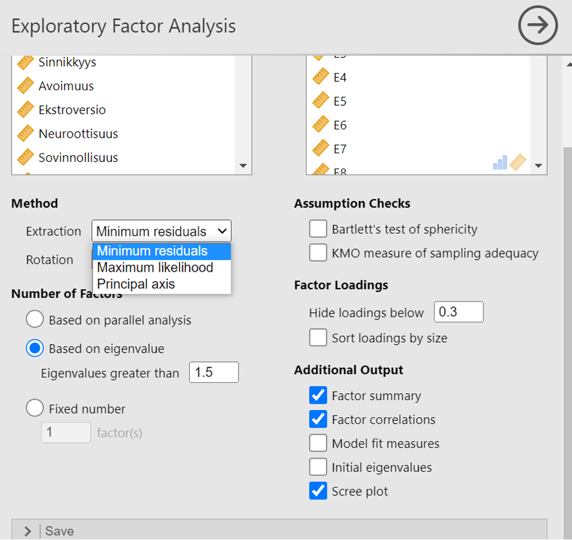

löytyy kolme eri tapaa laskea faktorianalyysi

- miten fitataan faktorirakenne aineistoon

- antaa vähän erilaisia tuloksia

 

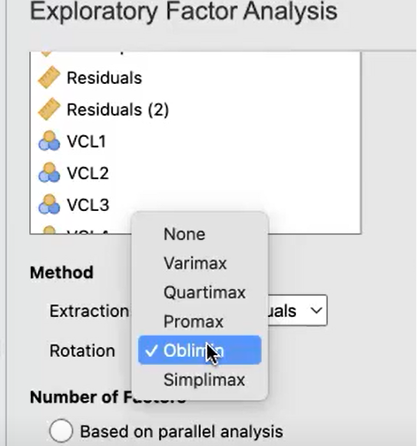

hiukan tärkeämpi ja kiinnostavampi on rotaatio

taustalla ajatus, että meillä on joku latentti rakenne taustalla, joka ei välttämättä osu täsmälleen kohdalleen kysymysten kanssa

kysymyspatteria ikään kuin ”pyöritellään”, jotta se maksimaalisesti osuu kohdalleen latentin rakenteen eli faktorin kanssa

löytyy erityyppisiä tapoja

- Oblimin

- Quartimax

- Promax

- Varimax

- Ei mitään

kriittistä se, että miten ajatellaan faktoreiden olevan

- jos ajatellaan faktoreiden olevan ortogonaalisia eli toisistaan riippumattomia ja täysin itsenäisiä eli eivät korreloi keskenään

  - silloin on syytä käyttää varimax rotaatiota

  - helpottaa tulkintaa, kun faktorit pakotetaan olemaan toisistaan riippumattomia ja korrelaatio 0

- jotkin muut rotaatiot eivät oleta ortogonaalisuutta ja siis sallivat faktorien korreloivan keskenään

  - tällöin tulkinta menee vaikeammaksi, mutta malli voi fitata paremmin dataan

  - koska tulkinta menee vaikeammaksi niin usein parempi käyttää oletusta, että faktorit ovat ortogonaalisia

- esim. jos ajatellaan, että meillä on 5 persoonallisuuspiirrettä, jotka ovat toisistaan riippumattomia niin ei voida käyttää Obliminia, koska siinä faktorien välillä on korrelaatiota

  - eli jos halutaan faktorien olevan riippumattomia niin Varimax paras vaihtoehto

- Rotaation valinta riippuu taustateoriasta

  - ajatellaanko faktorien olevan toisistaan riippumattomia vai sallitaanko niiden korreloida keskenään

 

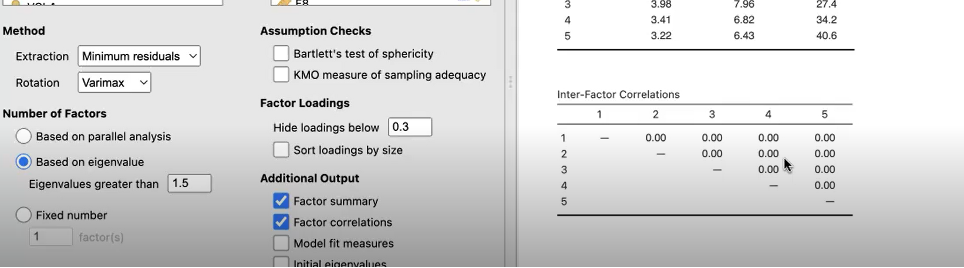

Varimax rotaatio käytössä

- korrelaatio faktorien välillä 0

 

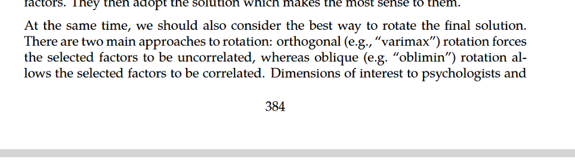

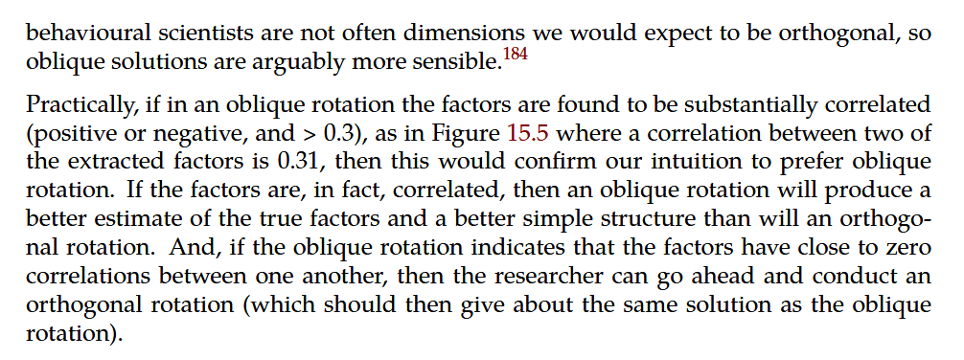

 

voidaan valita ortogonaalinen tai obliikki rotaatio

ensiksi kannattaa testata obliikilla rotaatiolla eli esim. Oblimin tai Promax onko faktorien välillä minkälaista korrelaatiota

- mikäli löytyy yli 0.3 korrelaatio joidenkin faktorien välillä niin kannattaa käyttää obliikkia rotaatiota

- eli, kun korrelaatio \> 0.3 -\> käytä promax tai oblivin

- kun korrelaatio \< 0.3 -\> käytä varimax

- myös teoreettista taustaa täytyy miettiä eli onko todennäköistä sen pohjalta, että faktorit korreloivat keskenään.  

Tiivistys loppuun

- mittaria kehitettäessä iso läjä kysymyksiä

- tehdään faktorianalyysi ja voidaan eksploratiivisesti tutkia minkätyylisiä rakenteita tämä iso läjä kysymyksiä mittaa

  - voi olla yksi faktori -\> kaikki kysyvät samaa asiaa

  -  voi olla 2, 3, 4 tai mitä tahansa

  - tutkijan tehtävä on teoreettisen mallin perusteella miettiä, mikä on oikea rakenne

    - onko ortogonaalinen

      - halutaanko, että faktorit ovat korreloivia vai korreloimattomia

    - kuinka monta faktoreita tarvitaan 

    - mikä on tavoiteltu selitysosuus

 

## Bayes faktori

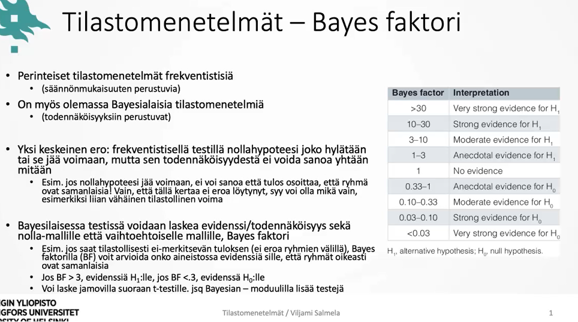

Pääasiassa tällä kurssilla käsitelty frekventistisiä tilastomenetelmiä

- perustuvat säännönmukaisuuteen

- nollahypoteesi joko hylätään tai voimaan, mutta sen todennäköisyydestä ei voi sanoa yhtään mitään

Bayesilaisessa statistiikassa verrataan aina malleja

- nollamalli ja vaihtoehtoinen malli, voi olla useampiakin

  - bayesilaisellä todennäköisyyslaskennalla arvioidaan sitä, onko evidenssin perusteella mikä malli todennäköisesti oikein tai paras

  - Bayesilainen laskenta on symmetristä

    - samalla tavalla kuin voidaan laskea nollamallille evidenssiä voidaan myös laskea vaihoehtoiselle hypoteesille

  - Bayes-faktori on myös tavallaan efektikoon mitta

Bayes faktori

- kun saadaan frekventisitisestä analyysistä nollatulos eli nollahypoteesi jää voimaan, niin voi laskea bayes faktorin avulla löytyykö aineistosta evidenssiä nollatulokselle

- tulkinnallinen mitta

  - Arvo 0.33–3 -\> ei evidenssiä

  - yli kolme -\> evidenssiä vaihtoehtoiselle hypoteesille H~1~

  - alle 0.33 -\> evidenssiä nollahypoteesille H~0~

 

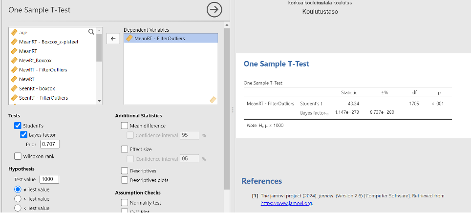

One sample t-testi

- test valuena 1000

- bayes factor

- arvo kymmeniä tuhansia eli hyvin voimakas efekti

- Bayes faktori löytyy kaikista t-testeistä

 

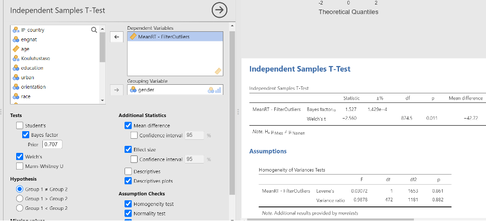

independent samples t-testi

- bayes faktorin tulkinta statistic kohdan testisuureesta

  - arvo 1,5 eli ei ole evidenssiä ylipäätään sen mukaan

  - p-arvo Welchin t-testissä on merkitsevä eli vaihtoehtoinen hypoteesi tilastollisesti merkitsevä

  - bayesiläisen laskennan mukaan kuitenkin ero on niin pieni ettei siellä juurikaan ole evidenssiä suuntaan tai toiseen

 

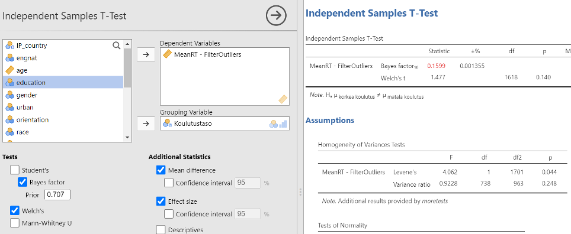

tässä p-arvo ei ole welchin testillä merkitsevä ei nollahypoteesi säilyy

bayesin faktorilla voi katsoa löytyykö sen mukaan evidenssiä nollahypoteesille

- arvo on 0.1599, joka on pienempi kuin 0.3 eli evidenssiä löytyy nollahypoteesille bayes faktorin mukaan

- voitaisiin sanoa, että aineiston mukaan löytyy evidenssiä sille, että reaktioajat ovat eri koulutustasoryhmien välillä samanlaisia

- tätä ei samalla tavalla pysty frekventistisellä statistiikalla päättelemään, voidaan ainoastaan sanoa, ettei löytynyt merkitsevää eroa

Jamovissa näkyvä bayes factor~10~

- alaindeksissä olevat numerot 1ja 0 tarkoittavat, että tulokset tulkitaan siten, että yli 3 arvot tukevat vaihtoehtoista hypoteesia ja alle 0.3 arvot tukevat nollahypoteesia

- voitaisiin laskea myös toisinpäin, jolloin tulkinta vain kääntyisi päinvastoin

 

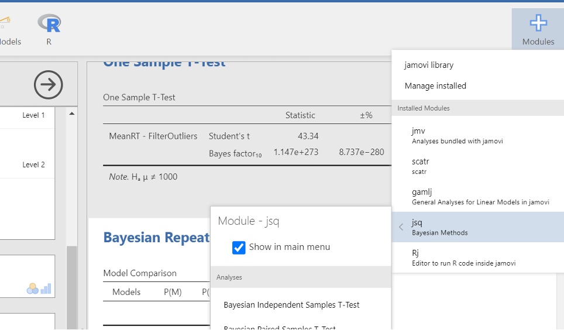

jsq moduulin lataamalla sai lisättyä bayesilaiset anovat yms. tilastoanalyysit

loppuvideossa käydään läpi Bayesilainen toistomittaus anova -\> katso ensin normaali toistmittaus Anova video

 
