## Scatterplot, HeatMap ja Rj-editor 

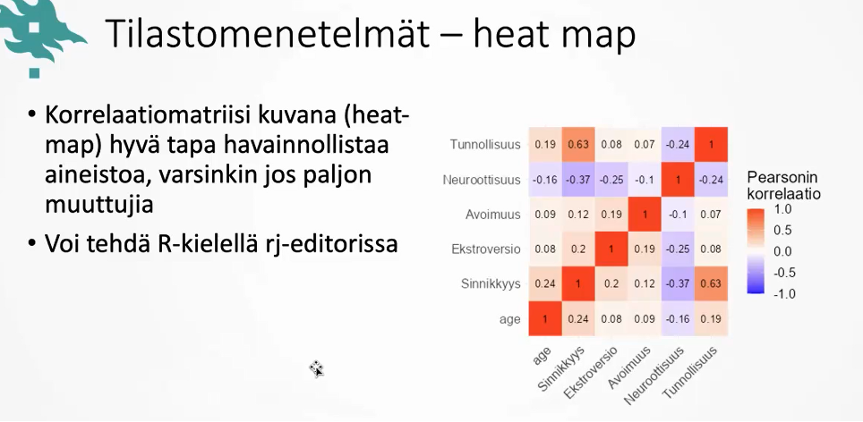

<br>

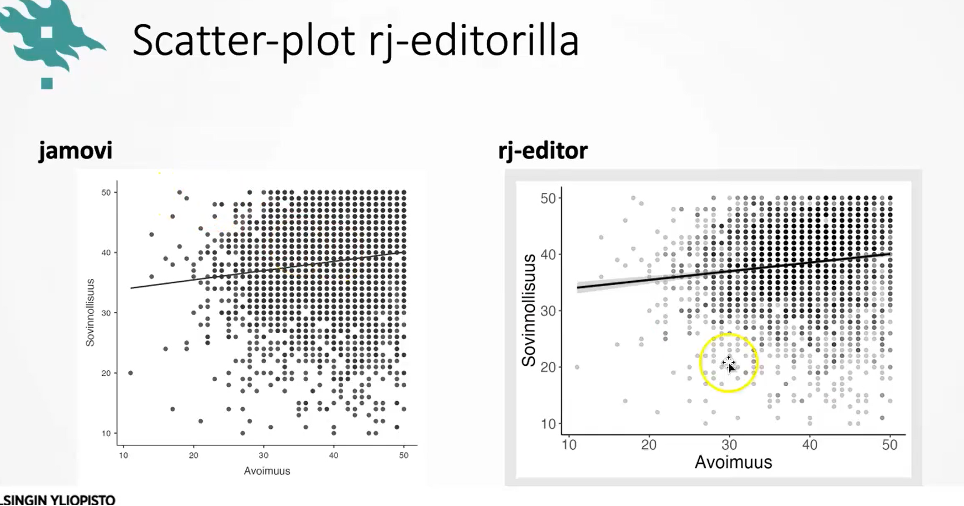

- jamovissa haasteena, että piirtää kaikki pisteet joissa useampia havaintoja vain suoraan mustaksi

- rj-editorilla voidaan määritellä transparenssia eli läpinäkyvyyttä sen mukaan kuinka paljon havaintoja tietty arvo on saanut

<br>

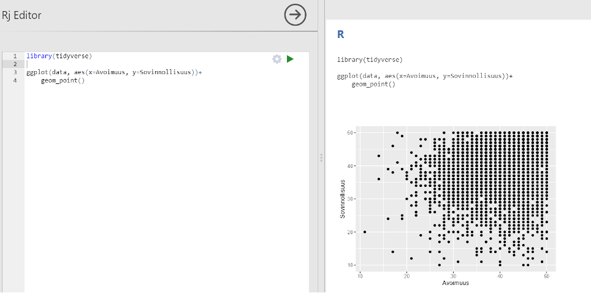{width="600"}

komennot:

- library(tidyverse) -\> hakee kirjaston tidyverse, joka sisältää ggplotin

- ggplot(data, aes(x=Avoimuus, y=Sovinnollisuus)) -\> luo kuvan ja x ja y akselit

- \+ -\> pystyy lisäämään elementtejä kuvaan

- geom_point() -\> lisää pisteet kuvaan

<br>

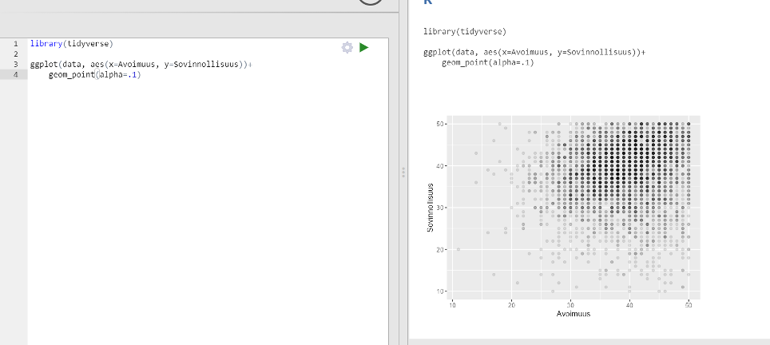{width="600"}

- geom_point(alpha=.1) -\> alpha määrittelee läpinäkyvyyden tason. 1 ei yhtään läpinäkyvä ja mitä lähempänä 0 sitä läpinäkyvämpi

<br>

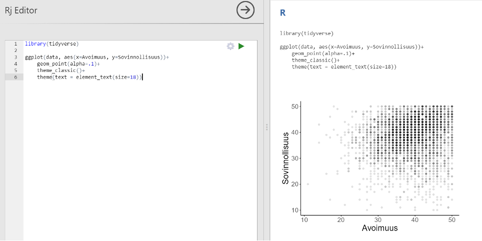{width="600"}

- theme_classic -\> muuttaa teeman

- theme(text = element_text(size=18)) -\> muuttaa tekstin fonttikoon

<br>

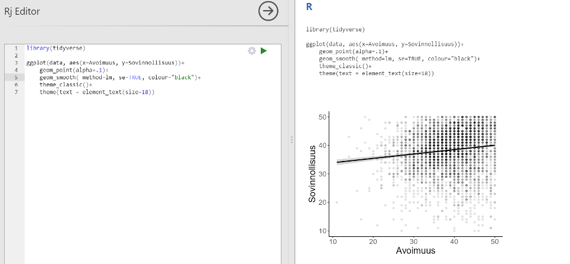{width="600"}

geom_smooth( method=lm, se=TRUE, colour="black")

- piirtää regressiosuoran

<br>

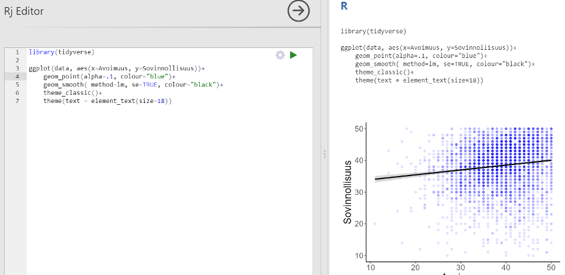{width="600"}

- geom_point(alpha=.1, colour="blue") -\> lisättiin värikomento ja pisteet muutettiin sinisiksi

<br>

## Heatmap rj-editorilla 

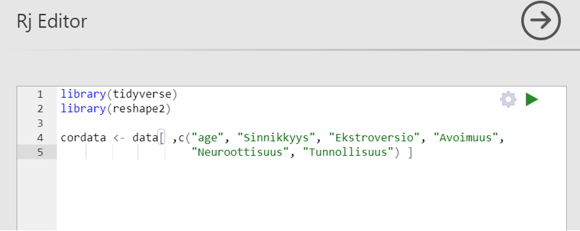

cordata \<- data\[ ,c("age", "Sinnikkyys", "Ekstroversio", "Avoimuus",  "Neuroottisuus", "Tunnollisuus") \]

- komennolla saadaan valittua haluttu tietty osa datasta

- reshape2 librarya tarvitaan heatmapin tekemiseen

str(cordata) -\> tällä voi tsekata minkätyyppisiä muuttujat ovat, minulla tuli koko ajan virhe ”x must be numeric”, joka johtui siitä, että ikä oli jäänyt vahingossa kategoriseksi muuttujaksi

<br>

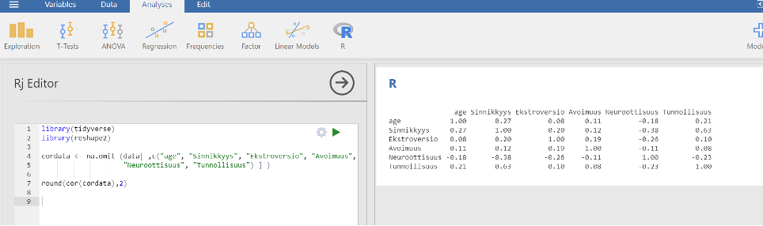

round(cor(cordata),2)

- round() -\> pyöristää, kun 2 niin kahteen desimaaliin, kun 4 niin 4 desimaaliin yms

cor(cordata) -\> cor() tekee korrealaatiomatriisin

<br>

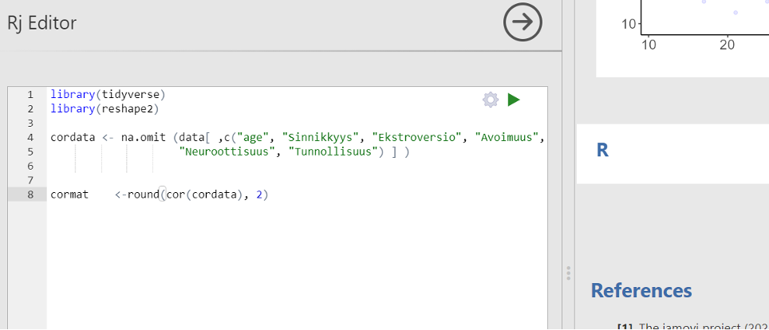{width="600"}

\<- komennolla tallennetaan tulokset johonkin muuttujaan

cormat \<- round(cor(cordata), 2), tallentuu cormat muuttujaan

- silloin kun tallennetaan johonkin ne eivät myöskään tulostu näkyviksi

- ne saadaan tulostettua näkyville kirjoittamalla muuttuja, johon ne tallennettiin eli tässä tapauksessa cormat

<br>

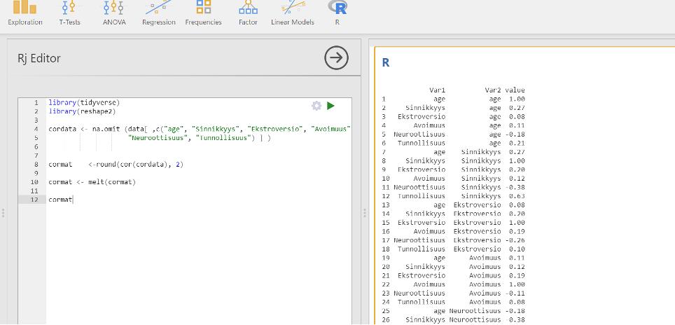{width="600"}

melt(cormat)

- muuttaa numerot datamatriisiksi, jotka pystytään sitten muuttamaan heatmapiksi

<br>

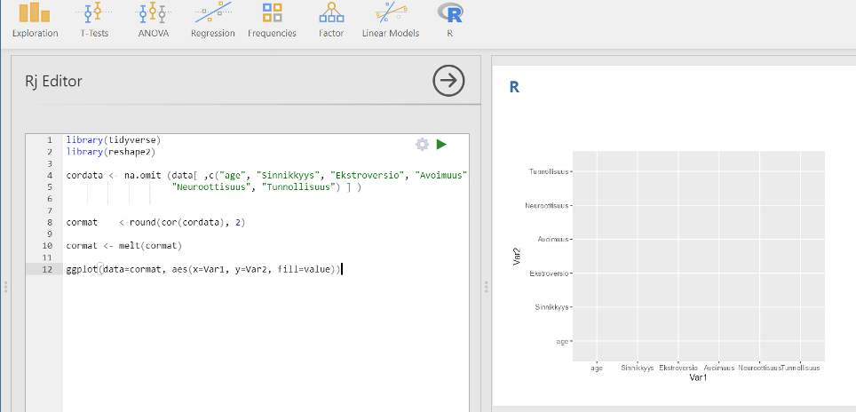

käytetään ggplotia kuvan luomiseen

ggplot(data=cormat, aes(x=Var1, y=Var2, fill=value))

- Var1 ja Var2 ovat äskeisen melt funktion luomat muuttujat

<br>

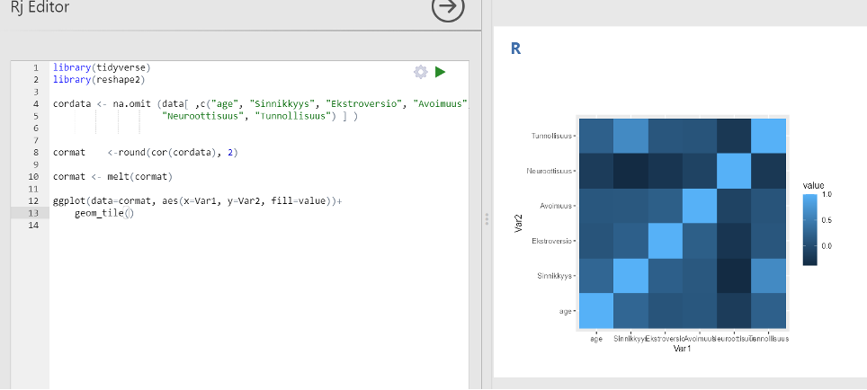

- geom_tile() -\> lisää värit korrelaation mukaisesti

<br>

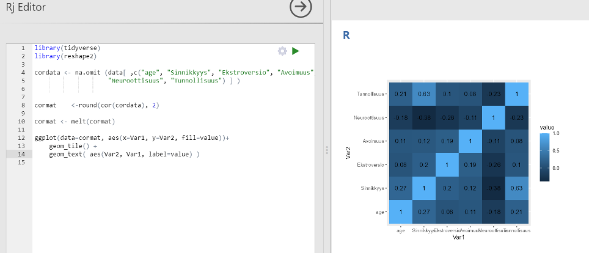

geom_text( aes(Var2, Var1, label=value) )

- lisää arvot laatikoihin

<br>

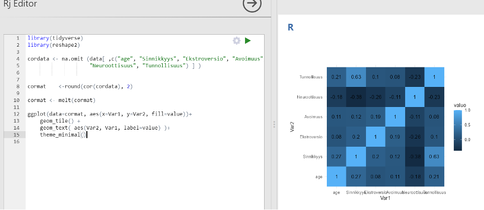

theme_minimal()

- määrittää teeman

<br>

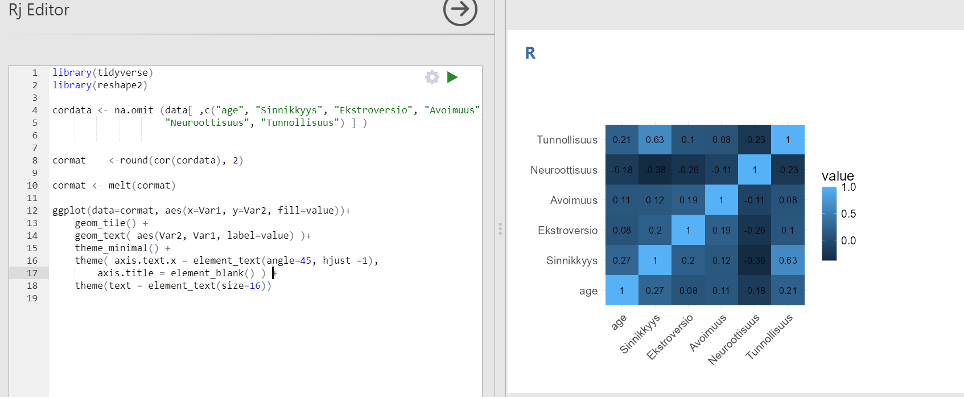

theme(text = element_text(size=16))

- määrittää tekstin koon

theme( axis.text.x = element_text(angle=45, hjust =1), axis.title = element_blank() )

theme( axis.text.x = element_text(angle=45, hjust =1))

- kääntää tekstien kulman 45 asteeseen

axis.title = element_blank()

- poistaa otsikot Var1 ja Var2

<br>

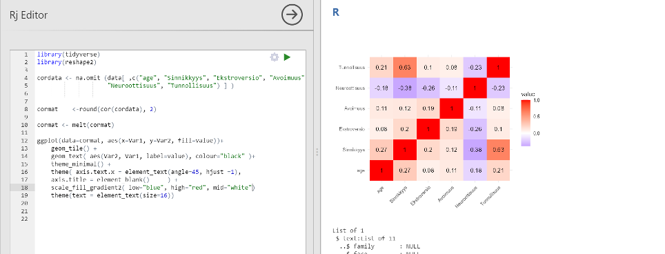

scale_fill_gradient2( low="blue", high="red", mid="white")

- määrittää heatmapin värit

<br>

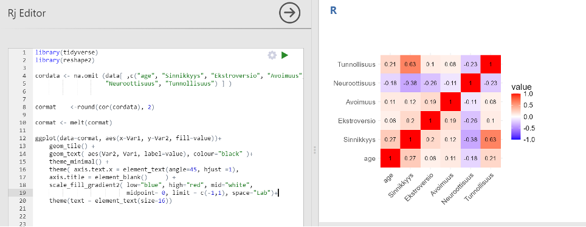

scale_fill_gradient2( low="blue", high="red", mid="white",

midpoint= 0, limit = c(-1,1), space="Lab")+

midpoint= 0, limit = c(-1,1), space="Lab"

- lisäyksellä varmistetaan, että värien skaala menee -1:stä 1:n, vaikka arvoissa ei olisi yhtään ääriarvoa.

<br>

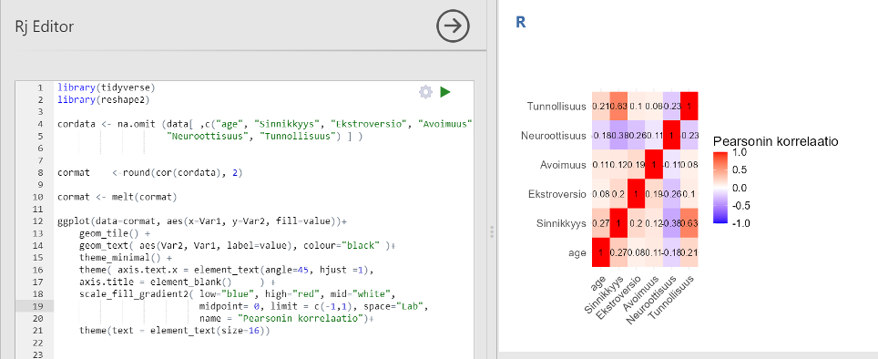

name = "Pearsonin korrelaatio"

- lisäys muutti skaalan nimeksi Pearsonin korrelaatio

scale_fill_gradient2( low="blue", high="red", mid="white",

midpoint= 0, limit = c(-1,1), space="Lab",

name = "Pearsonin korrelaatio")

<br>

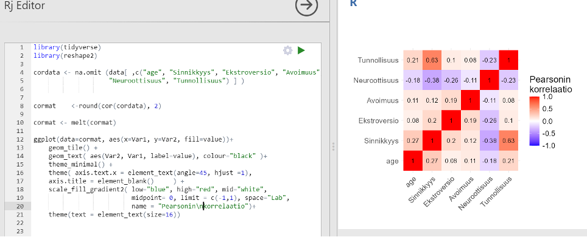

\\n tekee rivinvaihdon

name = "Pearsonin\\nkorrelaatio"

-  saatiin Pearsonin ja korrelaatio eri riveille

<br>

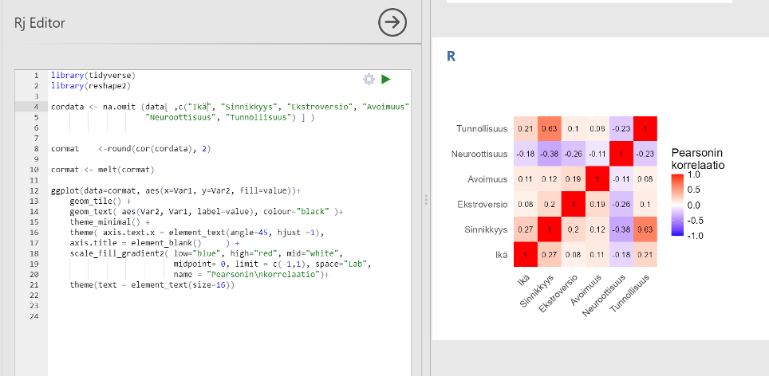

muutettiin muuttujan ”age” nimi suomenkieliseksi eli ”Ikä”.

- käytiin ensin vaihtamassa data välilehdeltä muuttujan nimi oikeasti ja sitten se piti vielä korjata r-editoriin oikeaksi nimeksi takaisin

<br>

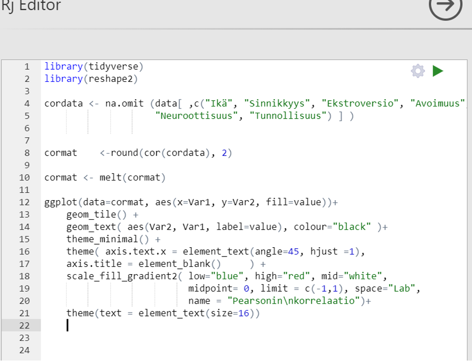

Vielä kopioitavana teksinä koko heatmapin koodi:

```{r}
#| eval: false 

library(tidyverse)

library(reshape2)

cordata <- na.omit (data[ ,c("Ikä", "Sinnikkyys", "Ekstroversio", "Avoimuus",

"Neuroottisuus", "Tunnollisuus") ] )

cormat <-round(cor(cordata), 2)

cormat <- melt(cormat)

ggplot(data=cormat, aes(x=Var1, y=Var2, fill=value))+

geom_tile() +

geom_text( aes(Var2, Var1, label=value), colour="black" )+

theme_minimal() +

theme( axis.text.x = element_text(angle=45, hjust =1),

axis.title = element_blank() ) +

scale_fill_gradient2( low="blue", high="red", mid="white",

midpoint= 0, limit = c(-1,1), space="Lab",

name = "Pearsonin\nkorrelaatio")+

theme(text = element_text(size=16))


```
