## Scatterplot, HeatMap ja Rj-editor


<br>


- jamovissa haasteena, että piirtää kaikki pisteet joissa useampia havaintoja vain suoraan mustaksi

- rj-editorilla voidaan määritellä transparenssia eli läpinäkyvyyttä sen mukaan kuinka paljon havaintoja tietty arvo on saanut

<br>

{width="600"}

komennot:

- library(tidyverse) -\> hakee kirjaston tidyverse, joka sisältää ggplotin

- ggplot(data, aes(x=Avoimuus, y=Sovinnollisuus)) -\> luo kuvan ja x ja y akselit

- \+ -\> pystyy lisäämään elementtejä kuvaan

- geom_point() -\> lisää pisteet kuvaan

<br>

{width="600"}

- geom_point(alpha=.1) -\> alpha määrittelee läpinäkyvyyden tason. 1 ei yhtään läpinäkyvä ja mitä lähempänä 0 sitä läpinäkyvämpi

<br>

{width="600"}

- theme_classic -\> muuttaa teeman

- theme(text = element_text(size=18)) -\> muuttaa tekstin fonttikoon

<br>

{width="600"}

geom_smooth( method=lm, se=TRUE, colour="black")

- piirtää regressiosuoran

<br>

{width="600"}

- geom_point(alpha=.1, colour="blue") -\> lisättiin värikomento ja pisteet muutettiin sinisiksi

<br>

## Heatmap rj-editorilla


cordata \<- data\[ ,c("age", "Sinnikkyys", "Ekstroversio", "Avoimuus",  "Neuroottisuus", "Tunnollisuus") \]

- komennolla saadaan valittua haluttu tietty osa datasta

- reshape2 librarya tarvitaan heatmapin tekemiseen

str(cordata) -\> tällä voi tsekata minkätyyppisiä muuttujat ovat, minulla tuli koko ajan virhe ”x must be numeric”, joka johtui siitä, että ikä oli jäänyt vahingossa kategoriseksi muuttujaksi

<br>


round(cor(cordata),2)

- round() -\> pyöristää, kun 2 niin kahteen desimaaliin, kun 4 niin 4 desimaaliin yms

cor(cordata) -\> cor() tekee korrealaatiomatriisin

<br>

{width="600"}

\<- komennolla tallennetaan tulokset johonkin muuttujaan

cormat \<- round(cor(cordata), 2), tallentuu cormat muuttujaan

- silloin kun tallennetaan johonkin ne eivät myöskään tulostu näkyviksi

- ne saadaan tulostettua näkyville kirjoittamalla muuttuja, johon ne tallennettiin eli tässä tapauksessa cormat

<br>

{width="600"}

melt(cormat)

- muuttaa numerot datamatriisiksi, jotka pystytään sitten muuttamaan heatmapiksi

<br>


käytetään ggplotia kuvan luomiseen

ggplot(data=cormat, aes(x=Var1, y=Var2, fill=value))

- Var1 ja Var2 ovat äskeisen melt funktion luomat muuttujat

<br>


- geom_tile() -\> lisää värit korrelaation mukaisesti

<br>


geom_text( aes(Var2, Var1, label=value) )

- lisää arvot laatikoihin

<br>


theme_minimal()

- määrittää teeman

<br>


theme(text = element_text(size=16))

- määrittää tekstin koon

theme( axis.text.x = element_text(angle=45, hjust =1), axis.title = element_blank() )

theme( axis.text.x = element_text(angle=45, hjust =1))

- kääntää tekstien kulman 45 asteeseen

axis.title = element_blank()

- poistaa otsikot Var1 ja Var2

<br>


scale_fill_gradient2( low="blue", high="red", mid="white")

- määrittää heatmapin värit

<br>


scale_fill_gradient2( low="blue", high="red", mid="white",

midpoint= 0, limit = c(-1,1), space="Lab")+

midpoint= 0, limit = c(-1,1), space="Lab"

- lisäyksellä varmistetaan, että värien skaala menee -1:stä 1:n, vaikka arvoissa ei olisi yhtään ääriarvoa.

<br>


name = "Pearsonin korrelaatio"

- lisäys muutti skaalan nimeksi Pearsonin korrelaatio

scale_fill_gradient2( low="blue", high="red", mid="white",

midpoint= 0, limit = c(-1,1), space="Lab",

name = "Pearsonin korrelaatio")

<br>


\\n tekee rivinvaihdon

name = "Pearsonin\\nkorrelaatio"

- saatiin Pearsonin ja korrelaatio eri riveille

<br>


muutettiin muuttujan ”age” nimi suomenkieliseksi eli ”Ikä”.

- käytiin ensin vaihtamassa data välilehdeltä muuttujan nimi oikeasti ja sitten se piti vielä korjata r-editoriin oikeaksi nimeksi takaisin

<br>


Vielä kopioitavana teksinä koko heatmapin koodi:

```{r}
#| eval: false 

library(tidyverse)

library(reshape2)

cordata <- na.omit (data[ ,c("Ikä", "Sinnikkyys", "Ekstroversio", "Avoimuus",

"Neuroottisuus", "Tunnollisuus") ] )

cormat <-round(cor(cordata), 2)

cormat <- melt(cormat)

ggplot(data=cormat, aes(x=Var1, y=Var2, fill=value))+

geom_tile() +

geom_text( aes(Var2, Var1, label=value), colour="black" )+

theme_minimal() +

theme( axis.text.x = element_text(angle=45, hjust =1),

axis.title = element_blank() ) +

scale_fill_gradient2( low="blue", high="red", mid="white",

midpoint= 0, limit = c(-1,1), space="Lab",

name = "Pearsonin\nkorrelaatio")+

theme(text = element_text(size=16))


```

<br>

## Long ja wide format (pitkä ja leveä data)

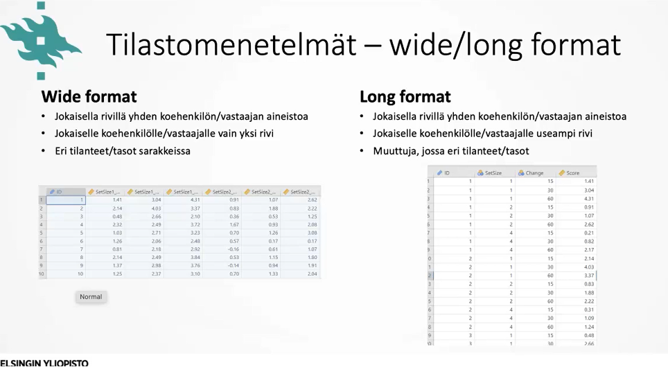

Wide

- joka rivillä yhden koehenkilön aineistoa

- joka koehenkilöllä vain yksi rivi

- eri tilanteet sarakkeissa

Long

- joka rivillä vain yhden koehenkilön aineistoa, mutta joka koehenkilölle on varattuna useampi rivi

- muuttuja, jossa eri tilanteet / tasot

<br>

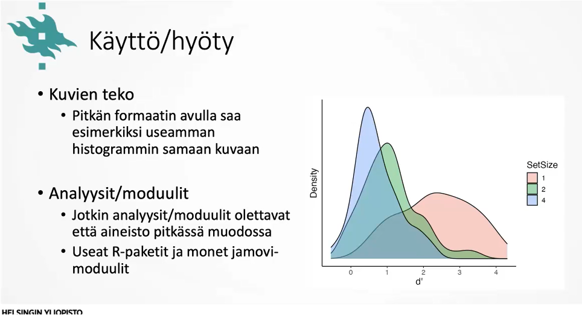

jos kääntää aineiston pitkään muotoon niin helppo tehdä kuvia

- esim. saa samaan kuvaan monta histogrammia

<br>

### Jamovissa

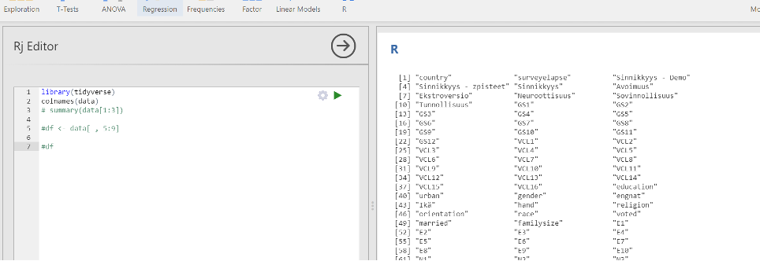

colnames(data) -\> komennolla näkee, mitkä ovat datan kolumnien eli sarakkeiden nimet

<br>

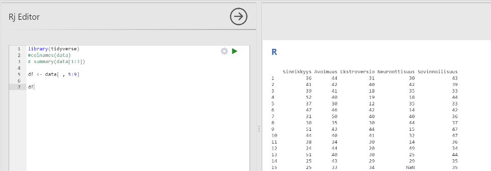

\<- data\[ , 5:9\]

- komennolla tallennettiin data sarakkeista numero 5:stä numero 9:n muuttujaan df

- sen jälkeen df muuttujalla saa tulostettua kyseiset sarakkeet

<br>

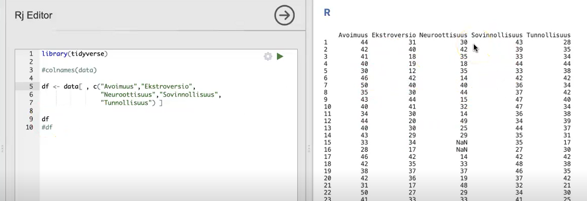

kolumnit voi tallentaa df muuttujaan myös seuraavalla komennolla

- \<- data\[ , c(”Avoimuus”, ”Ekstroversio”)\] ¨

- tällöin täytyy kirjoittaa sarakkeiden nimet täsmälleen oikein

<br>

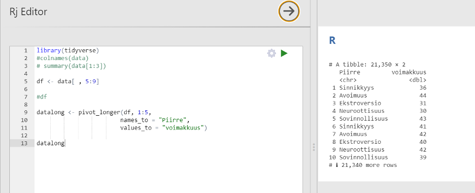

pivot_longer(df, 1:5, names_to = ”Piirre”, values_to = ”Voimakkuus”)

- muuttaa datan pitkään muotoon. names_to ja values:to muuttavat sarakkeiden otsikoita

- \<- jälleen kerran nuolikomennolla talletetaan tiettyyn muuttujaan (datalong)

Jamovissa ei pysty suoraan viemään r-editorista datapuolelle graafiseen käyttöliittymään, joten data pitkässä muodossa täytyy tallettaa

<br>

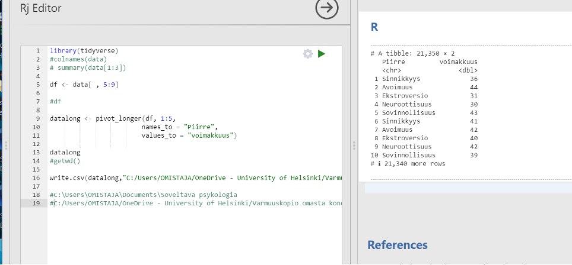

getwd() komennolla näkee working directoryn?? en tiedä mitä hyötyä siitä oli, koska kuitenkin oli eri kuin mihin kaikki tiedostovat lähtökohtaisesti kannattaa tallentaa

write.csv() komennolla saa talletettua tiedoston valitsemaansa kansioin

C:/Users/OMISTAJA/OneDrive - University of Helsinki/Varmuuskopio omasta koneesta/Tiedostot/Soveltava Psykologia/Tutkimusmenetelmät_1/Data/Grit\_&\_ Face/datalong.csv"

- käytin kyseistä polkua

- Kun kopioi polun siitä täytyy muuttaa kenoviivat kauttaviivoiksi, eli alun perin kopioidussa ne ovat \\ ja tulee virhe. Kun ne muuttaa / niin alkaa toimimaan

- loppuun pitää muistaa kirjoittaa uuden tiedoston nimi eli esim. ”datalong.csv”

write.csv(datalong,"C:/Users/OMISTAJA/OneDrive - University of Helsinki/Varmuuskopio omasta koneesta/Tiedostot/Soveltava Psykologia/Tutkimusmenetelmät_1/Data/Grit\_&\_ Face/datalong.csv")

- tuo oli komento kokonaisuudessaan, jolla tiedosto suostui tallentumaan

<br>

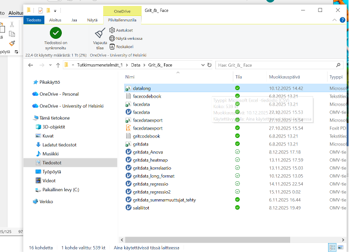

<br>

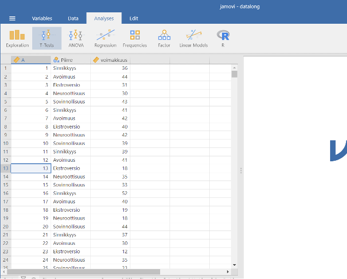

- sen myötä kyseiseen valittuun kansioon tallentui tiedosto datalong.csv

- jamovissa voi avata tiedoston, joka on nyt long formatissa eli joka koehenkilöllä on 5 eri riviä

<br>

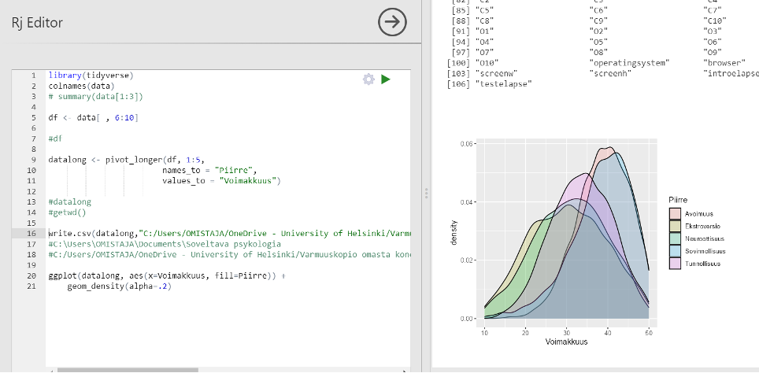

nyt, kun datalong oli muutettu pitkään formaattiin niin siitä pystyttiin piirtämään histogrammit joka piirteestä päällekäin

- histogrammi piirrettiin ggplotilla seuraavalla komennolla

- ggplot(datalong, aes(x=Voimakkuus, fill=Piirre)) +

  - geom_density(alpha=.2)

  - alpha käskyllä saa läpinäkyvyyttä säädettyä

<br>

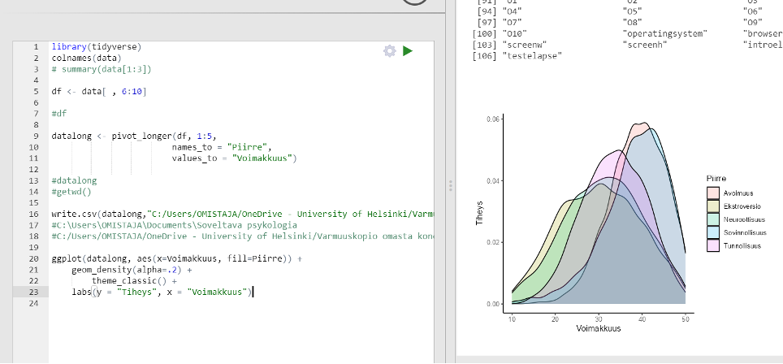

theme_classic()

- muuttaa teeman yksinkertaisemmaksi ja taustalta poistuu ylimääräinen sälä

labs()

- muokkaa otsikoita eli labeleitä

<br>

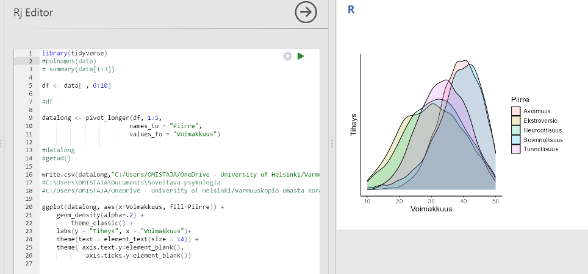

theme(text = element_text(size = 14))

- muokkaa tekstin fonttikokoa

<br>

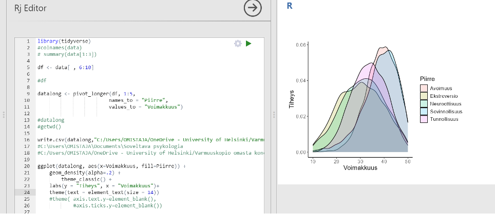

theme( axis.text.y=element_blank(), axis.ticks.y=element.blank()) poistaa y-akselin arvot kuvaajasta

alemmassa kuvassa y-akselin arvot näkyvät, koska komento on otettu pois käytöstä eron havainnollistamiseksi. Ylemmässä kuvassa arvot ovat poistettuna

koodi, jolla saa muunnettua datan pitkään muotoon (long form) ja piirrettyä päällekkäiset histogrammit

```{r}
#| eval: false 

library(tidyverse)
#colnames(data)
# summary(data[1:3])

df <- data[ , 6:10]

#df

datalong <- pivot_longer(df, 1:5,
                        names_to = "Piirre",
                        values_to = "Voimakkuus")
                        
#datalong
#getwd()

write.csv(datalong,"C:/Users/OMISTAJA/OneDrive - University of Helsinki/Varmuuskopio omasta koneesta/Tiedostot/Soveltava Psykologia/Tutkimusmenetelmät_1/Data/Grit_&_ Face/datalong.csv")
#C:/Users/OMISTAJA/OneDrive - University of Helsinki/Varmuuskopio omasta koneesta/Tiedostot/Soveltava Psykologia/Tutkimusmenetelmät_1/Data/Grit_&_ Face

ggplot(datalong, aes(x=Voimakkuus, fill=Piirre)) +
    geom_density(alpha=.2) +
        theme_classic() + 
    labs(y = "Tiheys", x = "Voimakkuus")+
    theme(text = element_text(size = 14))+ 
    theme( axis.text.y=element_blank(),
            axis.ticks.y=element_blank())


```

<br>

vastaavalla idealla, kun data on pitkässä muodossa, voidaan piirtää boxplotteja ja muita kuvioita

<br>

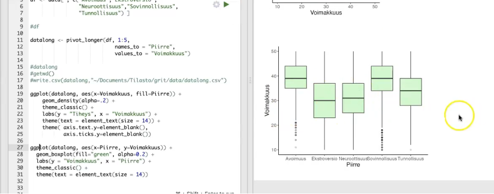

boxplotin koodi

```{r}
#| eval: false

ggplot(datalong, aes(x=SetSize, y=Score)) + 
    geom_boxplot(fill="green", alpha=0.2) + 
    labs(y = "D'", x = "SetSize") + 
    theme_classic() + 
    theme(text = element_text(size=14))


```

<br>

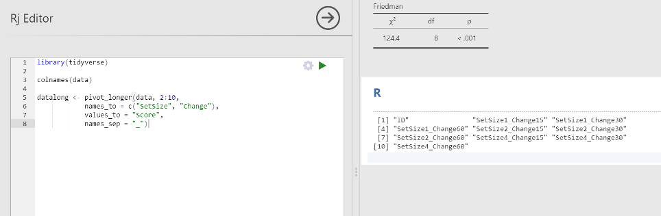

muokataan toistomittaus-Anova viedon 42 aineistosta changewithinsubjects pitkämuotoinen (long format)

talletetaan datalong muuttujaan

- \<- pivot_longer(data, 2:10,

  - muuttaa long formiin

- names_to = c()

  - muuttaa kolumnien eli sarakkeiden nimet

- values_to = ()

  - muuttaa arvojen nimen

- names_sep = ()

  - selkeyttää millä nimet on datassa eroteltuna

  - esimerkiksi kyseisessä aineistossa ne on eroteltuna alaviivalla \_

<br>

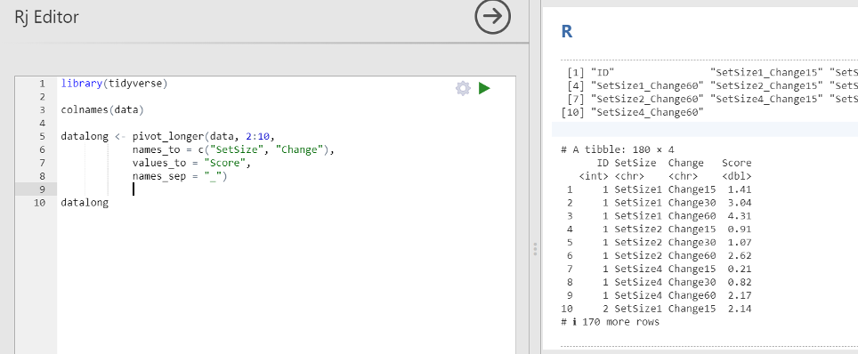

kun ajetaan datalong komento, nähdään, että se on jakautunut kolmeen sarakkeeseen SetSize, Change ja Score

- Alaviiva nimien erottamiseksi on hyvin näppärä, koska tämäntyylisellä funktiolla saa nimet suoraan eroteltua

- jos muuttujat on nimetty systemaattisesti voidaan käyttää automaattikoodeja, joilla ne saadaan eroteltua

  - esim. names_sep = ”jotain”

<br>

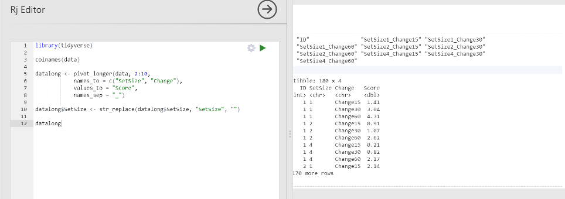

- datalong\$SetSize \<- str_replace(datalong\$SetSize, "SetSize", "")

- komennolla saadaan SetSizen nimestä poistettua SetSize ja se on vain 1, 2 tai 4

<br>

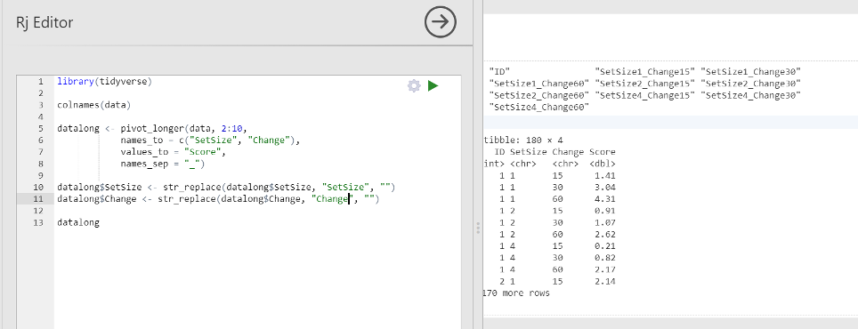

tehtiin sama muutokselle eli changelle

datalong\$Change \<- str_replace(datalong\$Change, "Change", "")

<br>

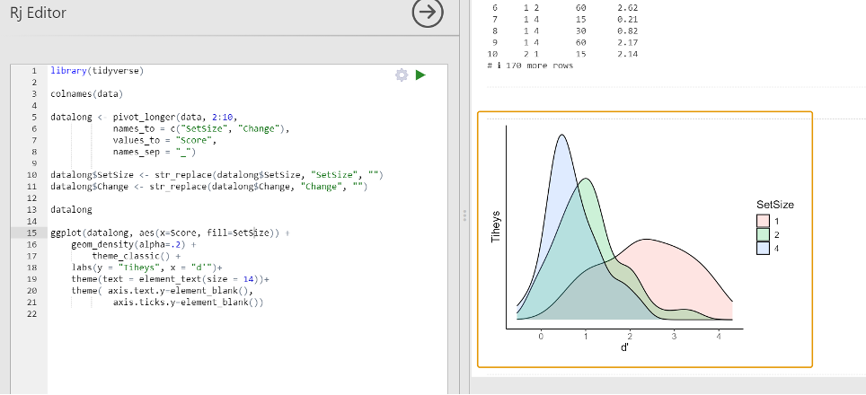

samalla koodilla kuin aiemmin saadaan long format muodossa olevasta datasta piirrettyä päällekäiset histogrammit

```{r}
#| eval: false

ggplot(datalong, aes(x=Voimakkuus, fill=Piirre)) +
    geom_density(alpha=.2) +
        theme_classic() + 
    labs(y = "Tiheys", x = "Voimakkuus")+
    theme(text = element_text(size = 14))+ 
    theme( axis.text.y=element_blank(),
            axis.ticks.y=element_blank())

```

<br>

täytyi vain muuttaa oikeat muuttujien nimet ja homma pelittää

<br>

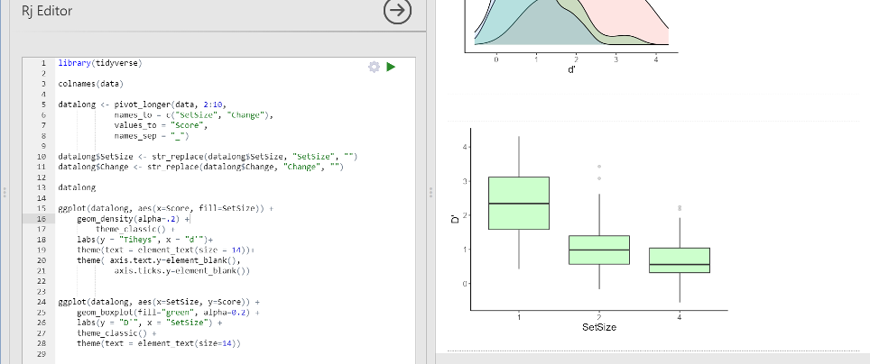

boxplot

- näkee keskimäärisen muistisuorituksen (musta poikkiviiva)

  - ja kvartaalivälit

- mediaani, 25-75 persentiiliväli (IQR, Inter quartal range), 25 – 1,5\* IQR, 75 + 25 \* IQR

```{r}
#| eval: false


ggplot(datalong, aes(x=SetSize, y=Score)) + 
    geom_boxplot(fill="green", alpha=0.2) + 
    labs(y = "D'", x = "SetSize") + 
    theme_classic() + 
    theme(text = element_text(size=14))


```

Eli, jos jamovin kuvaajan piirto-ominaisuudet ei tyydytä, niin r-editorilla saa monipuolisemmin piirrettyä

<br>

## R-studio, aineiston avaaminen ja kuvailu

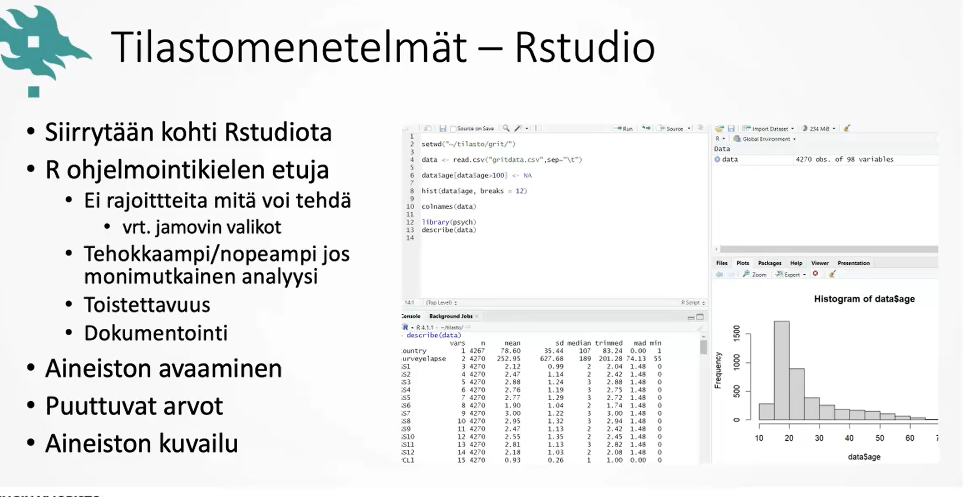

jamovilla enemmän rajoitteita, r-kielelle valtava määrä paketteja ja voi itse määritellä mitä tekee

<br>

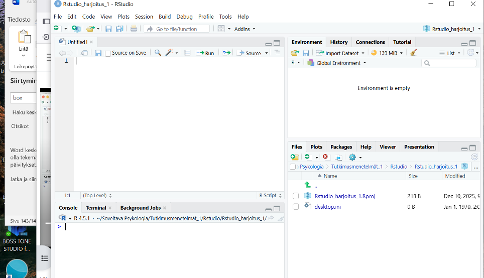

Näppäinyhdistelmällä ctrl + L saa konsolin tyhjennettyä

<br>

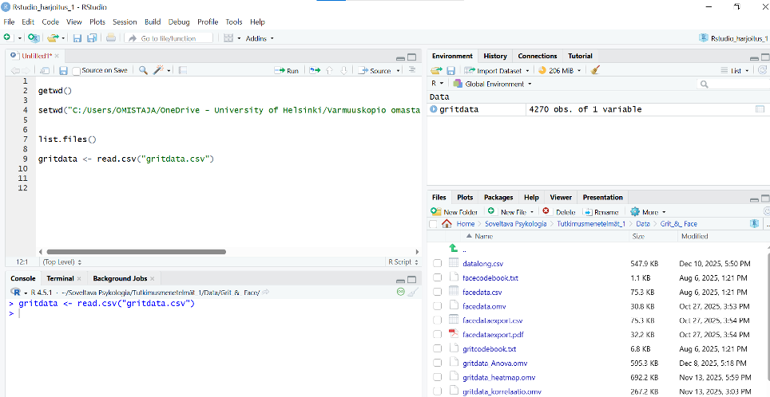

getwd()

- näyttää nykyisen working directoryn

setwd()

- asettaa working directoryn

list.files()

- listaa kyseisen working directoryn eli työskentely kansion tiedostot

gritdata \<- read.csv(”gridata.csv”)

- tallettaa gritdata.csv sisällön gritdata muuttujaan, joka näkyy oikeassa yläreunassa environment kohdassa

- näyttää, että datassa olisi vain yksi muuttuja eli jokin on pielessä

- kyse siitä ettei ohjelma osaa erotella tabilla eroteltuja

<br>

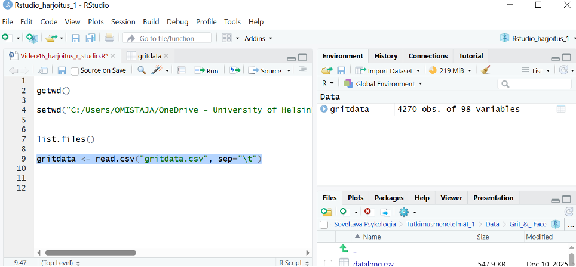

lisäämällä sep=”\\t”

- gritdata \<- read.csv("gritdata.csv", sep="\\t")

- ohjelma osaa erotella ja näkyy 98 muuttujaa

sep = separate eli erottelufunktio

- sep=”\\t”

  - komennon jälkeen osaa erotella tabilla erotellut muuttujat

- separator voi olla myös esim.

  - pilkku -\> sep=”,”

  - tai puolipiste -\> sep=”;”

- eri formaatteja löytyy, tyypillisimmin pilkku

<br>

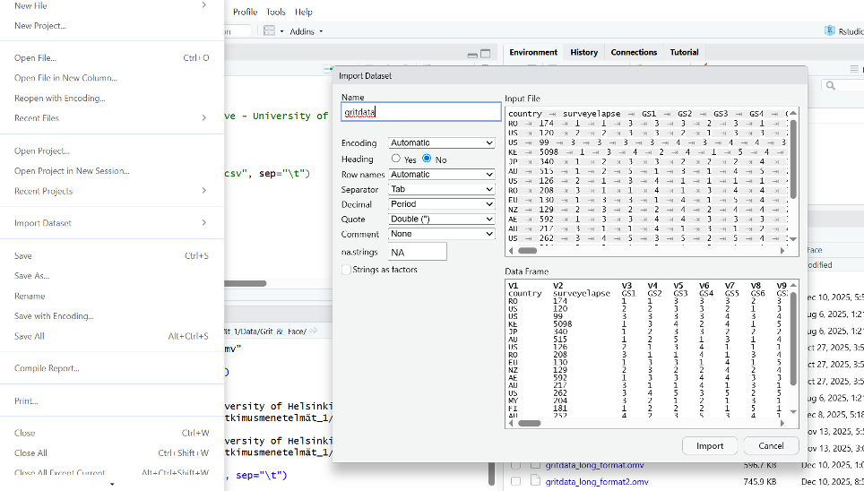

- voidaan avata datasetti myös file valikosta kohdasta import dataset

- from text

- avautuu valikko, josta voi esim valita separaattorin

<br>

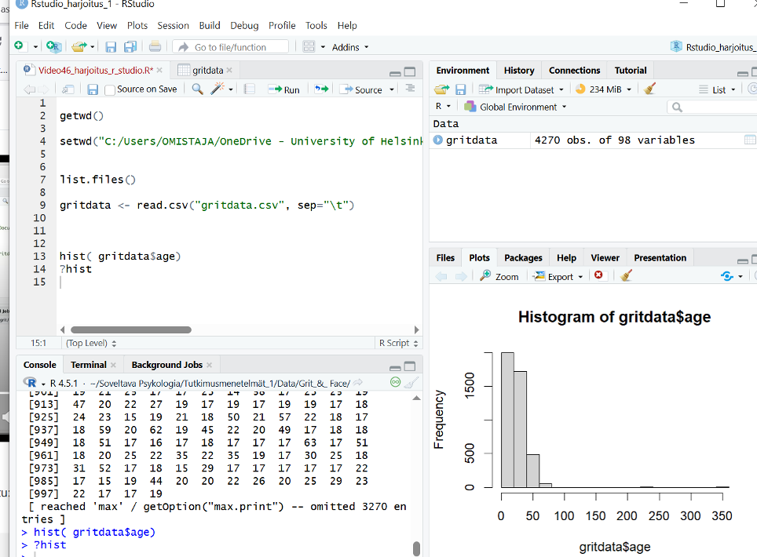

- \$ merkillä voi viitata tiettyyn osaan/muuttujaan datassa

- histogrammin saa piirrettyä hist() funktiolla

  - hist( gritdata\$age)

  - piirretään histogrammi gritdatan age muuttujasta

  - nähdään kuvasta, että löytyy outliereita, sillä ikäjakauma jatkuu 350 ikävuoteen asti

<br>

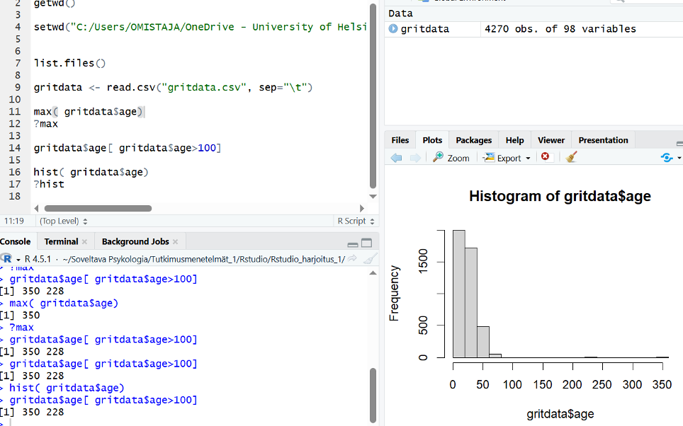

max()

- kertoo maksimiarvon

?max

- antaa ohjeita

gritdata\$age\[ gritdata\$age\>100\]

- näyttää gritdatan age muuttujan yli 100 olevat arvot

- tällä voi siis etsiä outliereita

<br>

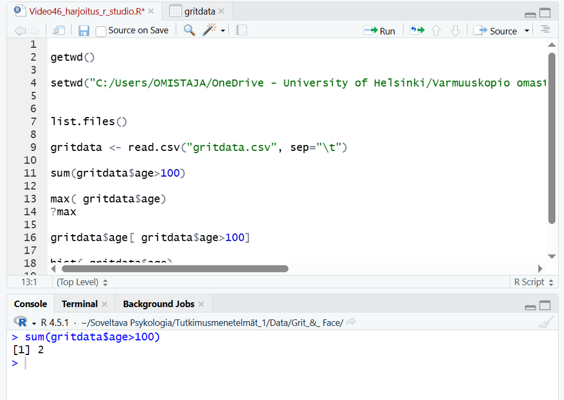

sum(gritdata\$age\>100)

- näyttää montako ehdon täyttävää arvoa löytyy

<br>

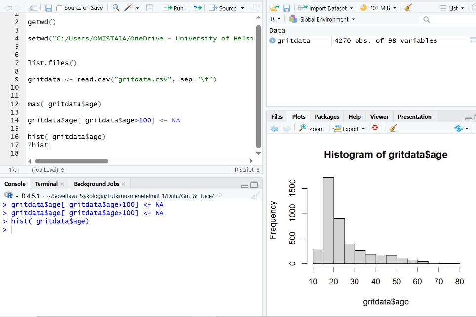

gritdata\$age\[ gritdata\$age\>100\] \<- NA

- merkattiin yli 100 olevat arvot puuttuviksi

- NA tarkoittaa puuttuvaa arvoa

- nuolikomennolla merkattiin hakasulkeiden sisältö puuttuvaksi

- histogrammissa näin vain järkeviä ikäarvoja

<br>

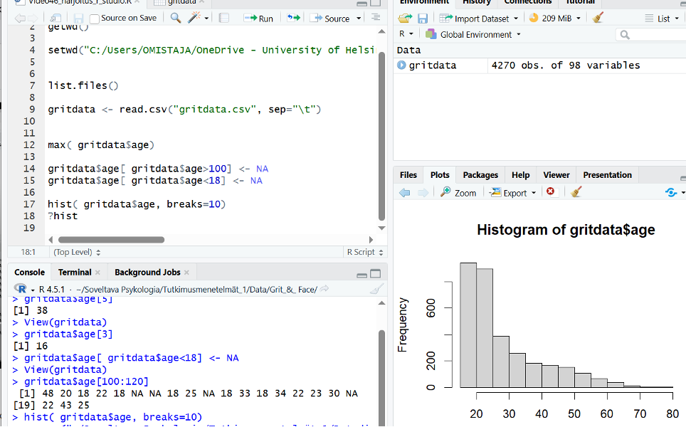

breaksilla voi säätää välejä, joilla histogrammiin piirtyy palkkeja

gritdata\$age\[ gritdata\$age\<18\] \<- NA

- merkattiin alle 18 arvot puuttuviksi

kirjoitattamalla konsoliin datalähteen ja hakasulkeissa sen numeron, niin se näyttää järjestysnumeron mukaisen arvon

esim. gritdata\$age\[1\]

- näyttää gritdata\$age ensimmäisen arvon

gritdata\$age\[5\]

- viidennen arvon

gritdata\$age\[100:120\]

- näyttää arvot välillä 100 – 120

<br>

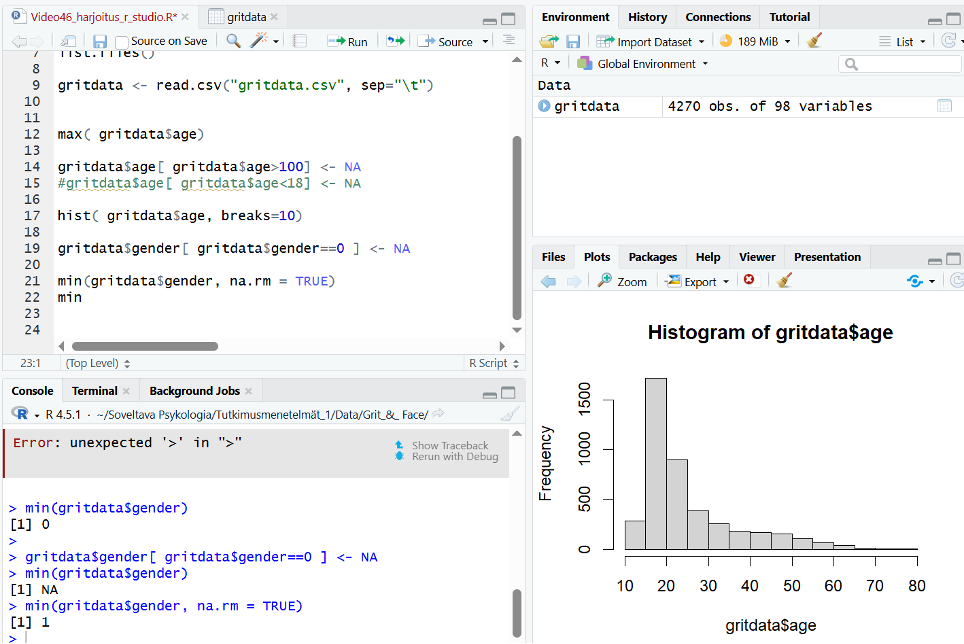

poistettiin alle 18 ikäarvojen poisto \#

gender muuttujasta merkattiin 0 arvot puuttuviksi

- gritdata\$gender\[ gritdata\$gender==0 \] \<- NA

konsolissa tarkastettiin mitä minimi näyttää

- antoi minimiksi ensin NA, joka tarkoitti, ettei minimifunktio osannut automaattisesti tulkita puuttuvia arvoja poistetuiksi

lisättiin minimifunktioon NA arvojen poistaminen

- min(gritdata\$gender, na.rm = TRUE)

- na.rm = puuttuvat arvot poistetaan NA remove

- tämän seurauksena antaa tulokseksi minimiarvon 1 eli oikean vastauksen

<br>

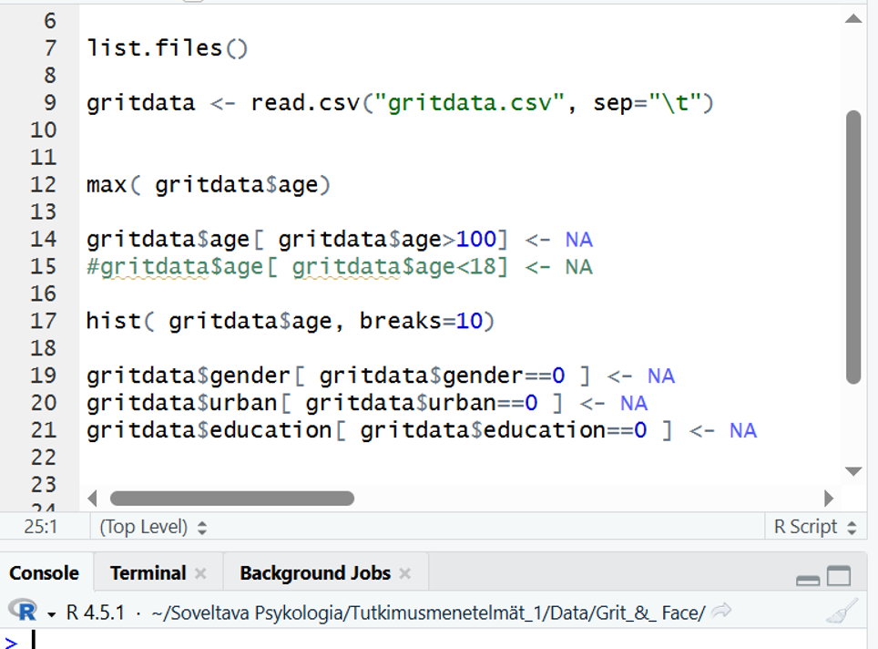

voidaan poistaa yksi kerrallaan muistakin muuttujista 0 arvot

- kuten kuvassa urbanista ja educationista

kuitenkin hiukan hidasta

jos tiedetään, että kaikki 0 arvot datassa ovat vääriä / puuttuvia arvoja voidaan käyttää

- gritdata\[ gritdata ==0\] \<- NA

- merkitsee kaikki gritdatan 0 arvot puuttuviksi

colnames(gritdata)

- näytää sarakkeiden nimet

<br>

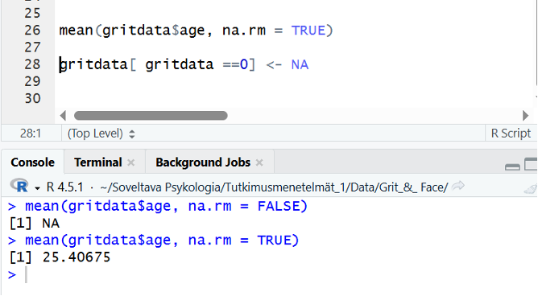

- kun na.rm ei käytössä, niin keskiarvofunktio ei tunnista puuttuvia arvoja ja osaa laskea sitä

- kun na.rm on käytössä, niin osaa laskea keskiarvon

- na.rm on siis tärkeä käyttää monissa funktioissa, jotka eivät suoraan osaa tunnistaa puuttuvia NA arvoja

- Keskiarvo: mean(gritdata\$age, na.rm = TRUE)

- Keskihajonta: sd(gritdata\$age, na.rm = TRUE)

<br>

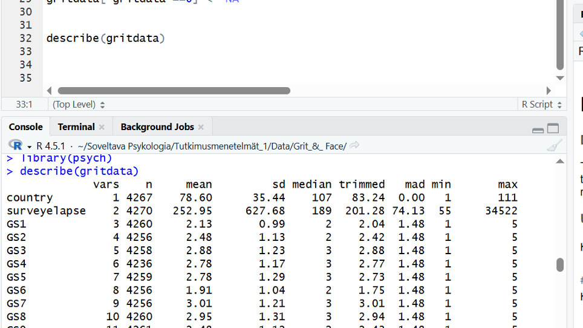

describe()

- funktiolla saa kaikkien muuttujien keskeisiä kuvailevia statistiikkoja esille

<!-- -->

- täytyy muistaa käyttää library(psych) kirjastoa

- eli koodin alkuun lisätään library(psych)

?describe

- näkee ohjeet, miten voi hiukan tarkemmin määritellä sen mitä haluaa funktiolla tulostaa

<br>

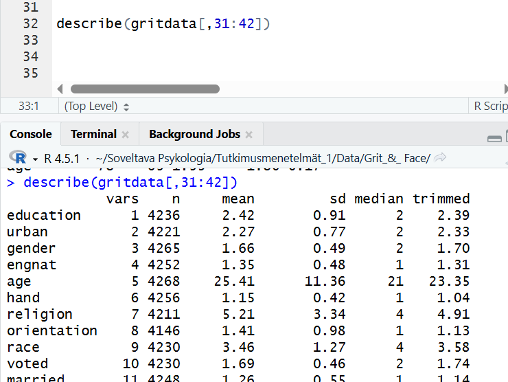

jos halutaan rajata vaikkapa gritdasta vain rivit 29-41 niin se voidaan lisätä hakasulkeisiin ja näin rajoittaa.

- describe(gritdata\[,29:41\]

<br>

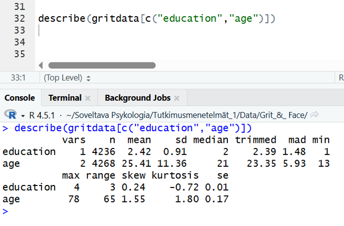

- myös kolumnien nimet kirjoittamalla voi määritellä valitut muuttujat

- describe(gritdata\[c("education","age")\])

<br>

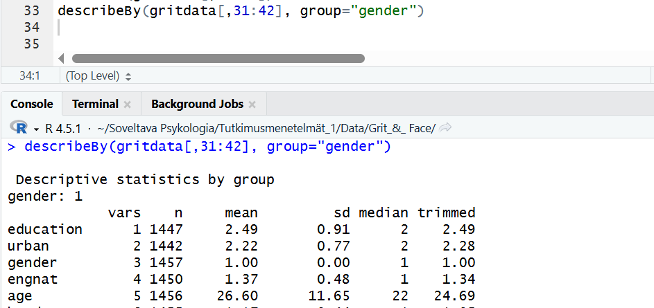

describeBy(gritdata\[,31:42\], group="gender")

- jaotellaan kuvailevat tiedot faktorin eli ryhmittelevän muuttujan mukaan

- tässä tapauksessa gender ja näyttää siis tunnusluvut gender 1, gendar 2, ja gender 3 erikseen

<br>

## Rstudio summamuuttujat

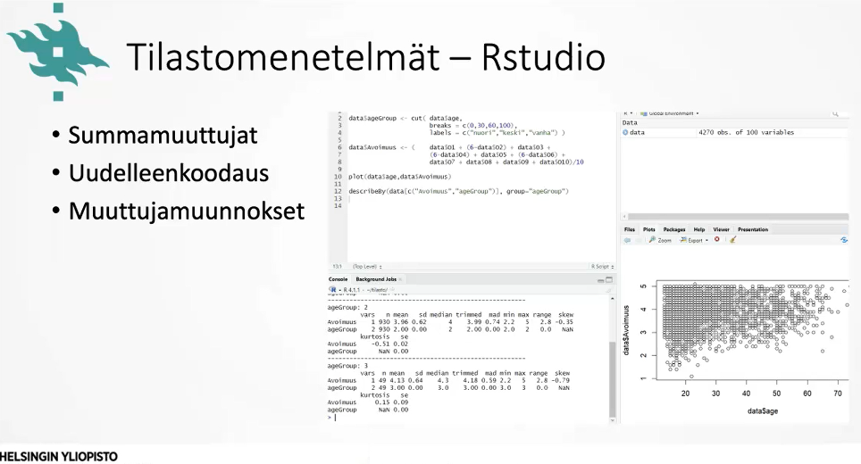

<br>

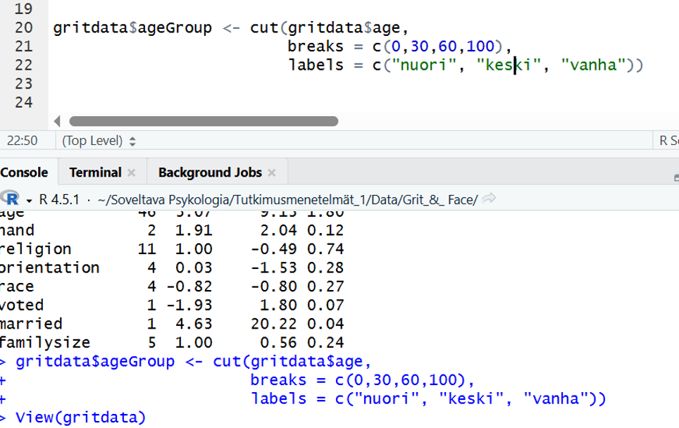

gritdata\$ageGroup \<- cut(gritdata\$age,

breaks = c(0,30,60,100),

labels = c("nuori", "keski", "vanha"))

muuttujan uudelleenkoodaus

- yllä koodattiin ikä uuteen muuttujaan kolmeksi ikäryhmäksi

- breaksillä määritellään, missä kohtaa on ryhmien rajat

- labelsilla ryhmien nimet

<br>

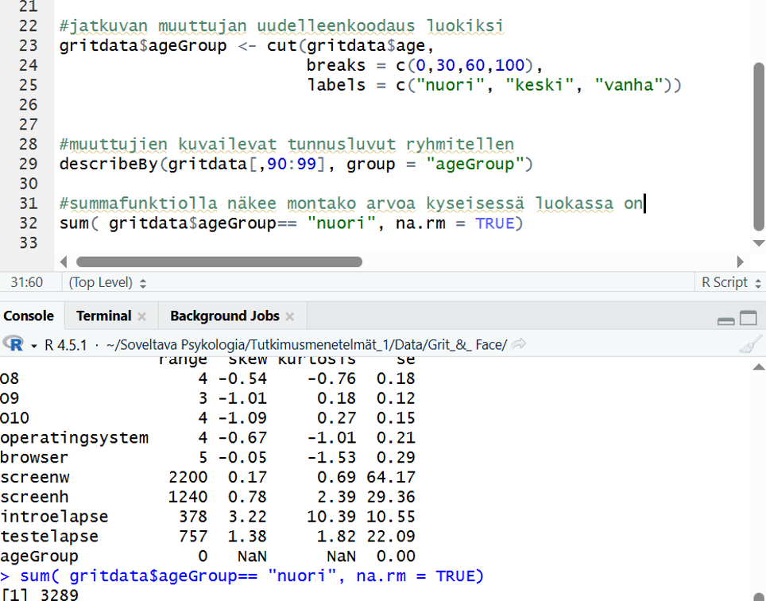

muuttujien kuvailevat tunnusluvut ryhmitellen

- describeBy(gritdata\[,90:99\], group = "ageGroup")

summafunktiolla näkee montako arvoa kyseisessä luokassa on

- sum( gritdata\$ageGroup== "nuori", na.rm = TRUE)

<br>

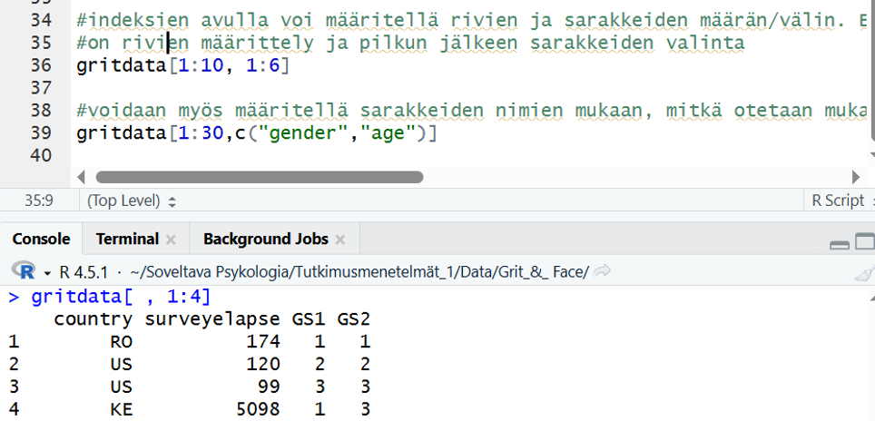

indeksien avulla voi määritellä rivien ja sarakkeiden määrän/välin. Enskiksi on rivien määrittely ja pilkun jälkeen sarakkeiden valinta

- gritdata\[1:10, 1:6\]

voidaan myös määritellä sarakkeiden nimien mukaan, mitkä otetaan mukaan

- gritdata\[1:30,c("gender","age")\]

<br>

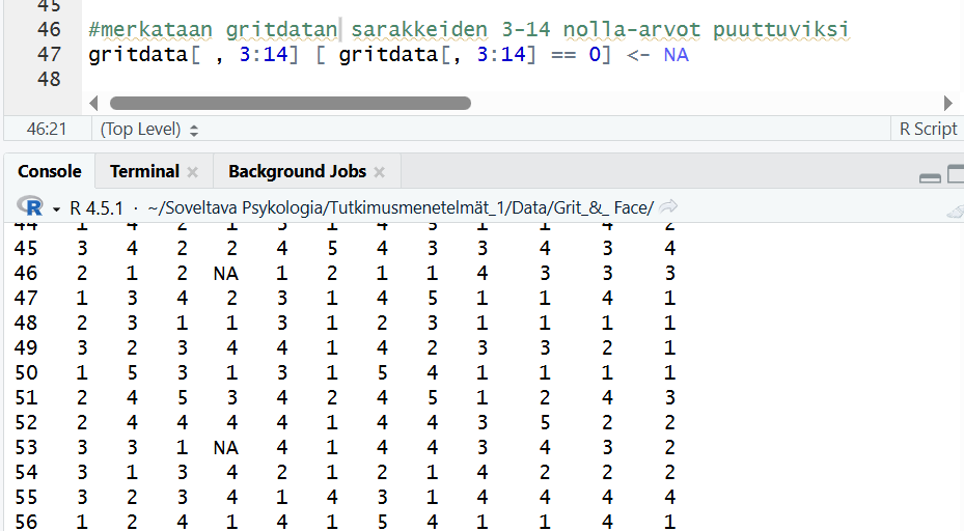

merkataan gritdatan sarakkeiden 3-14 nolla-arvot puuttuviksi

- gritdata\[ , 3:14\] \[ gritdata\[, 3:14\] == 0\] \<- NA

katso colnamesista mistä muuttujista täytyy poistaa 0 arvot

--\> käytä seuraavaa komentoa

gritdata\[ , 3:14\] \[ gritdata\[, 3:14\] == 0\] \<- NA

gritdata\[ , 43:92\] \[ gritdata\[, 43:92\] == 0\] \<- NA

voi myös tehdä kerrallaan, jos ok poistaa nollat koko aineistosta

- gritdata\[gritdata == 0\] \<- NA

<br>

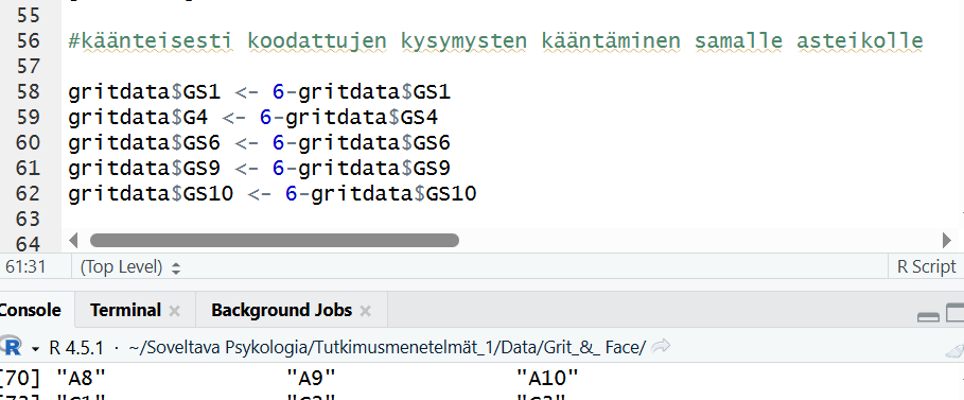

käänteisesti koodattujen kysymysten kääntäminen samalle asteikolle

- eli käännetään samoin päin kuin muut kysymykset, kun tehdään summamuuttujaa

```{r}
#| eval: false 

gritdata$GS1 <- 6-gritdata$GS1
gritdata$G4 <- 6-gritdata$GS4
gritdata$GS6 <- 6-gritdata$GS6
gritdata$GS9 <- 6-gritdata$GS9
gritdata$GS10 <- 6-gritdata$GS10


```

<br>

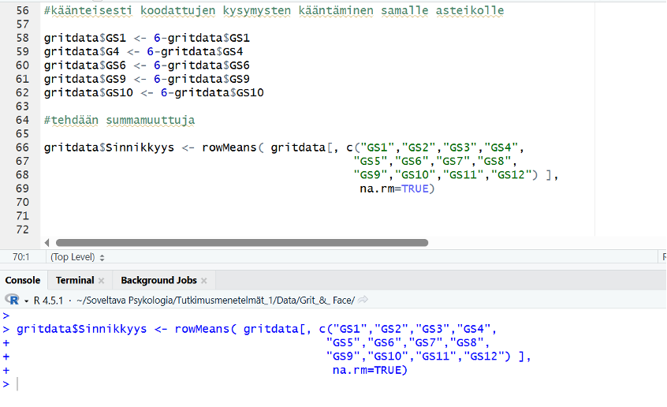

tehdään summamuuttuja

- gdata\$Sinnikkyys \<- rowMeans(gdata\[, c("GS1","GS2","GS3","GS4", "GS5","GS6","GS7","GS8", "GS9","GS10","GS11","GS12") \], na.rm=TRUE)

eli otetaan kaikki rivit ja vain tietyt sarakkeet (GS sarakkeet). Lasketaan GS sarakkeiden kaikkien rivien keskiarvot. Rivikeskiarvot tallentuvat Sinnikkyys summamuuttujaan

eli saadaan jokaiselta koehenkilöltä keskiarvo jokaisesta 12 grit kysymyksestä

<br>

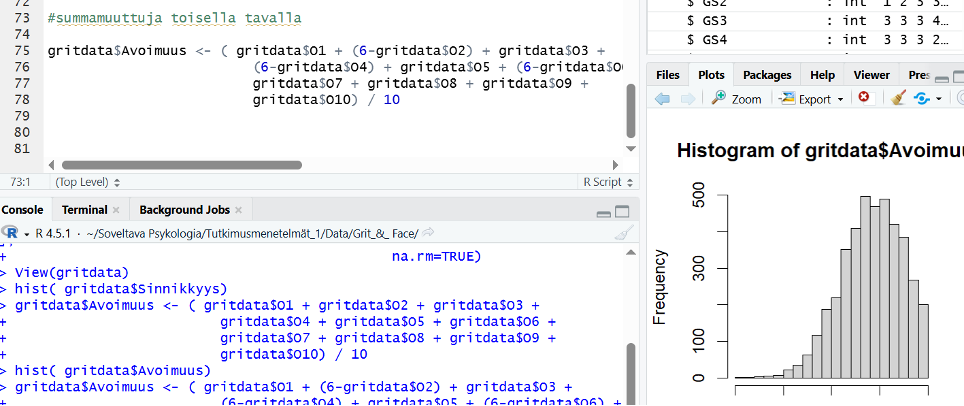

```{r}
#| eval: false 

gritdata$Avoimuus <- ( gritdata$O1 + (6-gritdata$O2) + gritdata$O3 +
                         (6-gritdata$O4) + gritdata$O5 + (6-gritdata$O6) +
                         gritdata$O7 + gritdata$O8 + gritdata$O9 + 
                         gritdata$O10) / 10


```

lasketaan siis muuttujat suoraan yhteen ja otetaan niiden keskiarvo.

täytyy muistaa kääntää käänteisesti koodatut kysymykset

asteikon 1-5:lle saa käännettyä erottamalla 6:sta

eli, jos 1 pitäisikin olla 5 niin 6 – 1 = 5

tässä tavassa se hyvä puoli ettei kosketa ollenkaan alkuperäisiin muuttujiin, vaan koodauksen kääntö samoin päin tehdään vain suoraan summamuuttujaan

<br>

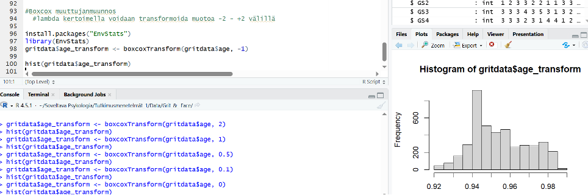

Boxcox muuttujanmuunnos

- lambda kertoimella voidaan transformoida muotoa -2 - +2 välillä

```{r}
#| eval: false 

install.packages("EnvStats")
library(EnvStats)
gritdata$age_transform <- boxcoxTransform(gritdata$age, -1)

hist(gritdata$age_transform)


```

boxcox muuttaa arvot random asteikolle niin kannattaa normalisoida!

onnistuu scale funktiolla

- gritdata\$age_transform \<- scale(boxcoxTransform(gritdata\$age, -1))

<br>

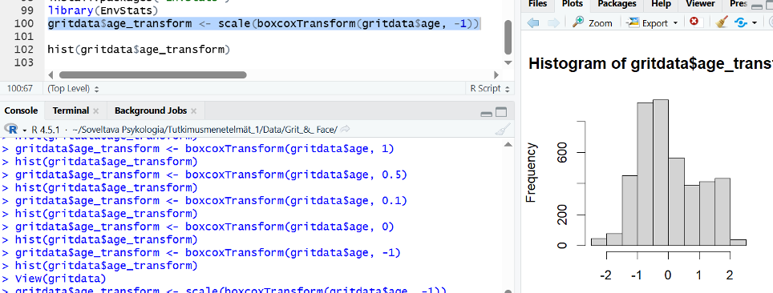

normalisoitu boxcox muunnoksen läpikäynyt muuttuja

<br>

## Kuvat R-kielellä r-studiossa

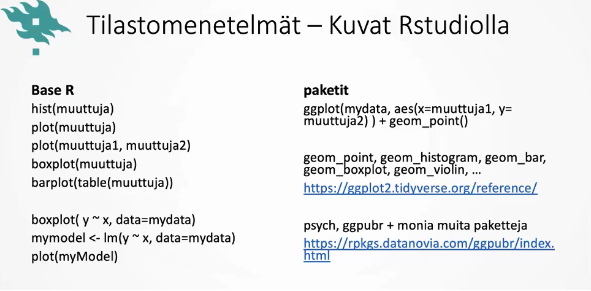

Base r ja paketit

kaava/formula muoto suht yleinen r-kielellä

- boxplot( y\~x, data=mydata)

ggplotissa

- ensiksi kerrotaan mistä datasta, sitten esteettiset ominaisuudet (aes), x ja y muuttujat ja sitten lisätään erilaisia elementtejä

ggpubr

- tehty ggplotin päälle

- julkaisuja varten

<br>

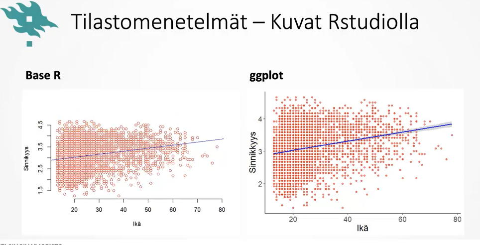

- kuvat samannäköisiä teki kummalla tahansa

<!-- -->

- kannattaa ymmärtää, jonkin verran kumpaakin

<!-- -->

- julkaisuja varten tarvitsee todnäk hienostuneempia työkaluja, kuten ggpubr

<br>

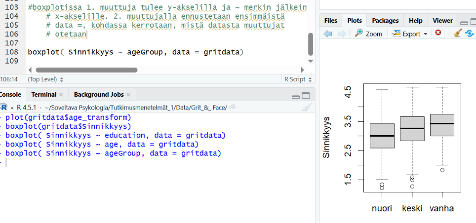

boxplot r:n kaavamuodolla

- boxplotissa 1. muuttuja tulee y-akselilla ja \~ merkin jälkeinen

- x-akselille. 2. muuttujalla ennustetaan ensimmäistä

- data =, kohdassa kerrotaan, mistä datasta muuttujat otetaan

- boxplot( Sinnikkyys \~ ageGroup, data = gritdata)

<br>

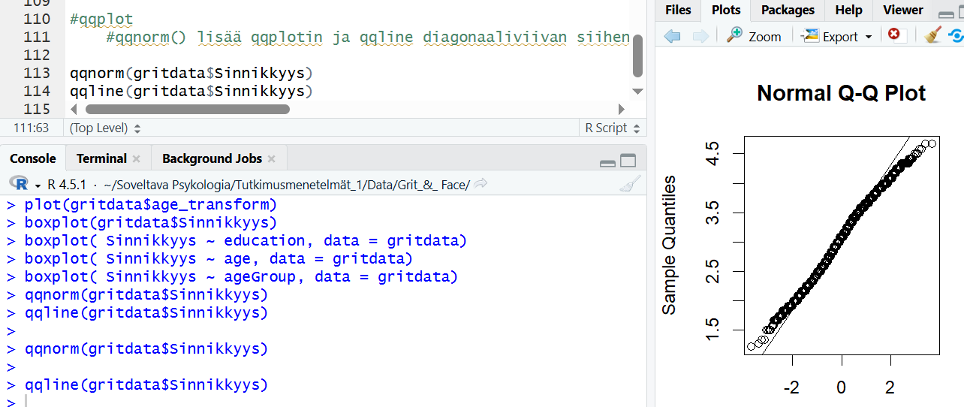

qqplot

- qqnorm() lisää qqplotin ja qqline diagonaaliviivan siihen

- qqnorm(gritdata\$Sinnikkyys)

- qqline(gritdata\$Sinnikkyys)

- frame=FALSE, poistaa laatikon reunoilta

- col = "", muuttaa väriä

- qqnorm(gritdata\$Sinnikkyys, frame=FALSE, col = "blue")

- qqline(gritdata\$Sinnikkyys, col = "orange")

?qqnorm

- saa lisätietoja ja vinkkejä

<br>

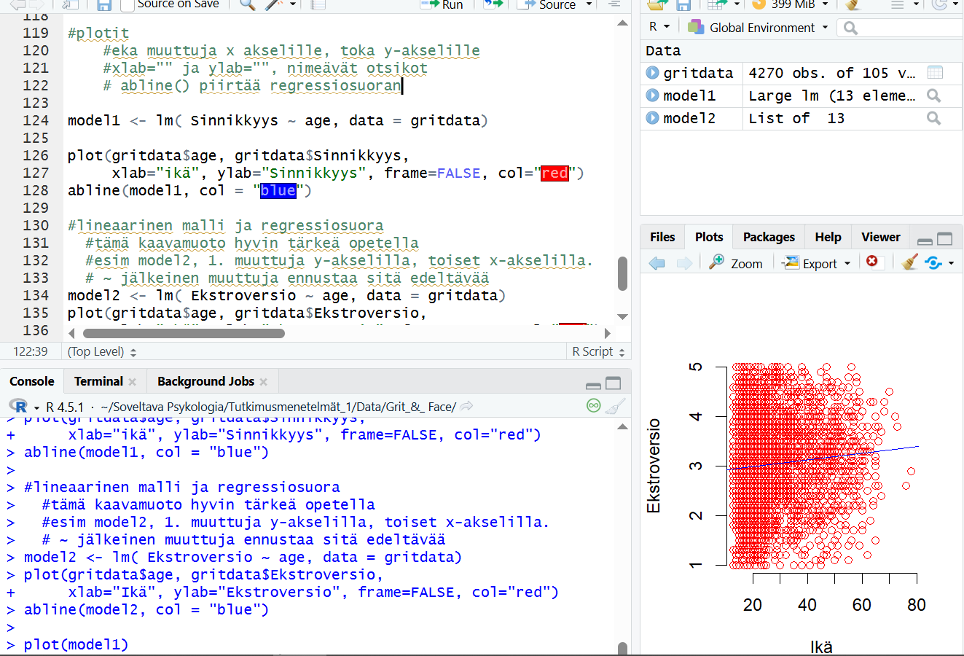

plotit

- eka muuttuja x akselille, toka y-akselille

- xlab="" ja ylab="", nimeävät otsikot

- abline() piirtää regressiosuoran

model1 \<- lm( Sinnikkyys \~ age, data = gritdata)

<br>

plot(gritdata\$age, gritdata\$Sinnikkyys,

xlab="ikä", ylab="Sinnikkyys", frame=FALSE, col="red")

abline(model1, col = "blue")

lineaarinen malli ja regressiosuora

- tämä kaavamuoto hyvin tärkeä opetella

- esim model2, 1. muuttuja y-akselilla, toiset x-akselilla.

- \~ jälkeiset muuttujat ennustavat \~ merkkiä edeltävää

model2 \<- lm( Ekstroversio \~ age, data = gritdata)

plot(gritdata\$age, gritdata\$Ekstroversio,

xlab="Ikä", ylab="Ekstroversio", frame=FALSE, col="red")

abline(model2, col = "blue")

<br>

yllä model2 muuttujaan talletetaan lineaarinen malli

kertauksena

- lm(ennustettava muuttuja \~ ennustavat muuttujat, data = datanlähde)

- labsit nimeävät kuvaajan akselit

plot(model1)

- plottaa suoraan regressiomallista asioita

- esim. qqplotin ja residuaalit

<br>

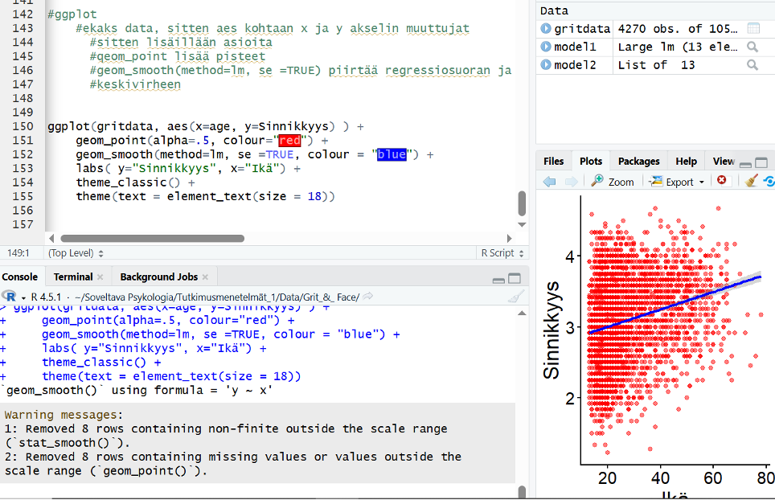

ggplot

- ekaks data, sitten aes kohtaan x ja y akselin muuttujat

- sitten lisäillään asioita

- qeom_point lisää pisteet

- geom_smooth(method=lm, se =TRUE) piirtää regressiosuoran ja keskivirheen

- ggtitle("a"), voi lisätä otsikon

```{r}
#| eval: false 

ggplot(gritdata, aes(x=age, y=Sinnikkyys) ) + 

geom_point(alpha=.5, colour="red") + 

geom_smooth(method=lm, se =TRUE, colour = "blue") + 

labs( y="Sinnikkyys", x="Ikä") + 

theme_classic() + 

theme(text = element_text(size = 18))

```

<br>

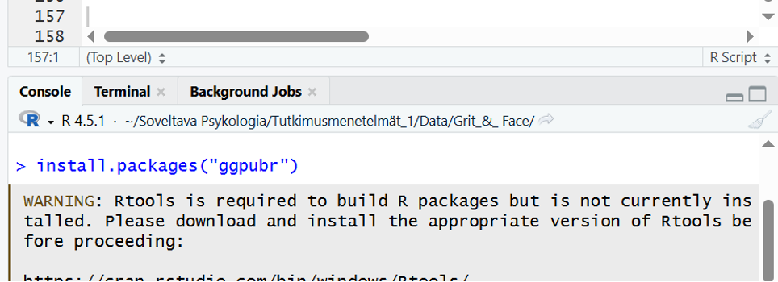

asennettiin ggpubr

- install.packages(”ggpubr”)

lisää kirjasto ylös

- library(ggpubr)

<br>

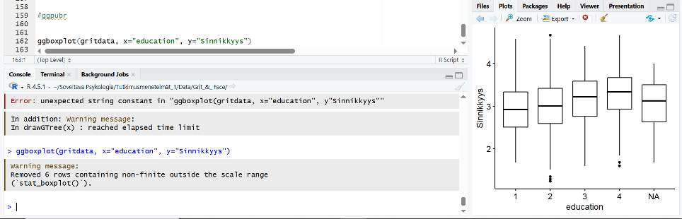

ggboxplot(gritdata, x="education", y="Sinnikkyys")

- luokittelee puuttuvat arvot yhdeksi luokaksi

  - tätä ei haluta niin lisätään seuraava juttu

<br>

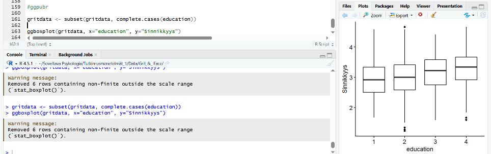

gritdata \<- subset(gritdata, complete.cases(education))

- saatiin puuttuvien arvojen luokka pois boxplotista

<br>

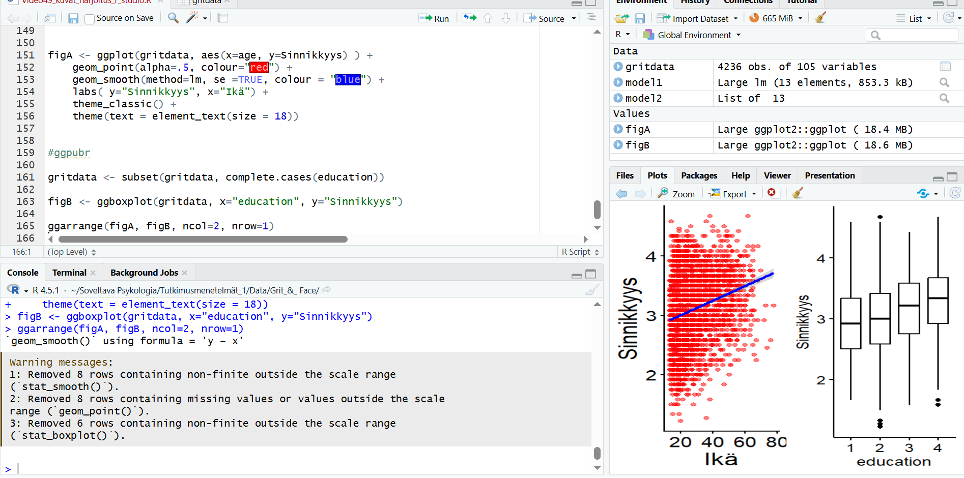

kuvat voi tallettaa muuttujiksi \<- komennolla

- ggarrange komennolla voi plotata kuvat vierekkäin

ggarrange(figA, figB, ncol=2, nrow=1)

- ncol=2, määrittää sarakkaiden määrän kahdeksi

- nrow=1, määrittää rivien määrän yhdeksi

<br>

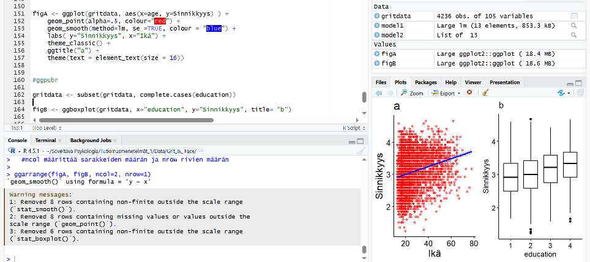

lisättiin kuviin otsikot

- ggtitle("a"), ggplotissa otsikko

- title= "b", ggpubr:ssä otsikko

```{r}
#| eval: false 

figA <- ggplot(gritdata, aes(x=age, y=Sinnikkyys) ) + 

geom_point(alpha=.5, colour="red") + 

geom_smooth(method=lm, se =TRUE, colour = "blue") + 

labs( y="Sinnikkyys", x="Ikä") + 

theme_classic() +

ggtitle("a") +

theme(text = element_text(size = 16))

gritdata <- subset(gritdata, complete.cases(education))

figB <- ggboxplot(gritdata, x="education", y="Sinnikkyys", title= "b")

```

<br>

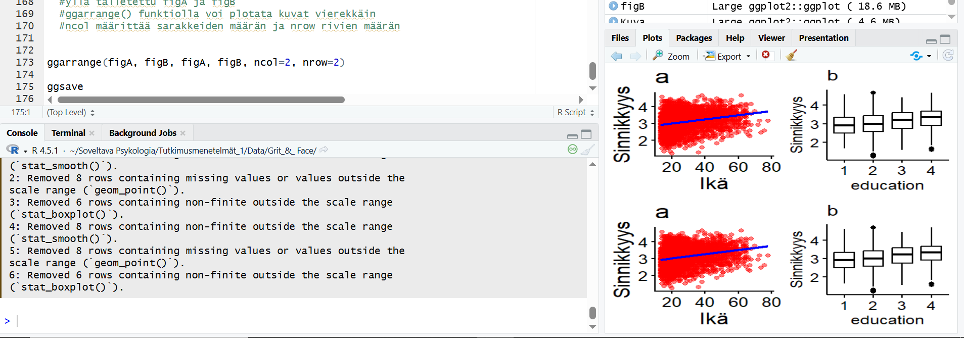

- ggarrangella pystyy rivien ja sarakkeiden määrää asettelemaan kuvia vierekkäin ja päällekkäin enemmänkin

- ggarrange(figA, figB, figA, figB, ncol=2, nrow=2)

- löytyy myös ggsave funktio, jota en kuitenkaan saanut toimimaan

- kuvat pystyy exporttaamaan oikeassa reunassa plot kohdan export valikosta

<br> <br>

## Korrelaatio ja muuttujien tyypin vaihtaminen rstudiolla 

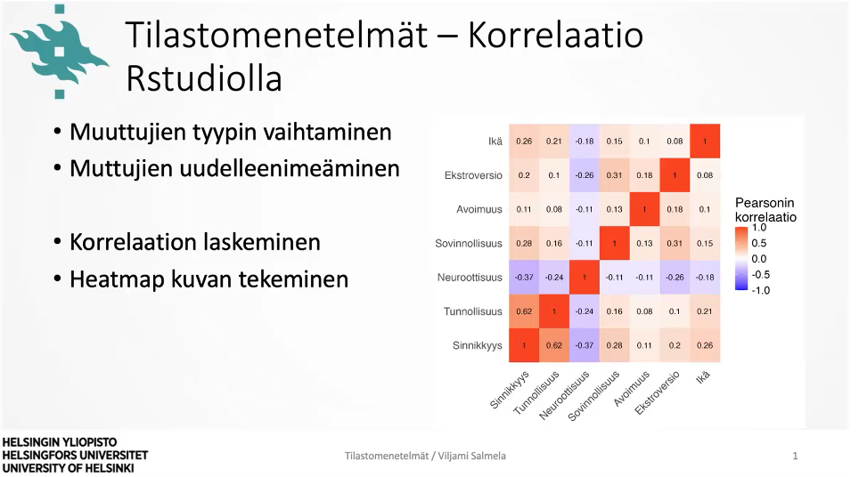

<br>

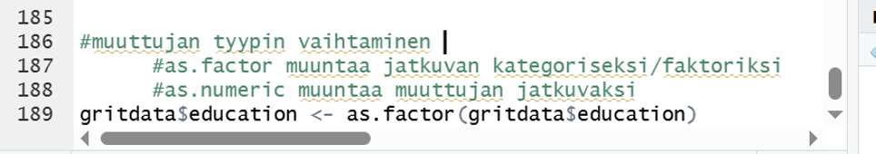

muuttujan tyypin vaihtaminen

- as.factor muuntaa jatkuvan kategoriseksi/faktoriksi

- as.numeric muuntaa muuttujan jatkuvaksi

gritdata\$education \<- as.factor(gritdata\$education)

<br>

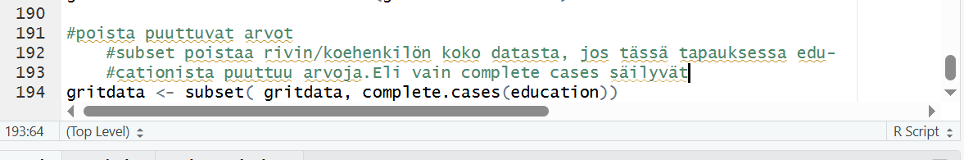

poista puuttuvat arvot

- subset poistaa rivin/koehenkilön koko datasta, jos tässä tapauksessa educationista puuttuu arvoja.Eli vain complete cases säilyvät

gritdata \<- subset( gritdata, complete.cases(education))

<br>

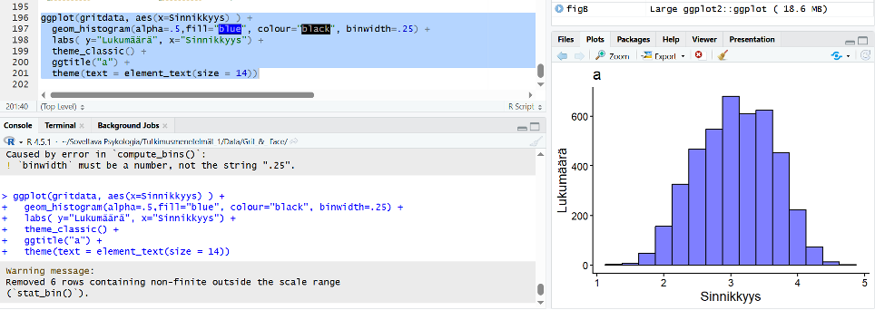

histogrammin koodi ggplotilla

```{r}
#| eval: false 

ggplot(gritdata, aes(x=Sinnikkyys) ) + 
  geom_histogram(alpha=.5,fill="blue", colour="black", binwidth=.25) + 
  labs( y="Lukumäärä", x="Sinnikkyys") + 
  theme_classic() +
  ggtitle("a") +
  theme(text = element_text(size = 14))


```

<br>

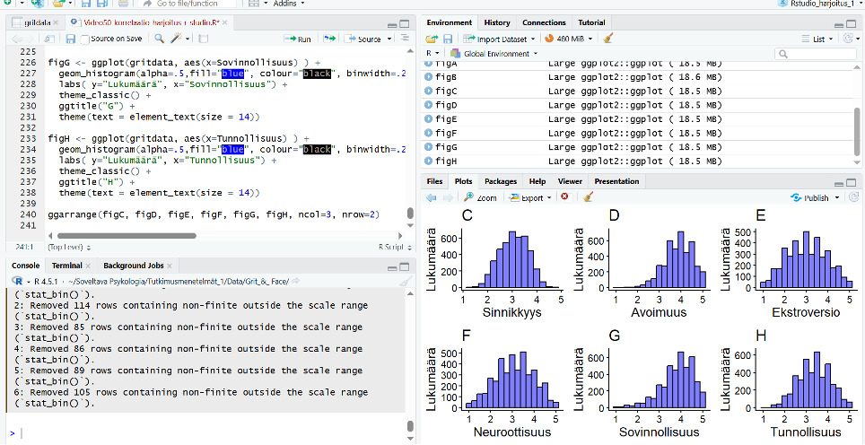

tehtiin jokaisesta persoonallisuuspiirteestä histogrammi, joka talletettiin fig komentoon ja ggarrange() funktiolla piirrettiin ne kahteen riviin ja kolmeen sarakkeeseen

- ggarrange(figC, figD, figE, figF, figG, figH, ncol=3, nrow=2)

ggsave("../../figs/piirrejakaumat.png")

- nyt onnistuin tallentamaan ggsave funktiolla kuvan

- oletan, että ../ siirtää yhden kansiotason taaksepäin

- eli nyt kun käytin kaksi kertaa ../../ niin tallennus onnistui

ggsave("../../figs/piirrejakaumat.png", width = 30, height= 20, units = "cm", dpi = 300)

- tässä vielä määritettynä kuvan koko ja resoluutio (dpi)

<br> <br>

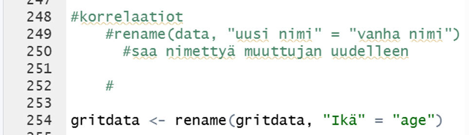

muuttujan uudelleennimeäminen

- rename(data, "uusi nimi" = "vanha nimi")

- saa nimettyä muuttujan uudelleen

gritdata \<- rename(gritdata, "Ikä" = "age")

<br><br>

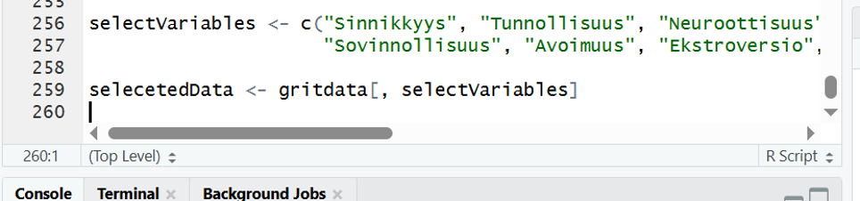

voidaan valita tietyt muuttujat ja luoda uusi datasetti, jossa vain ne muuttujat mukana

- selectVariables \<- c("Sinnikkyys", "Tunnollisuus", "Neuroottisuus", "Sovinnollisuus", "Avoimuus", "Ekstroversio", "Ikä")

selecetedData \<- gritdata\[, selectVariables\]

- nuolifunktiolla talletetaan ensin tietyt sarakkeet selectVariables muuttujaan ja sen jälkeen nuolifunktiolla talletetaan gritdatasta seletVariables muuttuja SelectedDataan uuteen dataframeen

<br> <br>

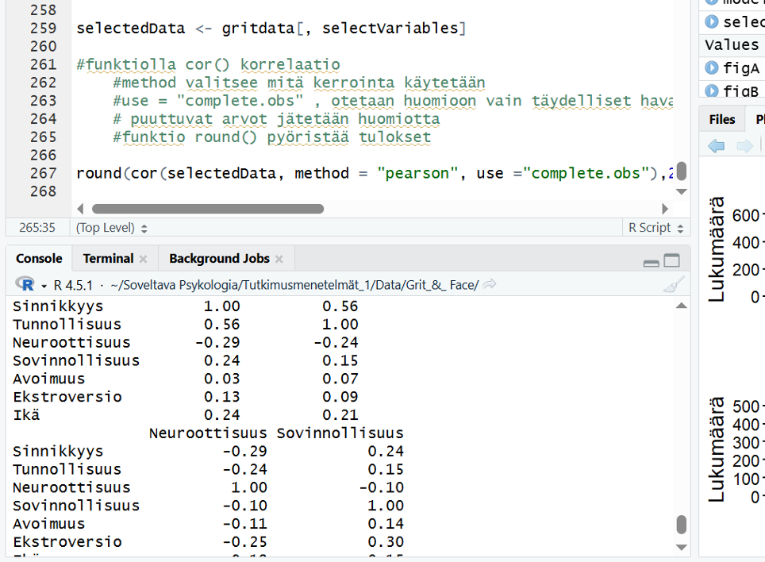

korrelaatioiden laskeminen rstudiossa

- funktiolla cor() korrelaatio

- method valitsee mitä kerrointa käytetään

- use = "complete.obs" , otetaan huomioon vain täydelliset havainnot eli puuttuvat arvot jätetään huomiotta

- funktio round() pyöristää tulokset

```{r}
#| eval: false 


round(cor(selectedData, method = "pearson", use ="complete.obs"),2)
```

<br> <br>

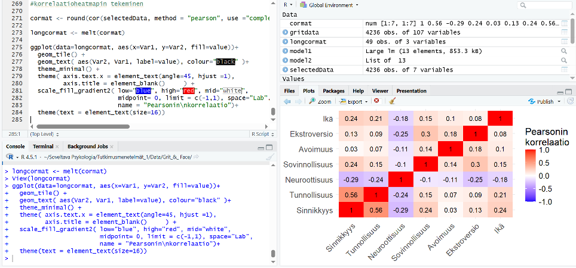

Korrelaatioheatmapin tekeminen

```{r}
#| eval: false 

cormat <- round(cor(selectedData, method = "pearson", use ="complete.obs"),2)

longcormat <- melt(cormat)

ggplot(data=longcormat, aes(x=Var1, y=Var2, fill=value))+
  geom_tile() +
  geom_text( aes(Var2, Var1, label=value), colour="black" )+
  theme_minimal() +
  theme( axis.text.x = element_text(angle=45, hjust =1),
         axis.title = element_blank()     ) +
  scale_fill_gradient2( low="blue", high="red", mid="white",
                        midpoint= 0, limit = c(-1,1), space="Lab",
                        name = "Pearsonin\nkorrelaatio")+
  theme(text = element_text(size=16))


```

- melt() funktio muuttaa datan pitkään matriisimuotoon, josta pystyy tekemään heatmapin

  - muuttaa datan kahteen kolumniin

<br>

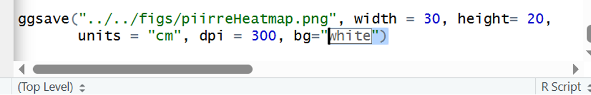

talletetaan ggsavella

- ggsave("../../figs/piirreHeatmap.png", width = 30, height= 20, units = "cm", dpi = 300, bg="white")

- bg=”white” muuttaa taustan valkoiseksi

<br> <br>

## T-testit Rstudio

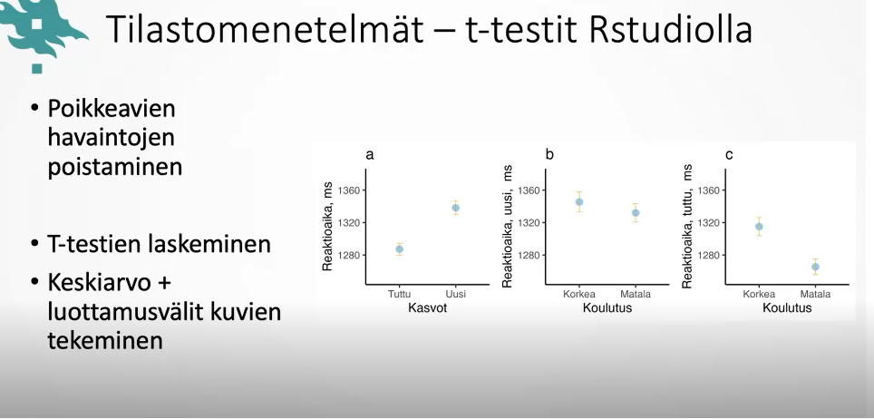

rm(list = ls())

- tyhjentää enviroment ikkunan kokonaan

- rm() funktiolla voi poistaa myös yksittäisiä objekteja

<br> <br>

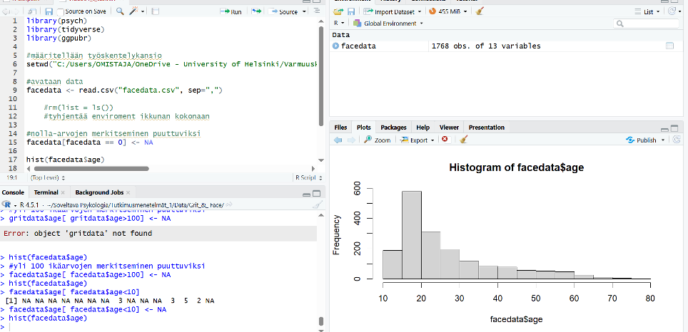

työskentelykansion määritys, datan avaaminen, nolla-arvojen merkintä puuttuviksi

```{r}
#| eval: false 

library(psych)
library(tidyverse)
library(ggpubr)

#määritellään työskentelykansio
setwd("C:/Users/OMISTAJA/OneDrive - University of Helsinki/Varmuuskopio omasta koneesta/Tiedostot/Soveltava Psykologia/Tutkimusmenetelmät_1/Data/Grit_&_ Face")

#avataan data
facedata <- read.csv("facedata.csv", sep=",")

    #rm(list = ls())
    #tyhjentää enviroment ikkunan kokonaan

#nolla-arvojen merkitseminen puuttuviksi 
facedata[facedata == 0] <- NA

hist(facedata$age)

#yli 100 ikäarvojen merkitseminen puuttuviksi 
facedata$age[ facedata$age>100] <- NA 
facedata$age[ facedata$age<10] <- NA


```

<br> <br>

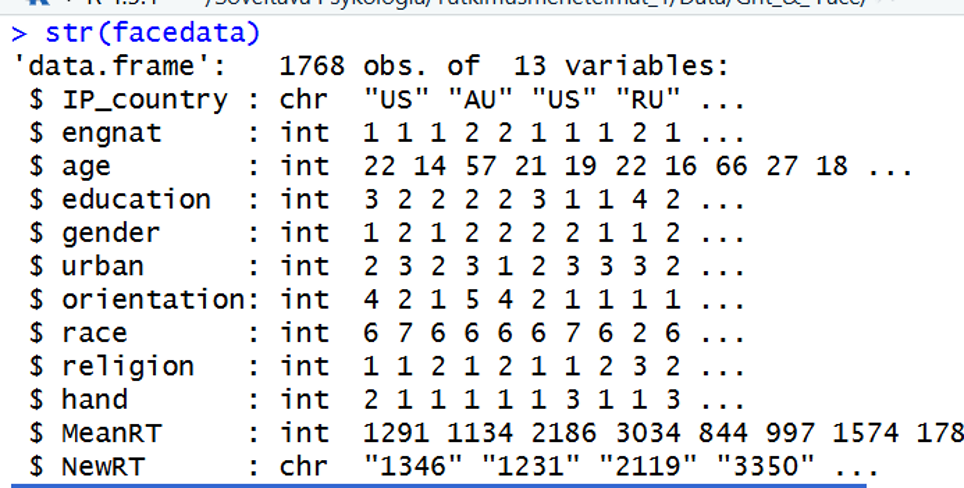

muuttujan tyypin tarkastaminen

- str(facedata)

- funktiolla str() voi tarkastaa ovatko muuttujat kategorisia vai jatkuvia 

<br> <br>

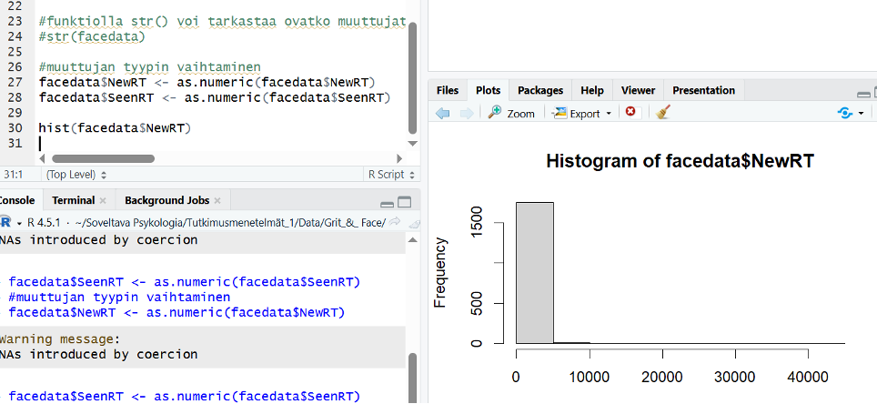

Muuttujan tyypin vaihtaminen

- facedata\$NewRT \<- as.numeric(facedata\$NewRT)

- facedata\$SeenRT \<- as.numeric(facedata\$SeenRT)

<br> <br>

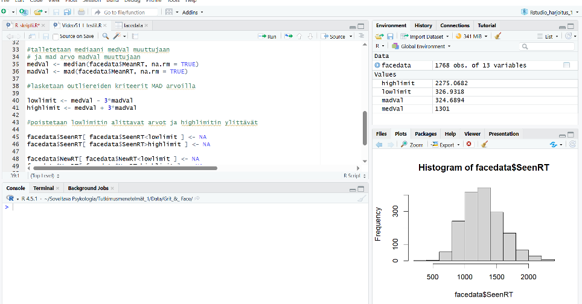

```{r}
#| eval: false 

#talletetaan mediaani medVal muuttujaan
# ja mad arvo madVal muuttujaan 
medVal <- median(facedata$MeanRT, na.rm = TRUE)
madVal <- mad(facedata$MeanRT, na.rm = TRUE)

#lasketaan outliereiden kriteerit MAD arvoilla 

lowlimit <- medVal - 3*madVal
highlimit <- medVal + 3*madVal

#poistetaan lowlimitin alittavat arvot ja highlimitin ylittävät

facedata$SeenRT[ facedata$SeenRT<lowlimit ] <- NA
facedata$SeenRT[ facedata$SeenRT>highlimit ] <- NA

facedata$NewRT[ facedata$NewRT<lowlimit ] <- NA
facedata$NewRT[ facedata$NewRT>highlimit ] <- NA

hist(facedata$SeenRT)


```
